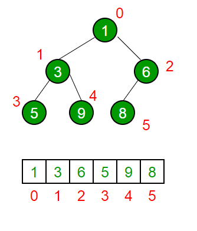

# Question 4: Adapting Data Structures [25 points]

An adapter is an object that wraps another object in order to provide a different interface to that underlying object.
In this way, suitably adapted objects of type X can be passed to an interface that accepts only objects of type X'.

Your application uses a web API to fetch data and a third-party library to process that data.
The web API and the library represent binary trees in different ways:
the web API returns a JSON containing a `List`-based representation of a binary tree (explained below),
while the third-party library uses a `BinaryTree` object.
The ultimate objective is to create an adapter from `List` to `BinaryTree`.

You can assume that the binary trees are complete, meaning that each level _n_ has _2n</s>_ nodes,
except the lowest level, where leaf nodes are filled left-to-right.
The list representation of the binary tree packs the nodes by levels, as follows:

Your tasks are:

1. Following a Test-Driven Development workflow, write in [ListAdapterTest.java](src/test/java/ListAdapterTest.java)
   tests for the [`ListAdapter`](src/main/java/ListAdapter.java) class
2. Implement the [`ListAdapter`](src/main/java/ListAdapter.java) class

_You will get up to 8 points for a useful and complete test suite,_
_up to 11 points for a correct implementation, and up to 6 points if your code is maintainable and follows best practices._
