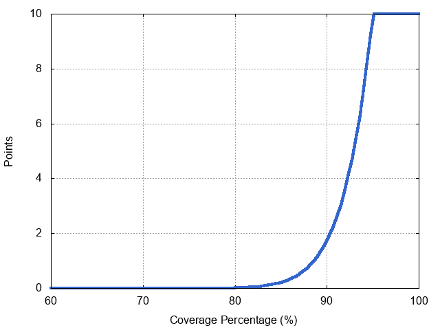

# Part 1: Practice [60 points]

In this part of the exam, you will write code that must compile and run.
Make sure it is rock-solid, follows the SwEng best practices, and is both readable and concise. 
You may use comments and/or Javadoc, but you are not required to do so. Test your code well.

We provide you with a project that can be used with Android Studio and built with Gradle. 
You can use any IDE as long as the code and tests build using `gradlew build`.
To check line coverage, you may:

- [Run coverage in Android Studio](http://sweng.discoursehosting.net/t/code-coverage-in-android-studio/292), or
- Run `gradlew test` then `gradlew jacocoTestReport` from the command line, or
- Push your code to GitHub, and check the corresponding job https://jenkins.epfl.ch/view/Final/job/final-GASPAR on Jenkins. 
  *(This is what the staff will take into consideration when grading)*

**Do not modify in any way the public interface** of the code we give you, including:

- Do not alter method definitions, not even the checked exceptions.
- Do not add public, protected, or package-private methods or fields; 
  if you wish, you can add private members and classes, but nothing visible from the outside.

Make sure that **your code builds on Jenkins**. You will receive 0 points if your code does not pass the basic tests on Jenkins. 
It is 100% your responsibility to check the status of your `final-GASPAR` job on Jenkins, and we will not make any exceptions. 
 We will use many automated tests when grading, so if we cannot build and run your code, **you will receive 0 points**.

**Code that has been commented out does not count**. 
If you choose to push commented code to the repo, we will not accept any requests to uncomment it for purposes of grading.

## The Teal (Toy Exam Abstract Language) specification

Teal is a simple programming language for adding integers. 
A Teal program defines a library of functions and then invokes these functions to compute expressions. 
A library is a block of code that defines one or more `functions`, with each line of code defining exactly one function.

For example, you can define a library that looks as follows:
~~~~
double(x): x + x 
triple(x): !double(x) + x
tenTimes(x): !triple(!double(x)) + !double(!double(x))
hundredTimes(x): !tenTimes(!tenTimes(x))
theAnswer(): 42
~~~~

and then call the Teal interpreter to invoke these functions, such as `invoke("theAnswer", null)` returns 42, 
or `invoke("hundredTimes", 13)` returns 1300.

Functions in Teal take one parameter or none at all, and return an integer. 
A function declaration consists of the function name followed by zero or one parameter enclosed in parentheses, then a colon ":",
followed by the function body, which is an `expression`. Function names are unique within the library. 

An `expression` can be:

- a literal integer value (e.g., 2, 10), or 
- the name of the function's parameter, which at runtime gets replaced by the parameter's value, or 
- an addition operation consisting of two expressions separated by "+", or
- an invocation of a function, beginning with a "!", followed by the function name, 
  and then the parameter expression (if any) between parentheses. 
  Teal does not support recursion, neither direct nor indirect via another function.

## Question 1: `TealParser` [`20` points]

The Teal parser takes the code for a Teal library and turns it into an object that can be used by the interpreter (in the next question) to execute Teal programs. 
It's in the `TealParser` class found in `final/src/main/java/ch/epfl/sweng/parser/TealParser.java`. 

Write a test suite that achieves 95% line coverage on the provided `TealParser` implementation (including the nested class), 
using the skeleton we provided in your exam repo. Do not modify the `TealParser` class in any way.

Our grading will use a coverage utility function similar to the one used in the midterm.

`Solution`: See [final/src/test/java/ch/epfl/sweng/tests/parser/TealParserTests.java](final/src/test/java/ch/epfl/sweng/tests/parser/TealParserTests.java) for a sample solution.

## Question 2: `TealInterpreter` [`40` points]

The Teal interpreter enables a programmer to invoke functions defined in the library. 
It takes as arguments a function and a single integer parameter (`null` if the function is parameter-less), 
and returns an integer representing the result of invoking that function with the parameter (if any).

The interface of the interpreter is in `src/main/java/ch/epfl/sweng/interpreter/TealInterpreter.java`, 
and a factory to create interpreters in `src/main/java/ch/epfl/sweng/interpreter/TealInterpreterFactory.java`.

For each of the following tasks you need to employ a different design pattern studied in SwEng.

You are allowed to add any new classes you need, provided they respect the given interfaces. Do not modify the given interfaces.

**(2.a)**: Fill in the `basicInterpreter()` method of `TealInterpreterFactory`, 
such that it returns a basic implementation of TealInterpreter that invokes a function from a given library and returns the result.

*Example*: If you have a library with one function `f(n): n + 1`, then the following Java statement
~~~~
int result = myBasicInterpreter.invoke("f", 41);
~~~~
would return the result `42`.

**(2.b)**: Fill in the `cachedInterpreter()` method of `TealInterpreterFactory`, 
such that it returns an interpreter that caches top-level results: 
if asked to perform an invocation that is identical to one it did in the past, the interpreter simply returns the cached result.

*Example*: If you have a library with one function `f(n): n + 1`, then
~~~~
int result = myCachedInterpreter.invoke("f", 41);
~~~~
invokes function f with parameter 41 and returns 42, after which
~~~~
int resultAgain = myCachedInterpreter.invoke("f", 41);
~~~~
does not invoke function f but immediately returns 42, after which
~~~~
int resultOnceMore = myCachedInterpreter.invoke("f", 2);
~~~~
invokes function f with parameter 2 and returns 3.

Your code should throw adequately specific runtime exceptions or custom versions thereof. 

For instance, throw `IllegalArgumentException` for arguments whose values are invalid, 
and throw `TealInterpretationException` if you discover during interpretation that the invoked function itself is invalid.

`Solution`: See [final/src/main/java/ch/epfl/sweng/interpreter/TealInterpreterFactory.java](final/src/main/java/ch/epfl/sweng/interpreter/TealInterpreterFactory.java) for a sample solution.

-----

## Grading

### Question 1 (20 points)

Your grade on the first question consists of three components: coverage, code quality, and robustness. We assigned 10 points to coverage, and 5 points each for code quality and robustness.

#### Coverage (10 points)

The code coverage score for your test suite is computed according to the following curve:

You get 10 points if coverage is 95% or above, and 0 points if coverage is less than 64% (the test we provided gets you there out of the box). The rest of the curve rewards coverage according to a general estimate of how much effort it takes to reach that level of coverage.

#### Code quality and robustness (10 points)

For this section, we manually looked at your code and assessed how well you observed the SwEng coding and testing guidelines. Please see the grading report in your repo for details.

##### Code quality (for each subitem)

  - +1 Proper formatting
  - +1 Proper naming
  - +1 Proper tests modularisation
  - +1 Proper usage of JUnit with expressive asserts, e.g. `assertThat(x, is(0));`
  - +1 Well structured code

##### Robustness (for each subitem)

  - +2.5 The tests must actually check the tree generated by the parser
  - +2.5 The exceptions are checked properly

### Question 2 (20 + 20 points)

Your grade on the second question also consists of three components: design pattern use, correctness, and code quality. We assigned 5 points to design pattern use and code quality (for each subitem), 15 points for correctness for subitem a), and 5 points for correctness for subitem b), respectively.

#### Design pattern use (5 + 5 points)

We manually looked at your code, and awarded 5 points for using an adequate design pattern correctly. Please see the grading report in your repo for details.

- For subitem a), implementing the `Visitor` design pattern was worth 5 points.
- For subitem b), implementing one of the `Proxy`, `Inheritance` or `Delegation` design patterns was worth 5 points.

#### Correctness (15 + 5 points)

We wrote tests to check the correctness of your code. Many of these tests are without points: they simply give you more detailed feedback on your solution without penalizing you for not passing them.

##### `BasicInterpreter`

###### [1 point] Provided Examples
- **✔** *[1 point]* Example library from `Practice.md`
- **✔** `answer(): 42`
- **✔** `f(n): n + 1`

###### [2 points] Illegal Arguments
- **✔** *[1 point]* Calling `invoke()` with `null` as the function name should throw an `IllegalArgumentException`
- **✔** *[1 point]* Passing `null` as the function library should throw an `IllegalArgumentException`

###### [5 points] Illegal invocations
- **✔** *[1 point]* Calling an undefined function should throw a `TealInterpretationException`
- **✔** *[1 point]* Passing no argument when an argument is expected should throw a `TealInterpretationException`
- **✔** *[1 point]* Passing an argument when no argument is expected should throw a `TealInterpretationException`
- **✔** *[1 point]* Using a variable when no arguments are expected should throw a `TealInterpretationException`  
- **✔** *[1 point]* Using a different variable than the argument should throw a `TealInterpretationException`  
- **✔** Using a different variable than the argument in a chain of calls should throw a `TealInterpretationException`  

###### [7 points] Single-function library
- **✔** *[1 point]* Calling an identity function (`f(n): n`) works.
- **✔** *[1 point]* Computing the result of another function with a parameter works.
- **✔** *[1 point]* Calling a function that returns a constant works.
- **✔** *[1 point]* Calling a function with no parameters works.
- **✔** *[1 point]* Adding a constant and a variable in a function works.
- **✔** *[1 point]* Computing the result of addition between a constant and another function with a parameter works.
- **✔** *[1 point]* Calling a long chain of functions works.
- **✔** Adding two constants is correct.

##### `CachedInterpreter`

###### [1.5 points] Provided Examples
- **✔** *[0.5 points]* `answer(): 42`
- **✔** *[0.5 points]* `f(n): n + 1`
- **✔** *[0.5 points]* Example library from `Practice.md`

###### [2.5 points] Caching
- **✔** *[0.5 points]* Results are not cached for a function called twice with different parameters.
- **✔** *[0.5 points]* Results are cached for parameter-less functions.
- **✔** *[1 point]* Results are cached for different functions in the same library.
- **✔** *[0.5 points]* Results are cached for a function called twice with the same parameter.

###### [0.5 points] Illegal Arguments
- **✔** *[0.5 points]* Calling `invoke()` with `null` as the function name should throw an `IllegalArgumentException`  
- **✔** *[0.5 points]* Passing `null` as the function library should throw an `IllegalArgumentException`

###### [0 points] Illegal invocations
- **✔** Calling an undefined function should throw a `TealInterpretationException`
- **✔** Passing no argument when an argument is expected should throw a `TealInterpretationException`
- **✔** Passing an argument when no argument is expected should throw a `TealInterpretationException`
- **✔** Using an argument when none are expected should throw a `TealInterpretationException`  
- **✔** Using a different variable than the argument should throw a `TealInterpretationException`  
- **✔** Using a different variable than the argument in a chain of calls should throw a `TealInterpretationException`  

###### [0 points] Single-function library
- **✔** Calling an identity function (`f(n): n`) works.
- **✔** Computing the result of another function with a parameter works.
- **✔** Calling a function that returns a constant works.
- **✔** Calling a function with no parameters works.
- **✔** Adding a constant and a variable in a function works.
- **✔** Computing the result of addition between a constant and another function with a parameter works.
- **✔** Calling a long chain of functions works.
- **✔** Adding two constants is correct.

### Code Quality (5 + 5 points)

For this section, we manually looked at your code and assessed how well you observed the SwEng coding guidelines. Please see the grading report in your repo for details.

For each subitem, you received points for the following:

  - +1 Proper formatting
  - +1 Proper naming
  - +1 No unused imports
  - +2 Well structured code

