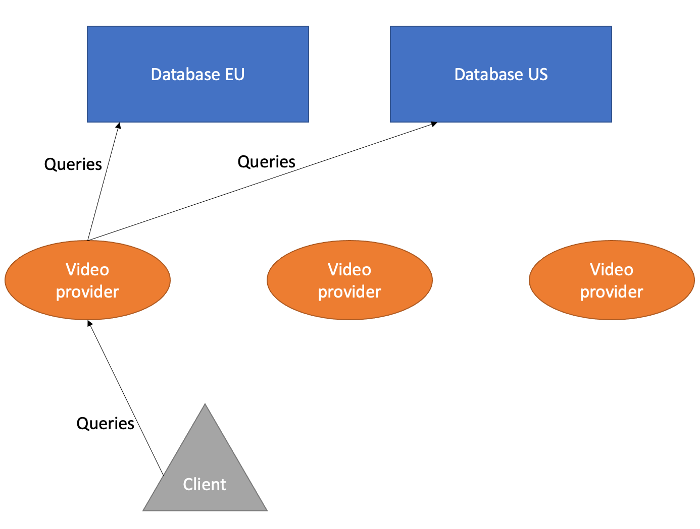

# Question 4: Caching [31 points]

You have just been hired at Swengflix, a service that provides video streaming. Given the scale of the service, the
file (video file) provider is asynchronous, and it is distributed over multiple _provider nodes_.

Your task as a new software developer is to work on the _video provider_. Every provider node is a video provider. The
Swengflix distribution network is designed with numerous provider nodes. All provider nodes query one of two _databases_
. Together, the two databases contain the entire Swengflix video library. A Swengflix client never queries a database
directly, only a provider node. One can think of provider nodes as data proxies.

Here is a schema representing the architecture:

    

In its current state, the video provider simply forwards file requests to the EU database. You need to let the video
provider query from both databases. In case both databases have the requested video file, the video provider should
always forward the result coming from the database that responds first. The provider should propagate exceptions in case no
database delivers the requested file. You can assume that both `Futures` (from the EU and US databases) eventually
complete.

Additionally, providers should provide a caching feature. They store the **2 video files most recently** requested by any caller of the provider. You have to use the _LRU_ policy for cache eviction. You
may assume that the databases are immutable, i.e. the database content (video files) never changes.

**NOTICE**: Points may be subtracted for changing code that should stay untouched, especially if doing so renders the
video provider useless, or changes its intended purpose (or that of any other component of the Swengflix distribution
system).

**IMPORTANT**: The `App.java` file is not a part of the exercise. It may be useful for checking that your solution
works as intended but you are **not required** to write any code into it. `App.java` will **not be graded**.

> :information_source: Use `./gradlew run` (or `gradlew.bat run` on Windows) to run the application.

- _You get 6 points if the video provider can query both databases correctly._
- _You get 13 more points if you handle Futures correctly._
- _You get 12 more points if your caching solution works as described above._

