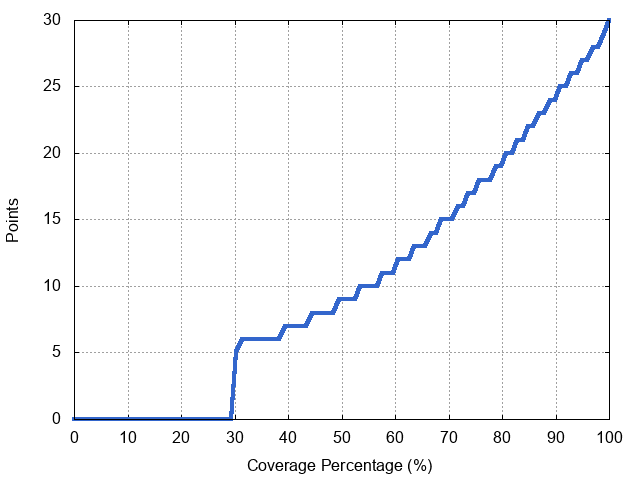

# Part 1: Practice [60 points]

In this part of the midterm, you will write two classes. Note that, as is usual in SwEng, the problem itself is fairly easy to reason about, and what really matters is that your code employs solid software engineering principles:

- Write correct and rock-solid code.
- Write tests for your code; aim for 100% line coverage. We provide a sample test case to ease the creation of further tests.
- Follow the SwEng coding conventions, write readable and concise code, and use comments judiciously.

We provide you with a project that can be opened and worked on in Android Studio, and built with Gradle.  
You are free to use any editor of your choice, as long as the code and tests build using `gradlew build`.

**Do not modify in any way the public interface of the code that is given to you**, not even to add checked exceptions. We will use many automated tests when grading; if we cannot build and run your code, you will receive 0 points.

Your code should fail-fast, throwing adequately specific runtime exceptions (or custom versions of these):
- When implementing known interfaces, follow their prescribed exceptions.
- Throw `IndexOutOfBoundsException` for any kind of index whose value is too low or too high.
- Throw `IllegalArgumentException` for arguments (other than indexes) whose value is invalid.
- Throw `IllegalStateException` for operations that fail because of an object's current state.

## Part 1: `EuclideanVector` [30 points]

Implement a `EuclideanVector` class, whose skeleton is in `midterm/src/main/java/ch/epfl/sweng/EuclideanVector.java`. It represents a vector in a Euclidean vector space (in the linear algebra sense) as a sequence of scalars. As you might remember from your math courses, the basis of a vector space is a finite set of vectors B = { bi } (with _i_=1...n) that are linearly independent and span the entire vector space. We call _n_ the dimension of the space and of each vector in that space.

Implement the following methods:

- The constructor, which takes an array of integers
- `int value(int index)`, which returns the value of the scalar element at `index` (with `index` starting at 0 not at 1)
- `int dimension()`, which returns the dimension of the vector (i.e., its number of elements)
- `double norm()`, which returns the norm of the vector (i.e., its length in the vector space)
- `boolean isOrthogonalTo(EuclideanVector other)`, which returns true if this vector is orthogonal to the `other` vector, false otherwise
- The `Iterable<Integer>` interface, i.e. the `Iterator<Integer> iterator()` method, which iterates over all values in the vector, in order

The `EuclideanVector` class should be **immutable**: its contents cannot change after having been created.

`Solution:` See [midterm/src](midterm/src) for a sample solution.

## Part 2: `PointSpace` [30 points]

Implement a `PointSpace` class, whose skeleton is in `midterm/src/main/java/ch/epfl/sweng/PointSpace.java`. It represents a set of points around an origin point in three-dimensional Euclidean space. 

Implement the following methods:

- The constructor, which takes the coordinates of the `PointSpace`'s origin point
- `int size()`, which returns the number of unique points in the `PointSpace`; the origin is not a point in the point space, unless explicitly added via `addPoint()`
- `void addPoint(int x, int y, int z)`, which adds the point `<x,y,z>` to the `PointSpace`
- `double distanceToClosestPoint()`, which returns the distance between this `PointSpace`'s origin and the point in this `PointSpace` that is closest to said origin
- `double distanceToFarthestPoint()`, which returns the distance between this `PointSpace`'s origin and the point in this `PointSpace` that is farthest away from said origin
- `PointSpace combine(PointSpace other)`, which returns a `PointSpace` consisting of the union of this point space and the `other` point space (the two point spaces must have the same origin). The union is a one-time snapshot, i.e., subsequent changes in the original spaces should not be reflected in the combined space.

`Solution:` See [midterm/src](midterm/src) for a sample solution.

-----

## Grading

Your grade on the practice part of the exam consists of three components: correctness, coverage, and code quality. We assigned 30 points to each of correctness and coverage, and subtracted points for code that didn't meet SwEng quality standards.

### Correctness [30 points]

We wrote tests to check the correctness of your code. Many of these tests are without points: they simply give you more detailed feedback on your solution without penalizing you for not passing them.

#### `EuclideanVector` 

##### Functionality [8 points] 

- A single-element `EuclideanVector` should not be orthogonal to itself
- The `dimension` of a 10-element `EuclideanVector` should be correct *[1 point]* 
- `isOrthogonalTo` should return true if the vectors are orthogonal *[1 point]* 
- A 10-element `EuclideanVector` should be iterable
- The last element of a 10-element `EuclideanVector` should be accessible
- The `norm` of a single-element `EuclideanVector` should be correct
- `EuclideanVector` should be immutable *[1 point]*
- The element of a single-element `EuclideanVector` should be accessible
- A single-element `EuclideanVector` should be orthogonal to a single-element vector of 0
- The iterator of an empty `EuclideanVector` should be correct *[1 point]*
- The iterator of a 10-element `EuclideanVector` should be correct *[1 point]*
- A 10-element `EuclideanVector` should not be orthogonal to itself *[1 point]*
- The `norm` of a 10-element `EuclideanVector` should be correct *[1 point]*
- The first element of a 10-element `EuclideanVector` should be accessible *[1 point]*
- The `dimension` of a single-element `EuclideanVector` should be correct
- The iterator of a single-element `EuclideanVector` should be correct
- A single-element `EuclideanVector` should be iterable

##### Corner cases [0 points] 

- The `norm` of an empty `EuclideanVector` should return 0, or throw an exception
- The norm of a 10,000-element `EuclideanVector` of MAX_INTs should be correct
- Creating an `EuclideanVector` from a 1GB array should work
- A 10,000-element `EuclideanVector should not be orthogonal to itself
- An empty `EuclideanVector` should  be orthogonal to everything, or throw exceptions
- The values of an empty `EuclideanVector` should throw an `IndexOutOfBoundsException`
- The `iterator` of an empty `EuclideanVector` should be empty, or throw exceptions
- An empty `EuclideanVector` should have `dimension` 0, or throw an exception
- Integer overflows in `isOrthogonalTo` should not cause problems

##### Invalid arguments [7 points]

- An overflowing index for `value` should throw an `IndexOutOfBoundsException *[1 point]*
- A null EuclideanVector for `isOrthogonal` should throw an `IllegalArgumentException` *[1 point]*
- A negative index for `value` should throw an `IndexOutOfBoundsException` *[1 point]*
- Calling remove() on an `iterator` should throw an `UnsupportedOperationException` *[1 point]*
- Calling next() on an empty `iterator` should throw a `NoSuchElementException` *[1 point]*
- A null array in the constructor should throw an `IllegalArgumentException` *[1 point]*
- A vector of different dimension for `isOrthogonal` should throw an `IllegalArgumentException` *[1 point]*

#### `PointSpace` 

##### Functionality [11 points]

- An empty `PointSpace` should have `size` 0 *[1 point]*
- The `distanceToClosestPoint` for a `PointSpace` containing only its origin should be 0 *[1 point]*
- Combining `PointSpace`s should lead to a correct `distanceToClosestPoint` *[1 point]*
- Combining `PointSpace`s should not change either of them *[1 point]*
- Combining empty `PointSpace`s should lead to a `size` of 0
- A `PointSpace` containing its origin should have `size` 1
- `distanceToClosestPoint` should be correct *[1 point]*
- `distanceToFarthestPoint` should be correct *[1 point]*
- The `size` of a `PointSpace` should be correct when there are no duplicates *[1 point]*
- Combining `PointSpace`s (with duplicates) should lead to a correct size *[1 point]*
- The `distanceToFarthestPoint` for a `PointSpace` containing only its origin should be 0 *[1 point]*
- The `size` of a `PointSpace` should be correct when there are duplicates *[1 point]*
- Combining `PointSpace`s should lead to a correct `distanceToFarthestPoint` *[1 point]*

##### Corner cases [0 points] 
Tests to make sure your implementation handles all of the edge cases that can arise.

- `combine` should work with two 100,000-point spaces

##### [4 points] Invalid arguments

- `distanceToClosestPoint` on an empty space should throw an `IllegalStateException` *[1 point]*
- A space with a different origin for `combine` should throw an `IllegalArgumentException` *[1 point]*
- A null space for `combine` should throw an `IllegalArgumentException` *[1 point]*
- `distanceToFarthestPoint` on an empty space should throw an `IllegalStateException` *[1 point]*

### Coverage [30 points]

The code coverage score for your test suite is computed according to the following curve:

You get 0 points if coverage is less than 30%: the test we provided gets you almost there out of the box, and by testing basic features such as constructing a `PointSpace` and `add`-ing a point to it will easily get you over 30%. The rest of the curve rewards coverage according to a general estimate of how much effort it takes to reach that level of coverage.

### Code Quality

For this section, we manually looked at your code and assessed how well you observed the SwEng coding guidelines. Please see the grading report in your repo for details.
