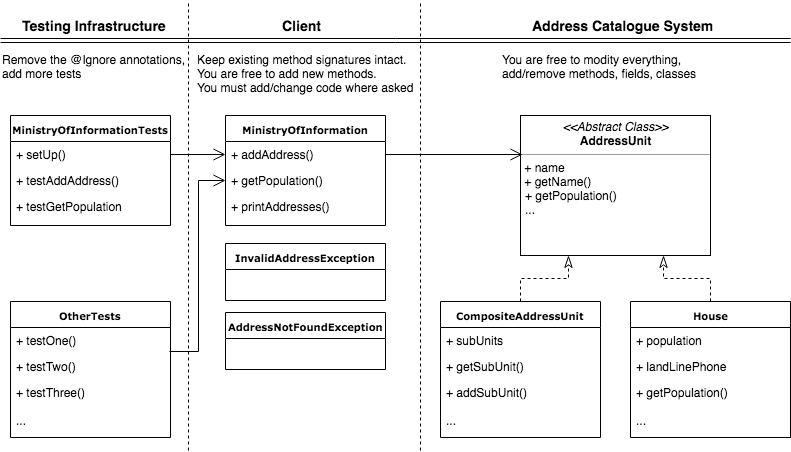

# CS305 – Software Engineering

## Midterm Exam

# Part 2: Practice [60 points]

You can find explanations to the solutions for the practical part of the examination below:

- [Question 1](#question-1-solution-explanation)
- [Question 2](#question-2-solution-explanation)
- [Question 3](#question-3-solution-explanation)

### Preamble

The Ministry of Information of Seychelles has placed you in charge of building an Address Catalogue System for them. This system is responsible for storing the addresses of all houses within their country. The address of any house in Seychelles is represented as a list of four strings: 

1. Country name
2. Island name
3. District name
4. House ID

An example address is: `["Seychelles", "Mahe", "Pointe La Rue", "1110"]`. 

As you have probably guessed by now, addresses form a hierarchy, i.e., one country consists of several islands, and an island consists of several districts, and each district contains several houses. To design this hierarchical system in an efficient yet flexible manner, you decide to use the Composite design pattern. The class hierarchy looks like this: 

 

Classes `AddressUnit`, `CompositeAddressUnit`, and `House` implement the Composite design pattern.
They form a tree-like structure, as in the following picture.
The red arrows show the address `["Seychelles", "Mahe", "Port Glaud", "111"]`:


The Class `MinistryOfInformation` represents the client and is used by the government to build upon the services provided by your system. This class uses an instance of the Address Catalogue System to perform a number of functions. 

In this exam, you will be working **ONLY** with the Address Catalogue System.
Under no circumstances are you allowed to change signatures of the existing methods in the class `MinistryOfInformation`.
If you do, you will receive 0 points for the practical problems.
You are free to _add_ new methods that you need, and you **must** add/modify code in the specified regions of the `MinistryOfInformation` class. 
Detailed information regarding what you can and cannot change can be found in the class hierarchy diagram above. 

The `MinistryofInformationTests` class contains a number of unit tests that you can use for different questions below. 

### Question 1: Find A House [15 points]

The `MinistryOfInformation` class uses the `findHouse` method to locate a house in the database.
This function is part of a public interface, and the inputs it receives cannot be assumed to be safe or compliant in any way.
Your first task is to implement this function while respecting the best defensive programming practices.
You should make sure that `findHouse`:

- returns a valid `House` for a valid address 
- throws the `InvalidAddressException` if the address provided is invalid (e.g., does not contain 4 strings)
- throws `AddressNotFoundException` if the address provided is valid but does not exist in the database.

Implement the function along with additional functions in other classes (if required), according to the Composite design pattern. Make sure the code cannot be crashed by providing bad inputs, i.e., either it returns a valid `House` object or throws one of `InvalidAddressException` or `AddressNotFoundException`.

#### Question 1: Solution Explanation

The composite DP requires that the class hierarchy performs the functionality of finding the House. Consequently, implementations that traverse the tree hierarchy in the [`MinistryOfInformation`](midterm/src/main/java/ch/epfl/sweng/MinistryOfInformation.java) class do not use the composite DP and lose points. 

The given solution implements the composite DP using the [`findUnit`](midterm/src/main/java/ch/epfl/sweng/AddressUnit.java#L70) method. This method recursively traverses the class hierarchy according to the given prefix. At each step, the [`checkAddress`](midterm/src/main/java/ch/epfl/sweng/AddressUnit.java#L42) method sanitizes the address and implements all the necessary checks for defensive programming. Modularizing these checks into a separate function allows the code to be reused for the further questions. In particular, this method checks for null addresses, incomplete addresses and individual strings in the prefix being empty or null. Finally, it checks if there exists a subUnit with the specified name. If the checks pass, the child node is found and the process continues until the prefix is exhausted. 
Finally, the [`findHouse`](midterm/src/main/java/ch/epfl/sweng/MinistryOfInformation.java#L39) method checks whether the prefix indeed specified a `House` and not a `CompositeAddressUnit`. 

### Question 2: Population Census [15 points]

The Address Catalogue System works so well that the Ministry of Information decided to reuse it for keeping track of Seychelles's population.

Each `House` object already keeps track of the number of people living there, in a field called `population`.
Your task is to implement a `getPopulation` method in the `MinistryOfInformation` class using the Composite design pattern.

The `getPopulation` method should report the total population for a given address prefix.
For example (numbers are arbitrary):

- `["Seychelles", "Mahe", "Pointe La Rue", "1110"]` -> `2` indicates that there is only a family of two living in this house
- `["Seychelles", "Mahe", "Pointe La Rue"]` -> `3172` indicates that the number of people living in the district Pointe La Rue is 3,172
- `["Seychelles", "Mahe"]` -> `95000` indicates that the population of the Mahe island in Seychelles is 95,000 
- `["Seychelles"]` -> `95843` indicates that the total population of the country of Seychelles is 95,843

Remove the corresponding `@Ignore` annotation in the `MinistryOfInformationTests` class to run the example unit test. 

#### Question 2: Solution Explanation

The solution can be logically broken down into two parts. First, the [`findUnit`](midterm/src/main/java/ch/epfl/sweng/AddressUnit.java#L70) method finds the `AddressUnit` specified by the prefix. This is done in the same manner as described in the previous solution. 

Second, the [`getPopulation`](midterm/src/main/java/ch/epfl/sweng/AddressUnit.java#L73) method returns the population for the subtree specified by the prefix. For a [`CompositeAddressUnit`](midterm/src/main/java/ch/epfl/sweng/CompositeAddressUnit.java#L102) this involves calling the `getPopulation` method recursively on all its children nodes and summing up the returned values; for a [`House`](midterm/src/main/java/ch/epfl/sweng/House.java#L31) this simply involves returning the population of that house. 

### Question 3: Message Broadcast [15 points]

Due to the success of the Address Catalogue System, the Ministry of Information has decided to use it for more and more purposes.
In particular, they want to use it to send letters to all houses within a given address prefix. 
To enable this new request, you decide to add functionality to print the full addresses of all houses in a given address prefix.

For example:

- `["Seychelles", "Mahe", "Pointe La Rue"]` -> Print the address of all houses in the district Pointe La Rue
- `["Seychelles", "Mahe"]` -> Print the address of all houses on the island of Mahe
- `["Seychelles"]` -> Print the address of all houses in the country of Seychelles

Each address should be printed in full (ordered from bigger to smaller address unit, e.g.: first country, then island, then district, then house) and on a new line with a comma and space between different divisions. For example:

```
Seychelles, Mahe, Port Glaud, 234
Seychelles, Mahe, Port Glaud, 432
```

Importantly, to maintain flexibility during the addition of new functionality, you decide to implement this new functionality using the Visitor design pattern. 
Normally, you would refactor the code to redo the `getPopulation` method as well, but for now, leave the `getPopulation`method as-is and only implement a visitor for the printing of all addresses within a prefix. 

You have been provided with the `AddressUnitVisitor` interface and a skeleton for the `PrintAddressesVisitor` class. 
Remove the corresponding `@Ignore` annotation in the `MinistryOfInformationTests`to run the example unit test.

#### Question 3: Solution Explanation

To implement the visitor DP, we add an `accept` method to both the [`CompositeAddressUnit`](midterm/src/main/java/ch/epfl/sweng/CompositeAddressUnit.java#L111) and [`House`](midterm/src/main/java/ch/epfl/sweng/House.java#L59) classes. Note, to ensure that the visitor DP is flexible and can incorporate new functionality, none of the functionality specific to printing addresses must be in the accept method. All of this functionality should be in the two [`visit`](midterm/src/main/java/ch/epfl/sweng/PrintAddressesVisitor.java#L31) methods in the [`PrintAddressesVisitor`](midterm/src/main/java/ch/epfl/sweng/PrintAddressesVisitor.java) class. 

Once again, the solution consists of two parts. First, just like the first question, the [`findUnit`](midterm/src/main/java/ch/epfl/sweng/AddressUnit.java#L70) method finds the `AddressUnit` specified by the prefix. Additionally, for this specific question, we also incorporate the prefix into the state of the visitor, so all addresses can be printed in full. This visitor state can be logically thought of as being representative of the depth traversed in the class hierarchy. Next, as mentioned before, we implement the rest of the functionality in the two [`visit`](midterm/src/main/java/ch/epfl/sweng/PrintAddressesVisitor.java#L31) methods. For a [`CompositeAddressUnit`](midterm/src/main/java/ch/epfl/sweng/PrintAddressesVisitor.java#L31) this involves adding the prefix of the node to the state of the visitor, calling the `accept` method on all its children and then finally removing its prefix so that its siblings in the hierarchy are unaffected. For a [`House`](midterm/src/main/java/ch/epfl/sweng/PrintAddressesVisitor.java#L45) this simply involves printing the prefix + the name of the house. 

### Question 4: Quality Assurance [15 points]

By this point you have implemented all the _functionality_ required for this exam. However, as a good SwEng student, you know that implementing new functionality is only part of the job. It is now time to check the robustness of your code by writing tests. 

Your final task is to write tests that achieve 95% statement coverage on all code in the `sweng.epfl.ch` package, including code written by you.

Grading: You will receive 0 points if coverage is below 85%. You will receive 15 points if your coverage is above 95%. In between these two, the number of points will be distributed according to an exponential curve that captures the fact that, the higher the coverage, the harder it gets to improve it. For example, 87% coverage earns you 4 points, 90% earns you 7 points, and 93% coverage earns you 12 points.

Remember that you can run `./gradlew test` and `./gradlew jacoco`, after which you can find coverage results in `midterm/build/reports/jacoco/test/html/index.html`. On Windows, use `gradlew.bat` instead of `./gradlew`.
 
