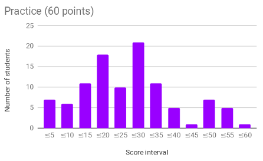
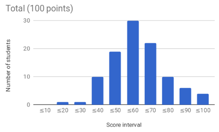

Software Engineering Midterm Exam (Fall 2018)

- [Exam statement](midterm.md)
- [Solutions to Practice questions](practice-solutions.md)
- [Solutions to Theory questions](theory-solutions.md)

The scores on this exam were distributed as follows:

