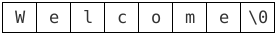

# C String Buffer Overlows

> The examples shown in this exercise depend largely on the compiler used and the protections it enforces. The examples here are obtained with GCC 9.1.0. Your outputs may slightly vary if you use another compiler, but the principles remain the same.

The goal of this exercise is to introduce you to security vulnerabilities in the C programming language's string processing functions.

Consider the following string:

```C
int main(void) {
    char my_string[] = "Welcome";
}
```

You can compile and run this example with the following commands

```bash
gcc -std=c11 example.c -o example
./example
```

This string contains 7 ASCII characters. Let's try to query what its size in memory is:

```C
#include <stdio.h>

int main(void) {
    char my_string[] = "Welcome";

    printf("sizeof(my_string) = %zu\n", sizeof(my_string));
}
```

If you compile and run the example, you'll see that the size of the string is not 7 bytes, but actually 8 bytes!

What happened under the hood? It turns out that the C programming language represents strings as *null-terminated* character arrays. This means a string is not just defined by its contents, but also by its end-of-string marker, the null character `'\0'`. The `my_string` variable above therefore has the following representation in memory.



Notice that strings in C do *not* store their length in any auxiliary field, but rather rely on the null character to determine where a string ends. The `string.h` header file in the C standard library defines many utility functions for string manipulation. All these functions *assume* that input strings are well-formed prior to calling them, i.e. they have a *non-checked* pre-condition that every string be  null-terminated.

The fact this pre-condition is unchecked resulted in the development of many security vulnerabilities where a string processing function from `string.h` was misused to access unintended data on the stack/heap of the machine on which the program was running.

For example, suppose we want to make a copy of a string into another string. The `string.h` library provides the following function which can do just that:

```C
#include <string.h>

char *strcpy(char *des, const char * src);
```

Let's try to use it to copy the characters of the `my_string` variable into the destination buffer:

```C
#include <stdio.h>
#include <string.h>

#define MY_STRING_LEN       (7)
#define MY_STRING_SHORT_LEN (2)

int main(void) {
    // We allocate 1 more entry than the "pure" length of the string to take the
    // null character into account.
    char my_string[MY_STRING_LEN + 1] = "Welcome";
    char my_string_short[MY_STRING_SHORT_LEN + 1];

    printf("my_string       = %s\n", my_string);
    printf("my_string_short = %s\n", my_string_short);

    strcpy(my_string_short, my_string);

    printf("my_string       = %s\n", my_string);
    printf("my_string_short = %s\n", my_string_short);
}
```

If you compile and run the code above, you get the following output (your output may vary for the initial value of `my_string_short` depending on what the uninitialized memory contents on your machine contain):

```
my_string       = Welcome
my_string_short = V
my_string       = come
my_string_short = Welcome
```

Observe that that `my_string`, which is the longer of the two strings, ends up transformed into `come`, and `my_string_short`, the smaller string, ends up becoming `Welcome`.

Can you explain what happened? You will need to read about how variables are allocated on the stack to understand what's going on.

The underlying issue is that the source string, `my_string` has a null-terminator, so `strcpy` knows how to copy its contents into the destination buffer `my_string_short`. However, `strcpy` is "dumb" and simply keeps on copying the source buffer into the destination buffer until a null character is seen in the source. For this to work correctly, the destination buffer needs to be large enough to contain the source string, but `strcpy` has *no information* about the length of the destination buffer, so it cannot enforce any safety here and just copy the 2 first characters of `my_string` (as we would have expected).

In conclusion, the `strcpy` function has a terrible interface and it's very difficult to do any form of safe defensive-programming with this function alone.

Fortunately, `string.h` also defines the `strncpy` function with a very similar signature as `strcpy`, but with an additional argument, `n`, which conveys the maximum number of characters to be copied. With this new function, it is possible to safely perform string copying routines without overrunning the destination buffer.

Rewrite the code above to use the `strncpy` function, then rerun the program. Do you still see weird behavior in the output?

In practice, if you gave the correct length argument to the `strncpy` function, then you should have correctly copied the first 2 characters of `my_string` into `my_string_short`.

In theory though, the `strncpy` seems like a safe function to call, but is it really? Can you come up with an example where `strncpy` actually produces an *invalid* string in the destination buffer? You'll need to read the fine-print of the `strncpy` function's documentation to answer this question.

```bash
man strncpy
```
