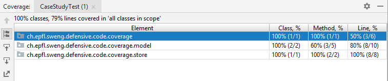
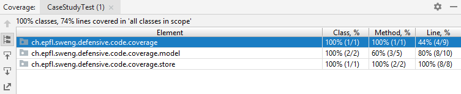
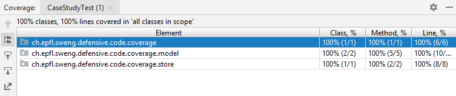

# How Defensive Programming affects Code Coverage
This exercise will teach you about **the interaction between defensive programming and code coverage**. This exercise will take the form of a case study. You will be given some bad, fragile code, i.e., code that breaks easily. This code will be subject to several refinements. It will evolve from being *brittle* to being *robust* while achieving *no decrease in code coverage*. This exercise will take you from the imperative to the functional paradigm while introducing Java 8's [Optional](https://docs.oracle.com/javase/8/docs/api/java/util/Optional.html) container object.

This exercise help you understand the impact that defensive programming has on code coverage. Code coverage is a measure used to describe the degree to which the source code of a program is executed when a particular test suite runs.

On the other hand, defensive programming protects your code from invalid inputs and barricades your program to contain the damage caused by errors.

You will now explore the interaction between code coverage and defensive programming. For that purpose, you will apply the principles of defensive programming to a code snippet and eventually evolve it from the imperative to the functional paradigm.

### Prerequisites
This exercise assumes you have a working IntelliJ environment or you use some tools that allow you to run tests and collect code coverage reports.

### Java 8's Optional
Since JDK 1.8, Java introduced the [Optional](https://docs.oracle.com/javase/8/docs/api/java/util/Optional.html) container object with the purpose of providing a type-level solution for representing optional values instead of using null references.

There are several ways of creating and using Optional objects.

To create an empty Optional object:

```java
Optional<String> opt = Optional.empty();
```

To create a non-empty Optional object:

```java
Optional<String> opt = Optional.of("Hello, world!");
```

To create an Optional for a possibly null object:

```java
Optional<String> opt = Optional.ofNullable(object);
```

To check if there is a value in it or not:

```java
Optional<String> opt = Optional.ofNullable(object);
if (opt.isPresent()) { /* ... */ }
```

To run some code on the wrapped object if a value is present:

```java
Optional<String> opt = Optional.ofNullable(object);
opt.ifPresent(str -> System.out.println(str));
```

To get the value of the wrapped object:
```java
Optional<String> opt = Optional.ofNullable(object);
String str = opt.get();
```

> You should avoid using the `get` method in general. The latter would require a call to `isPresent` beforehand. The goal of Optional is rather to use `map`, `flatMap`, and `ifPresent` which apply transformations to an object if the `Optional` contains an element. This enables the programmer to write code with less conditional branches which can help influence code coverage (as we will see below).

To transform the wrapped object into another wrapped object:
```java
Optional<String> opt = Optional.ofNullable(object);
Optional<Integer> optInt = opt.flatMap(str -> Integer.valueOf(str));
```

For further details, see the [Optional API](https://docs.oracle.com/javase/8/docs/api/java/util/Optional.html).

### Case study

In the following sections, you will change some lines of code, run a test suite, and observe the interaction between defensive programming and code coverage. To this end, you are given a Java project along with a test suite.

Get familiar with the code base. Also, have a look at the test suite.

#### Warmup

Consider the [demonstrate](src/main/java/ch/epfl/sweng/defensive/code/coverage/CaseStudy.java#L8) method of [CaseStudy.java](src/main/java/ch/epfl/sweng/defensive/code/coverage/CaseStudy.java):

```java
String code = "The code";
Course course = Courses.findByCode(code);
Lecturer lecturer = course.getLecturer();
String name = lecturer.getName();
System.out.println(name);
```

Run the test suite.


The test passes. The code coverage of [CaseStudy.java](src/main/java/ch/epfl/sweng/defensive/code/coverage/CaseStudy.java) reaches **100%**. The overall code coverage also reaches **100%**.

#### Breaking the code

This code can obviously break with **NullPointerException** if any term is null. You will break the code now.

```java
String code = "A code";
Course course = Courses.findByCode(code);
Lecturer lecturer = course.getLecturer();
String name = lecturer.getName();
System.out.println(name);
```

Replace `String code = "The code";` by `String code = "A code";` in [CaseStudy](src/main/java/ch/epfl/sweng/defensive/code/coverage/CaseStudy.java#L9). Run the test suite.



The test fails. A **NullPointerException** is thrown. The code coverage of [CaseStudy.java](src/main/java/ch/epfl/sweng/defensive/code/coverage/CaseStudy.java) drops to **50%**. Some lines are actually never reached during the test run. For the same reason, the overall code coverage drops to **79%**.

#### Checking for null

A typical way of avoiding the **NullPointerException** would be doing the following:

```java
Course course = Courses.findByCode(code);
if (course != null) {
  Lecturer lecturer = course.getLecturer();
  if (lecturer != null) {
    String name = lecturer.getName();
    if (name != null) {
      System.out.println(name);
    }
  }
}
```

This is ugly and brittle, and it's easy to miss some null checks. You can also expect the code coverage to decrease.

Add checks for null in [CaseStudy.java](src/main/java/ch/epfl/sweng/defensive/code/coverage/CaseStudy.java). Run the test suite.



The test still fails because of a **NullPointerException**. The code coverage of [CaseStudy.java](src/main/java/ch/epfl/sweng/defensive/code/coverage/CaseStudy.java) drops again, but this time to **44%**. The overall code coverage drops to **74%**.

An `if` statement actually adds a node in the decision tree of your program. In other words, it introduces two branches: one branch for when the condition is true, and one branch for when the condition is false.

You gain robustness at the cost of complexity.

#### Using Java 8's Optional

Let's try with Java 8's Optional:

```java
Optional<Course> optionalCourse = Courses.findByCode(code);
if (optionalCourse.isPresent()) {
  Course course = optionalCourse.get();
  Optional<Lecturer> optionalLecturer = course.getLecturer();
  if (optionalLecturer.isPresent()) {
    Lecturer lecturer = optionalLecturer.get();
    Optional<String> optionalName = lecturer.getName();
    if (optionalName.isPresent()) {
      String name = optionalName.get();
      System.out.println(name);
    }
  }
}
```

This isn't a lot better than null checks. Some might argue that it makes your intent clearer, but in the end there isn't much of a difference, because null checks are pretty obvious in these kinds of situations.

Use Java 8's Optional to make the code above compile. For that, you will need to change a few things in [Course.java](src/main/java/ch/epfl/sweng/defensive/code/coverage/model/Course.java#L16) , [Lecturer.java](src/main/java/ch/epfl/sweng/defensive/code/coverage/model/Lecturer.java#L10) , and [Courses.java](src/main/java/ch/epfl/sweng/defensive/code/coverage/store/Courses.java#L18) . You can use `Optional.ofNullable` to return Optional objects. Run the test suite.


The test obviously fails again. However, the code coverage of [CaseStudy.java](src/main/java/ch/epfl/sweng/defensive/code/coverage/CaseStudy.java) drops to **33%** this time. This is due to the additional lines of code added in [CaseStudy.java](src/main/java/ch/epfl/sweng/defensive/code/coverage/CaseStudy.java). The overall code coverage also drops to **66%**.

The problem lies in the code logic itself—it's typical imperative programming: you call a function, get the returned value, and take a decision based on the latter.

Object-oriented programming and dynamic polymorphism are useless here and don't apply to this code pattern.

#### Using the functional way

Let's try "the functional way":

```java
Courses.findByCode(code)
  .flatMap(Course::getLecturer)
  .flatMap(Lecturer::getName)
  .ifPresent(System.out::println);
```

Transform the code of [CaseStudy.java](src/main/java/ch/epfl/sweng/defensive/code/coverage/CaseStudy.java) in the "functional way". Run the test suite.


Again, the test fails. Nevertheless, the code coverage of [CaseStudy.java](src/main/java/ch/epfl/sweng/defensive/code/coverage/CaseStudy.java) now reaches **100%**. The reason is that you got rid of the `if` statements, i.e. the branches of the decision tree of the program. However, the overall code coverage is only of **91%** as the test run does not go through all the project's code.

#### Reaching an overall code coverage of 100%

Put back `String code = "The code";` in [CaseStudy.java](src/main/java/ch/epfl/sweng/defensive/code/coverage/CaseStudy.java). Run the test suite.



The test passes again at last. The only difference from before lies in the overall code coverage which reaches now **100%**.

By using Optional, and never working with null, you can avoid null checks altogether. Furthermore, with the functional paradigm, you can also avoid adding new branches in the decision tree of your program.

The code becomes clearer, less error-prone, robust, and simple.

> While this is true on the surface, in practice `Optional` just hides the very same branch you got rid of. The code coverage will surely increase. The complexity will remain the same under the hood, though. Therefore, keep in mind that `Optional` improves correctness by making it harder to make mistakes, not by decreasing total complexity.

### Tasks

Reading this and changing things here and there were your only tasks. You are aware now that defensive programming certainly impacts code coverage.

You completed the exercise. Congrats!
