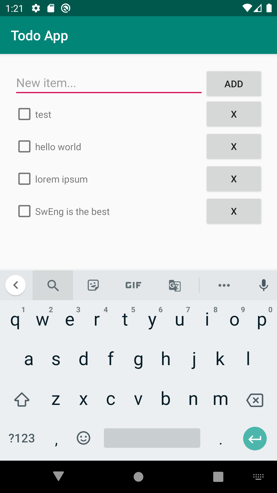
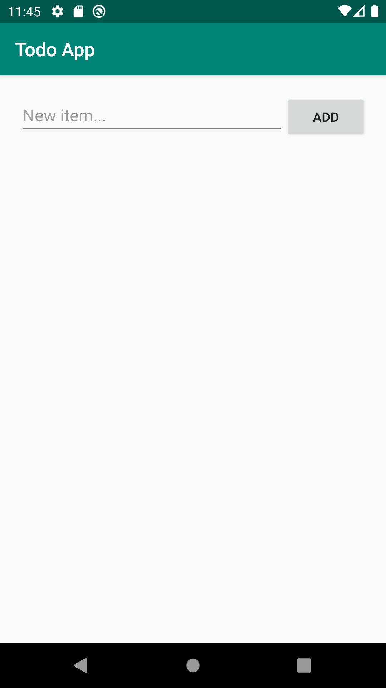

# Exercise 8

In this exercise, you will create a simple Android app MVP-style from scratch (no stubs :stuck_out_tongue:)!

We will create a todo app using the standard library and the MVP architecture that will look like this:



1. Fire up Android Studio and hit `Start a new Android Studio project`.

2. In the `Create New Project` window, select `Empty Activity` and click `Next`

3. Fill in the project settings:
    - Name: Todo App
    - Package name: ch.epfl.sweng.todoapp
    - Save location: {wherever you want to save the project, make sure to create the folder first}
    - Language: Java
    - Minimum API level: API 21: Android 5.0 (Lollipop)
    - [ ] This project will support instant apps
    - [x] Use androidx * artifacts

4. Hit `Finish` and wait for Android Studio to index the files.

Once the process is finished, you will see several subfolders in the `Project` view on the left: most notably `java` where the logic lives, and `res` which will store our assets and layout declarations.


5. Navigate to `res/layout/activity_main.xml`. This is where you define the UI layout of your screen (i.e. the View in MVP). Since we want to understand MVP from a code point of view, switch the tab at the bottom to `Text`. The visual editor is useful for designers, but the true representation of Layout objects in Android is using [XML](https://en.wikipedia.org/wiki/XML). You are looking at the declarative code of a UI screen (i.e. there is no logic nor data stored in the view). In MVP, we want the view to be as dumb as possible. This allows strong decoupling of business logic and data storage, which is useful for unit testing, separation of concerns and task sharing.

Modify the XML with the following view hierarchy:

- ConstraintLayout (layout width and height: match parent, padding: 20dp)
    - EditText (id: new_item_field, width: 0dp, height: wrap_content, hint: New item..., constraint left to left of parent, constraint right to left of add_button, constraint top to top of parent)
    - Button (id: add_button, width: wrap content, height: wrap content, text: Add, constraint right to right of parent, constraint top to top of new_item_field)
    - ScrollView (width: match parent, height: 0dp, constraint bottom to bottom of parent, constraint left to left of parent, constraint top to bottom of new_item_field)
        - LinearLayout (id: item_list, width and height: match parent, orientation: vertical)

If are coding correctly, you should see the preview on the right being updated as you type. Properties of the view objects are quite self-explanatory (albeit sometimes unintuitive. Feel free to ask a TA about the semantics).

6. Make sure that you have a virtual device set up (Tools > AVD manager). Then, hit the run button (or Run > Run 'app'). Wait for the emulator to start, the build to finish and for the APK to install. You should now see something like this:



7. We will also create a view to hold each item of the todo list. Each such view will display the name of the item, a checkbox to mark it and a delete button. Right-click on `res/layout/` and hit New > XML > Layout XML File. Name it `item_viewholder` and use `androidx.constraintlayout.widget.ConstraintLayout` as the root tag. Edit the layout with what we just mentionned:

- ConstraintLayout (width: match parent, height: wrap content)
    - CheckBox (id: item_checkbox, width and height: wrap content, constraint bottom to bottom of parent, constraint left to left of parent, constraint top to top of parent)
    - TextView (id: item_text, width: 0dp, height: wrap content, constraint bottom to bottom of parent, constraint left to right of item_checkbox, constraint right to left of item_delete_button, constraint top to top of parent)
    - Button (id: item_delete_button, width and height: wrap content, text: X, constraint bottom to bottom of parent, constraint right to right of parent, constraint top to top of parent)

8. We are done with the view declarations. Let us now define the models, which will encode business logic. First, create a package in `java/ch.epfl.sweng.todoapp/` (right-click > New > Package) and name it `models`. Inside, create a file (right-click > New > Java class), name it `TodoItem.java`.

9. In this class, define a `Status` enum which can be `CURRENT` or `DONE` to model the state of a todo item. Now to the `TodoItem` class, add a name and status property, a constructor, and a getter/setter for status.

10. Create a new `DataStore.java` model that will simply contain an `ArrayList<TodoItem>`. This will model the state of our application (trivial in this case, but it may model database access or network calls in more complex apps).

11. In true MVP fashion, we will now glue everything together by taking care of the Presenter. Remember that in MVP, the Presenter is a complete middleware between the Model and the View. Go back to `ch.epfl.sweng.todoapp` in `MainActivity.java`. In traditional Android MVP, Activities (and Fragments) roughly translate to the Presenter. We will be treating it as such.

You will notice that the onCreate method is already defined. This is Android boilerplate to bind the previously defined `activity_main.xml` as the actual layout to display in this Activity. More information on [the Android activity lifecycle](https://developer.android.com/guide/components/activities/activity-lifecycle).


12. First, initialize the datastore as a MainActivity member.

13. We will now bind our "New item" text field and its adjacent button to actually add an item to our data store. Wire up a click listener to the add_button, which will create a new model from the value in the new_item_field and add it to the datastore (hints: you may find the [findViewById](https://developer.android.com/reference/android/app/Activity.html#findViewById(int)), [Button](https://developer.android.com/reference/android/widget/Button) and [EditText](https://developer.android.com/reference/android/widget/EditText) API references useful. Also, where should you put the binding(s)?).

14. Now we must also update the display with the new item. Once the TodoItem is added to the data store, also obtain a View object from our previous `item_viewholder.xml` using [getLayoutInflater](https://developer.android.com/reference/android/app/Activity.html#getLayoutInflater()) and the [LayoutInflater](https://developer.android.com/reference/android/view/LayoutInflater.html) API. Then, update its text with the new item name (hints: findViewById can be called on an existing view) and add it as a child to the LinearLayout.

If everything went well, you should now be able to compile and run the project again, and add new items to your todo list.


15. Bind the CheckBox so that it also modifies the state of the TodoItem.

16. Bind the delete button so that it effectively removes the item. Don't forget to update the state and the view!

These last 2 steps describe the biggest issue with the MVP design pattern: State and View must be manually kept synchronized at all times with the Presenter. Failure to reflect changes in either the View or the Model will induce errors in the correctness of the program, respectively in the displayed data or the stored data.

We will now write instrumented tests for our user interface. The goal of such tests is to only test the _behaviour_ of our application without explicitely testing its implementation. In other words, we will write tests that simulate user behaviour.

17. Navigate to Gradle Scripts > `build.gradle (Module: app)`. Find the `dependencies` section and add:

```groovy
    androidTestImplementation 'androidx.test:rules:1.2.0'
    androidTestImplementation 'androidx.test:runner:1.2.0'
```

Then hit File > Sync project with Gradle files.

18. Navigate to `java/ch.epfl.sweng.todoapp (androidTest)` and `ExampleInstrumentedTest.java`. Add the following rule as a member of your ExampleInstrumentedTest, this will launch the activity automatically before every test.

```java
    @Rule
    public ActivityTestRule<MainActivity> rule = new ActivityTestRule<>(MainActivity.class);
```

Also, remove the `@RunWith(AndroidJUnit4.class)` annotation at the top of the class, as it creates conflicts when instantiating the test runner.

19. You can now write test by declaring public functions annotated with `@Test`. We will be using the [Espresso framework](https://developer.android.com/training/testing/espresso) to write instrumented test. Implement test function `addTodoItem` that types "Hello world!" into the new_item_field EditText, presses the add_button, and then checks that there exists a view with id item_text with matching text "Hello world!"

20. You can now run the test by right-clicking on the file in the Project view and click Run ExampleInstrumentedTest. The tests will start on the emulator (or your physical device) and you will be able to monitor them while they are being performed.

21. Write another test that checks that the remove button does its job, by adding several entries, pressing one remove button, and checking that the correct item is not displayed anymore. (hint: [allOf](https://developer.android.com/training/testing/espresso/recipes) may be useful here).