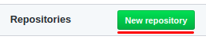
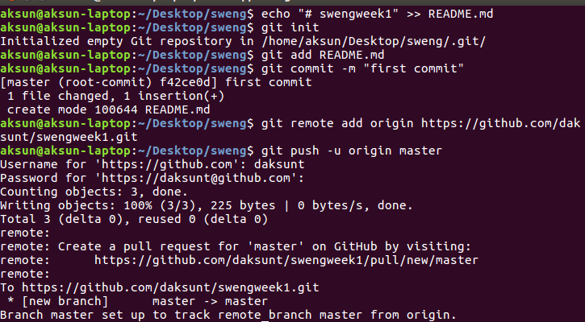
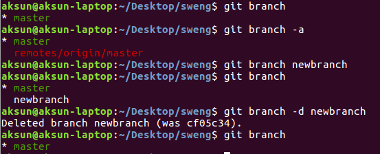
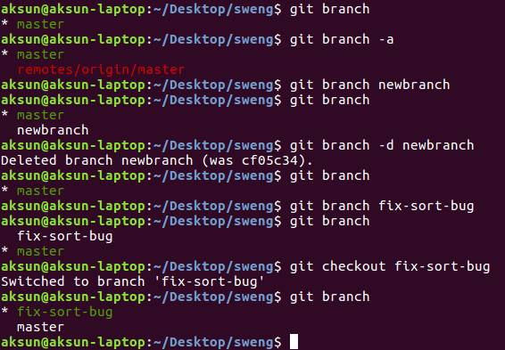
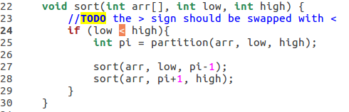
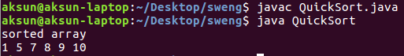
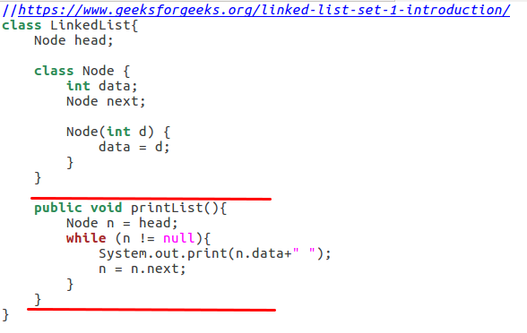
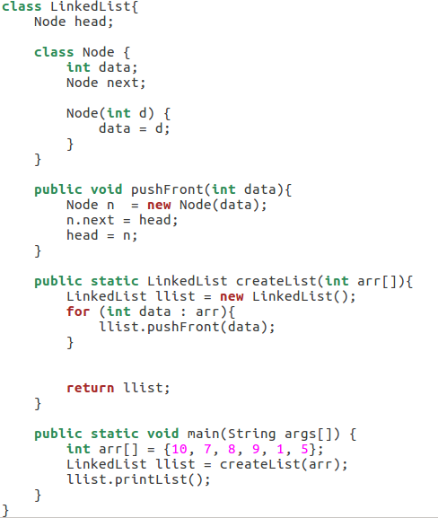
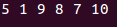
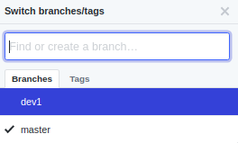

#### Disclaimer for the dear readers
If you are unsure about how a git command works, definitely use Google or pay a visit to StackOverflow. You can also check the [Git manual](https://git-scm.com/docs) for in-depth explanation of the commands. If it is too hard to keep track of all the git commands, then please refer to the [Git commands document](https://services.github.com/on-demand/downloads/github-git-cheat-sheet.pdf).

# An easy way to develop based on the git model  
In this exercise, we will see a workflow model to use git for application development. This workflow should provide a consistent way to implement new features and fix bugs while avoiding conflicts with other developers.  Let's first go over a simple example, which demonstrates this workflow in high-level.  

 from [2](https://nvie.com/posts/a-successful-git-branching-model/).

We will go over the figure starting with the smallest unit and finally seeing how these components interact. Let's assume there is an application that makes an animal sound when a button is pressed. Let's assume that the release version of this application is based on the yellow chain of nodes. When developers make changes to the application and when these changes are big enough, they commit these changes. In the figure above each commit is a node of the graph.

Each commit represents the state of the committed application at the time of the commit. Commits allow versioning and by choosing a particular commit, developers can go back to the previous versions of the application. 

Developers might want to avoid conflicts with each other's work, they might want to test out and implement different features, or they might want to fix bugs. For this purpose, they create *branches*. In the figure below, nodes that are chained and have the same color signify a *branch*.  

As an example, let's start with the Bob's rectangle. Bob wants to add a new button to the application so that the application will make a cat sound when the button is pressed. He can create a new branch (red node chain which represents this branch) for this button.  Then he can implement this feature, let's say within three commits (three chained red nodes). After ensuring that the feature is stable enough, he can then *merge* it to the main (yellow) branch (final red node chained with the final yellow node). This way, he lowers the risk of of corrupting the main (yellow branch) while adding the new feature.   

If Bob directly worked on the main yellow branch and if he was careless with his work, this could have created a mess for other collaborators, which can be burdensome to fix. In other words, Bob works in the red branch, and yellow branch is safe until the merging operation. If the red branch is ok, but if a problem occurs after the merge, then all Bob or any other developers need to do is undo the merge. This simplifies localizing programming errors.  

Here we have to pay attention to the *merge* keyword. *Merging* is basically porting the code differences from one branch to another so that code features that are available in one branch are also available in the other one. In Bob's case, merging allows the yellow branch to have the button that makes the cat sound. The problem here is that merging is not completely automatic and might require manual intervention. We will see this case shortly.

There is one problem remaining. Bob wants to work with other developers, such as Alice, David and Clair. For that, he pushes his code to a remote repository which is denoted as origin. In the scope of SwEng, origin can be thought as the repository in Github. For cooperation, the developers push to the origin repository. When they want to see the changes, they pull from origin, then continue to do their own modifications. In the figure above, each rectangle signifies a git directory where a version of the application lives, where history of the application can be available. In other words, each user has its own local repository where they make their changes and there is one origin remote repository. This is particular for git as git a *distributed* version control system.  
  
## Branches and Merging in-depth  
Before delving into exercises, let's go over the workflow model based on branches and merging in-depth. For simplicity, think in terms of two branches where you migrate differences from one branch to the other. Then, when one branch has progressed enough, carry the changes to the other branch. The figure below summarizes this approach.  

 from [2](https://nvie.com/posts/a-successful-git-branching-model/).

There is one *master* branch, which can be used for release or keeping a stable version of the application and a *develop* branch, which is used for code development such as adding new features or bug fixes. In real life, it is not that black and white and you have to modify this approach to your own needs. For example, assuming there are 3 developers, there can be one remote master branch. The first two developers might collaborate using a remote dev1 branch. They will have their local versions of dev1. They can do modifications on it and push it to remote dev1. They can also pull from the remote master to the local, merge the local changes from the dev1 and then push it to the remote master for release. The third developer might want to work by himself, so he works in his local branch dev2. The third developer can also pull from the remote master, merge the changes from dev2 into the local master branch and push it back to the remote master.   

There are other models.  These choices are stylistic and there are no hard constraints. Do whatever suits your needs. Always remember that you want to avoid working on the same files/directories with other developers as much as possible to avoid conflicts.  
  
There is one more concept that is worth mentioning before starting the exercises, which is *HEAD*. *HEAD* basically represents the current active branch of the repository.  When the developer is committing to a branch, that branch has to be checked out and the *HEAD* should point to the latest commit in that branch.   
  
### Guided Exercise  

#### Setting up  
1. In Github, create a new repository, any name is ok. For this exercise let's use **swengweek1**.




2. Open a terminal or a git shell and cd into a directory that you want to store the git directory.  
3. Enter the commands below                              

```sh  
echo "# swengweek1" >> README.md  
git init  
git add README.md  
git commit -m "first commit"  
git remote add origin https://github.com/<user-id>/<repo-id>.git #make sure user-id is your own, repo id is the name you have in the github. example https://github.com/daksunt/swengweek1.git  
git push -u origin master  
```  



4. Go to [exercises](./ex3). 


5. Download all java files into the git repository. One possible way, click to the file, go to raw, and right-click and save as to the git directory. Make sure the ending is *.java* . 


6. Open a terminal or a git shell and cd into the git repository.  
7. Add, commit and push the files.
```sh  
git add *.java
git commit -m "adding java files"  
git push  
```  


`git add` adds the java files to the git tracker. `git commit` is used for committing files.

#### Branch and Merge  
For this exercise we will use the [QuickSort](./QuickSort.java) file. Make sure this file is in your new git repository. Let's first view the branches.

`git branch` lists all the local branches.
```sh  
git branch 
```  



To see all the branches including the remote ones use the `-a` flag.  
```sh  
git branch -a  
```  

Let's try creating a branch. Type `git branch <branch name>` to create a new branch, where `<branch name>` is a string without spaces. 
```sh  
git branch newbranch
git branch  
```  
  
Now let's delete this branch. Type `git branch -d <branch name>` to delete the particular branch.
```sh  
git branch -d newbranch  
git branch  
```  
  
Now we know how to create and delete branches, let's start development.  
  
In `QuickSort` file there is a bug.  We would like to fix the bug.  We might mess up the code in master branch, which can have an effect on the other developers.  We do not want this to happen, so we need to create a new branch.
```sh  
git branch fix-sort-bug  
git branch
```  



To make sure that you are working on the new branch, you need to checkout that branch.  
```sh  
git checkout fix-sort-bug 
git branch
```  

Pay attention to the asterisk which signifies the current active branch.
  
* Alternative method: Instead of first creating a branch, then checking out, you can do it with one command.  
```sh  
git checkout -b fix-sort-bug  
```  
Pay attention to the asterisk.  
  
Now, we created a branch for development.   We want to fix the code.  Open `QuickSort` file in a text editor of your own choice.  Go to line 24 and replace the $>$ operator with $<$ operator. 

  
  
If you want, you can test the results with the commands below:
```sh  
javac QuickSort.java  
java QuickSort  
```    



Now we need to add this file to the commit.
```sh  
git add QuickSort.java 
git status  
```  


* Note: If you want to add everything, just do `git add .` and all the files within the directory will be added.

  Then we commit all the modifications.  
```sh  
git commit -m "Fixing sorting algorithm"  
```  

Let's see all the commits that affect the `QuickSort` file.
```sh  
git log --follow -- QuickSort.java  
```  

We can also see the commits for the current branch  
```sh  
git log  
```   


 
Now we want to merge the fix into the main branch and delete the bug fix branch since we are done.
```sh  
git checkout master
git merge fix-sort-bug 
git branch -d fix-sort-bug  
git push
```  


* [Final QuickSort File](QuickSortFinal.java)

Since there are no conflicts, it should work automatically.  
   
#### Branch and Merge with conflicts  
In this section, we will go over a more challenging version of the branching and merging model.  

**Conflict**: If the same file is changed separately in two different branches and when a merge is done between two branches, a conflict will occur. The developer needs to resolve this conflict manually.  
  
For this exercise we will use the [LinkedList](./LinkedList.java) file. Make sure this file is in your new git repository. Let's say we want to add printing feature. Create and checkout a new branch. *Beware you need to modify the LinkedList class*.
```sh  
git checkout -b dev1  
```  


Add the code below into the LinkedList class.
* Note: The code to add are available in [add_to_linkedlist.txt](add_to_linkedlist.txt) 



```java  
public void printList(){  
    Node n = head; 
    while (n != null){ 
        System.out.print(n.data+" "); 
        n = n.next; }
    }
}  
```  

Commit the changes. 
```sh  
git add LinkedList.java 
git status  
git commit -m "Adding printing"  
```  

Your new feature is in.  But wait, somebody else might have committed to the master branch.  Let's simulate this by going back to master and committing into it directly. *Beware you need to modify the LinkedList class*.
```sh  
git checkout master  
```  


Add this code into the LinkedList class.
```java  
public void pushFront(int data){  
    Node n  = new Node(data); 
    n.next = head; 
    head = n;
}  
  
public static LinkedList createList(int arr[]){  
    LinkedList llist = new LinkedList(); 
    for (int data : arr){ 
        llist.pushFront(data); 
    }  

    return llist;
}  

public static void main(String args[]) {  
    int arr[] = {10, 7, 8, 9, 1, 5}; 
    LinkedList llist = createList(arr); 
    llist.printList();
}  
```  


  
Then commit into the master branch directly to simulate a merge by someone else.  
```sh  
git add LinkedList.java
git status  
git commit -m "Adding main and create list"  
```  

* Note: If you want to rollback completely to a previous state and delete all the changes use:  
```sh  
git log
git reset --hard <commit-id>
```  

`git log` is useful to get *commit ids* of previous commits. Note that *commit id* is represented as a hash value. 

Before merging let's check the differences. Let's start by checking the differences between commits within the local master branch.
```sh  
git log master..dev1  
git diff master..dev1  
```  


Observe what is different between two branches and make sure it makes sense.
  
You can also view other version differences. The commands are given below:  
```sh  
git log  
git diff <commit-id> 
git diff <commit-id1> <commit-id2>
```  

Now when you want to do a merge, since the LinkedList.java file was modified concurrently by different developers, you will get a conflict. You need to resolve this conflict. You want to merge your changes into the master branch.
```sh  
git merge dev1  
```  


Open the *LinkedList.java* file in your git repository and there will be lines with "<<<<<<< HEAD" and ">>>>>>> dev1". These arrows show the code part that came from which branch. Modify the code to look like how you want it to be correct. change [from](21.png) to [to](22.png)

Check the changes.
```sh  
javac LinkedList.java
java LinkedList
```  



Commit.
```sh  
git add LinkedList.java
git status  
git commit -m "merging with main branch, adding printList feature"  
```  


* [Final LinkedList File](LinkedListFinal.java)

In the end, the best idea is to avoid conflicts as much as possible by working on separate tasks.  Let's finish the exercise by checking the master branch and pushing the differences to the remote repository.  
```sh  
git pull  
git push  
```  
  
#### Tracking remote branches  
If you push a different branch to a remote repository, that branch will be created in the remote.  Use *git fetch* to get those remote repositories if it does not exist.  
  
Do:
```sh  
git checkout dev1  
git push --set-upstream origin dev1  
git checkout master  
```  


  
Then delete dev1:  
```sh  
git branch -d dev1  
git branch  
```  
  
You need to create a local branch of the remote dev1 which will be used to track the changes in the remote dev1.  
```sh  
git checkout dev1  
```  

You can see the *dev1* branch in github too.



### Useful resources  
1. [https://git-scm.com/book/en/v2/Git-Branching-Basic-Branching-and-Merging](https://git-scm.com/book/en/v2/Git-Branching-Basic-Branching-and-Merging)
2. [https://nvie.com/posts/a-successful-git-branching-model/](https://nvie.com/posts/a-successful-git-branching-model/)
3. [https://guides.github.com/introduction/flow/](https://guides.github.com/introduction/flow/)