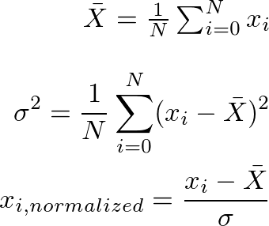

# Modularizing code

Modularity allows us to divide an application into smaller, independent parts. This has a lot of advantages, such as producing code that can be tested more easily, allows for division of work, etc.

Consider the problem of normalizing a list of doubles you get from a file, as you might have done in statistics, using the following formulas:



### Ex 1.1

Suppose this is the function we wrote to solve that problem. How would you modularize it?

```java
public static List<Double> normalizeNumbers(String inputFilename) throws FileNotFoundException {
       File file = new File(inputFilename);
       Scanner scanner = new Scanner(file);
       List<Double> numbers = new ArrayList<>();
       while(scanner.hasNextDouble()) {
           double number = scanner.nextDouble();
           numbers.add(number);
       }
       double sum = 0;
       for(double f: numbers) {
           sum += f;
       }
       double mean = sum / numbers.size();
       double sumSquare = 0;
       for(double f: numbers) {
           double diff = f - mean;
           sumSquare += diff * diff;
       }
       double std = Math.sqrt(sumSquare / numbers.size());
       List<Double> normalized = new ArrayList<>();
       for(double f: numbers) {
           normalized.add((f - mean) / std);
       }
       return normalized;
   }
```

### Ex 1.2

Write a few tests to make sure your modules work. You should still get the same values as before.
