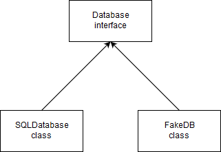

# API swappability

## 1. The `Database` interface

We simply need to write abstract functions that satisfy the requirements :

```java
interface Database {
    public User getUser(string username);
    public List<Post> getPostsOfUser(string username);
}
```

This will serve as common contract between the different concrete database implementations.

## 2. Database classes hierarchy

We simply want our concrete classes to satisfy the contract. By implementing the previous interface, we force the children to define the required functions.



## 3. Concrete implementations

For the SQL database, we just need to move the code to a new class (say `SQLDatabase`)

```java
public class SQLDatabase implements Database {
    public User getUser(string username) {
        // get user from database
        String sql = "SELECT * FROM users WHERE users=" + username;
        ResultSet rs = new Connection(SQL_CONFIG).query(sql);
        return User.from(rs);
    }

    public List<Post> getPostsOfUser(string username) {
        // get list of posts from database
        String sql = "SELECT * FROM posts WHERE to=" + username;
        ResultSet rs = new Connection(SQL_CONFIG).query(sql);
        return Post.listFrom(rs);
    }
}
```

We then simply translate these calls to the NoSQL implementation

```java
public class FakeDatabase implements Database {
    public User getUser(string username) {
        return FakeDB.get<User>("users", username);
    }

    public List<Post> getPostsOfUser(string username) {
        return FakeDB.get<List<Post>>("posts", username);
    }
}
```

## 4. Modifying the database calls

We first use dependency injection, so that instantiating the kind of database is someone else's problem (the caller). The type of the injection is of course the generic `Database` interface.

Then, we simply remove the database-specific code and replace it by the dedicated generic function call.

```java
class AuthService {
    // hold dependency
    private Database db;

    // inject in constructor
    public AuthService(Database db) {
        this.db = db;
    }

    public boolean authenticate(string username, string password) {
        // get user from database
        User user = db.getUser(username);

        // check if password is correct
        String userHash = HashLibrary.hash(password);
        return userHash == user.passwordHash;
    }
}
```

```java
class FeedPageGenerator {
    // hold dependency
    private Database db;

    // inject in constructor
    public AuthService(Database db) {
        this.db = db;
    }

    public View create(string username) {
        // get list of posts from database
        List<Post> posts = db.getPostsOfUser(username);

        // create a new view
        View v = new View();
        // append posts
        for (final Post p : posts) {
            v.append(new TextView(p.content));
        }
        // return view
        return v;
    }
}
```

## 5. Instantiating the database

Now we add the database an an app component. We will only instantiate the concrete database here once.
Then, we pass the dependency to the other components.

```java
class App {
    // App components
    Database db = new FakeDatabase();
    AuthService as = new AuthService(db);
    FeedPageGenerator fpg = new FeedPageGenerator(db);
    ViewController ctrl = new ViewController();

    public void main() {
        // display login page, wait for user input
        ctrl.display(new LoginScreen());
        // react to login attempt
        ctrl.onLogin((username, password) -> {
            // check for correct name / password
            if (as.authenticate(username, password)) {
                // generate the user feed and display it
                View postsPage = fpg.create(username);
                ctrl.display(postsPage);
            }
        })
    }
}
```

Swapping the database is as simple as replacing :

```java
    Database db = new FakeDatabase();

    by

    Database db = new SQLDatabase();
```

# Going further

## 1. Asynchronous API change

Now we need to pass a function around to define what happens when the database has fetched the object. This entails 2 changes to the interface signature :

1. Adding the callback as an argument : although Java > 8 now has lambdas as call site constructs, it still does not support functions as first class citizens. Hence we need to define a functional interface (an interface with a single method) so that we have a type for our lambda as argument (this interface would generally be given by the new API of the database, otherwise we simply need to chain the function calls).

```java
interface DatabaseCallback<T> {
    public void onObjectFetched(T object);
}
```

2. Changing the return type : since the call is asynchronous, the function call returns immediately without any object. The fetched data is passed to the callback as its argument when the query terminates.


So now we can transform our interface with the modified method signatures :


```java
interface Database {
    public void getUser(string username, DatabaseCallback callback);
    public void getPostsOfUser(string username, DatabaseCallback callback);
}
```

We can now re-implement the NoSQL database and simply transfer the callback :

```java
public class FakeDatabase implements Database {
    public void getUser(string username, DatabaseCallback callback) {
        FakeDB.get<User>("users", username, callback);
        return;
    }

    public void getPostsOfUser(string username, DatabaseCallback callback) {
        return FakeDB.get<List<Post>>("posts", username, callback);
        return;
    }
}
```

We also re-implement the SQL database. Writing synchronous code with asynchronous constructs simply means calling the callback at the end of the function :

```java
public class SQLDatabase implements Database {
    public void getUser(string username, DatabaseCallback callback) {
        // get user from database
        String sql = "SELECT * FROM users WHERE users=" + username;
        ResultSet rs = new Connection(SQL_CONFIG).query(sql);
        User user = User.from(rs);
        callback.onObjectFetched(user);
        return;
    }

    public void getPostsOfUser(string username, DatabaseCallback callback) {
        // get list of posts from database
        String sql = "SELECT * FROM posts WHERE to=" + username;
        ResultSet rs = new Connection(SQL_CONFIG).query(sql);
        List<Post> posts = Post.listFrom(rs);
        callback.onObjectFetched(posts);
        return;
    }
}
```

We also need to change the call sites : since the API is now asynchronous, we also need to pass a callback when the authentication resolves

```java
class AuthService {
    // hold dependency
    private Database db;

    // inject in constructor
    public AuthService(Database db) {
        this.db = db;
    }

    public void authenticate(string username, string password, DatabaseCallback callback) {
        // get user from database
        db.getUser(username, (user) -> {
            // check if password is correct
            String userHash = HashLibrary.hash(password);
            callback(userHash == user.passwordHash);
        });
    }
}
```

The same goes for the feed page generator, where we define what happens asynchronously after the posts are fetched and displayed :

```java
class FeedPageGenerator {
    // hold dependency
    private Database db;

    // inject in constructor
    public AuthService(Database db) {
        this.db = db;
    }

    public void create(string username, DatabaseCallback callback) {
        // get list of posts from database
        db.getPostsOfUser(username, (posts) -> {
            // create a new view
            View v = new View();
            // append posts
            for (final Post p : posts) {
                v.append(new TextView(p.content));
            }
            // return view
            callback(v);
        });
    }
}
```

Hence we also need to modify the call site of the components' functions :

```java
class App {
    // App components
    Database db = new FakeDatabase();
    AuthService as = new AuthService(db);
    FeedPageGenerator fpg = new FeedPageGenerator(db);
    ViewController ctrl = new ViewController();

    public void main() {
        // display login page, wait for user input
        ctrl.display(new LoginScreen());
        // react to login attempt
        ctrl.onLogin((username, password) -> {
            // check for correct name / password
            as.authenticate(username, password, (status) -> {
                if (status) {
                    // generate the user feed and display it
                    fpg.create(username, (postsPage) -> {
                        ctrl.display(postsPage);
                    });
                }
            });
        });
    }
}
```

## 2. Implementation with the Future monad

We've set our first foot in the [callback hell](http://callbackhell.com/). We can already see that our last code snippet has become quite convoluted and wide. We could name our lambdas and write them outside of their call site but this would kind of defeat the whole purpose of lambdas. Fortunately, modern programming techniques have brought us new tools to solve these modern issues.

The Future monad (implemented by CompletableFuture in Java >= 8) is an object that represents an asynchronous computation being made (a network operation, a disk access, a task on a thread). A Future can either be pending (computing), resolved with a successful value (of the wanted type) or failed. The Future can be processed on call site (as opposed to a lambda passed as argument) by calling `thenApply` (or another `then*` derivative). Futures can be chained, which allows us to express a sequence of codes that are waiting for each other. Error handling is also simplified as the original error in chained Futures can be called with a single `exceptionally` call at any stage of the resolution, or by using `handle` in which we can specify actions both for success and failure.

We first change our interface API such that both functions return a Promise that we can handle on call site and remove the now unnecessary function parameter :

```java
interface Database {
    public CompletableFuture<User> getUser(string username);
    public CompletableFuture<List<Post>> getPostsOfUser(string username);
}
```

In the FakeDatabase implementation, we first create the CompletableFutures. They are resolved when the database returns the value, which means when the asynchronous callback of the query is called. Hence we complete the future with the final value inside the query callback. We can then return the future object.

```java
public class FakeDatabase implements Database {
    public CompletableFuture<User> getUser(string username) {
        // create the future object
        CompletableFuture<User> future = new CompletableFuture<>();
        FakeDB.get<User>("users", username, (user) -> {
            // resolve the future when we get the value
            future.complete(user);
        });
        return future;
    }

    public CompletableFuture<List<Post>> getPostsOfUser(string username) {
        // create the future object
        CompletableFuture<List<Post>> future = new CompletableFuture<>();
        FakeDB.get<List<Post>>("posts", username, (posts) -> {
            // resolve the future when we get the value
            future.complete(posts);
        });
        return future;
    }
}
```

We can do the same in the SQLDatabase implementation. The Future here is simply resolved at the end of the function (note that a Future can be first resolved synchronously and then still be handled later).

```java
public class SQLDatabase implements Database {
    public CompletableFuture<User> getUser(string username) {
        // create the future object
        CompletableFuture<List<Post>> future = new CompletableFuture<>();
        // get user from database
        String sql = "SELECT * FROM users WHERE users=" + username;
        ResultSet rs = new Connection(SQL_CONFIG).query(sql);
        future.complete(User.from(rs));
        return future;
    }

    public CompletableFuture<List<Post>> getPostsOfUser(string username) {
        // get list of posts from database
        CompletableFuture<List<Post>> future = new CompletableFuture<>();
        String sql = "SELECT * FROM posts WHERE to=" + username;
        ResultSet rs = new Connection(SQL_CONFIG).query(sql);
        future.complete(Post.listFrom(rs));
        return future;
    }
}
```

We can now modify the call sites to handle these futures when they succeed. Since the components execute some other code afterwards, we can simply call `thenApply` which will be called once the value is ready, then it will run the given lambda and finally wrap the returned value in another Future (this allows chaining multiple Futures, as executing the lambda resolves the returned Future). Again, we can also delete the callback. We also do not forget to return this chained Future.

```java
class AuthService {
    // hold dependency
    private Database db;

    // inject in constructor
    public AuthService(Database db) {
        this.db = db;
    }

    public CompletableFuture<Boolean> authenticate(string username, string password) {
        // get user from database and handle the resolved future, also return the chained future
        return db.getUser(username, (user)).thenApply((user) -> {
            // check if password is correct
            String userHash = HashLibrary.hash(password);
            // this next return statement is automatically wrapped into a CompletableFuture<Boolean>
            return userHash == user.passwordHash;
        });
    }
}
```

We do the exact same thing for the FeedPageGenerator :

```java
class FeedPageGenerator {
    // hold dependency
    private Database db;

    // inject in constructor
    public AuthService(Database db) {
        this.db = db;
    }

    public CompletableFuture<View> create(string username) {
        // get list of posts from database and handle the resolved future, also return the chained future
        return db.getPostsOfUser(username).thenApply((posts) -> {
            // create a new view
            View v = new View();
            // append posts
            for (final Post p : posts) {
                v.append(new TextView(p.content));
            }
            // return view automatically wrapped into a CompletableFuture<View>
            return v;
        });
    }
}
```

We can finally rewrite the app such that no more callbacks are passed around, but all Futures are resolved on site. Note that we replaced the if statement with an `Optional` monad as we need to express the absence of action as a value since `thenApply` needs to return something even if the user is not authenticated.

```java
class App {
    // App components
    Database db = new FakeDatabase();
    AuthService as = new AuthService(db);
    FeedPageGenerator fpg = new FeedPageGenerator(db);
    ViewController ctrl = new ViewController();

    public void main() {
        // display login page, wait for user input
        ctrl.display(new LoginScreen());
        // react to login attempt
        ctrl.onLogin((username, password) -> {
            // check credentials
            as.authenticate(username, passowrd))
            .thenApply(status -> {
                // handle future and wrap the view in an optional
                if (status) { return Optional.of(fpg.create(username)); }
                else { return Optional.empty(); }
            })
            .thenApply(viewOption ->
                //  handle chained future, display page if logged in
                viewOption.ifPresent(postsPage -> ctrl.display(postsPage))
            );
        });
    }
}
```

Of course, the readability gain here is not obvious here since the example code was already quite small.