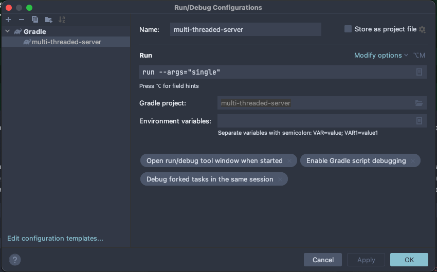

# Multi-threading in web servers

In this exercise, you will write two versions of a simple HTTP server: a single-threaded and a multi-threaded one. Then, you will evaluate their performance in terms of latency and throughput.

## Building a simple HTTP server with the Spark Framework

To build the server, you will use the [Spark Framework](https://sparkjava.com), an easy-to-use Java web framework that minimizes boilerplate code.

To listen to GET requests to `http://localhost:4567/hello`, you just need to write:

```java
import static spark.Spark.*;

public class HelloWorld {
    public static void main(String[] args) {
        get("/hello", (req, res) -> "Hello World");
    }
}
```

Your job is to create a server that:

1. Receives GET requests to the `/loop` API endpoint
2. Upon request, loops through all integers from 0 to `Integer.MAX_VALUE` (to simulate some server-side work)

The multi-threaded version has to use a thread pool of size 4, and should handle each request on a separate thread.

You can run the server with `./gradlew run --args="single"` or `./gradlew run --args="multi"` (to run the single threaded and the multi threaded respectively). You can also run it directly from IntelliJ IDEA/Android Studio (after importing the Gradle project). To do so, you would need to add a new configuration that passes arguments as follows:



## Performance testing

For measuring latency and throughput, you will use [Locust](https://locust.io), an open-source, widely used load and performance testing tool.

To get started, install Locust by running `pip install locust` in your terminal.

Locust, in contrast with other similar tools, allows to define user behavior as a simple Python script. For instance, the following script `locustfile.py` simulates a user executing a HTTP GET request to a `/about` endpoint:

```python
from locust import HttpUser, task

class User(HttpUser):
    @task
    def about(self):
        self.client.get("/about")
```

Then, to run a new test:

1. Run `locust` in your terminal (in the same directory as the `locustfile.py`)
2. Go to the [web interface](http://0.0.0.0:8089)
3. Specify the number of total users to simulate, their spawn rate and the target host
4. Hit "Start swarming": Locust will run the load test and display useful statistics and charts in the web UI
5. To stop the test, hit the "Stop" button

Your job is to:

1. Run a performance test on both versions of the server with 100 users and a spawn rate of 10 users per second. Let the test run for a minute
2. Inspect the final results
3. Answer the following questions: what is the relationship between latency and throughput? Which version of the server is better? Why?
