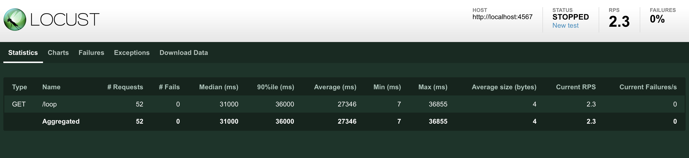
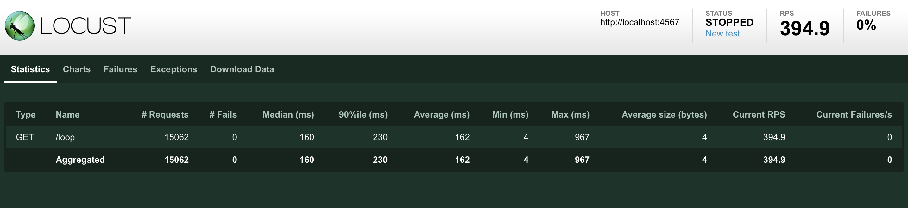

# Multi-threading in web servers

## Performance testing solutions

These are the results for the single-threaded and multi-threaded version, respectively (numbers may vary, depending on your machine):

The number of requests per second corresponds to the throughput, while, for example, "Average (ms)" corresponds to the average latency per request.

As you can see, latency and throughput are inversely proportional in our setting.

The multi-threaded version of the server drastically outperforms the single-threaded one, serving more requests in a second (~395 vs ~2.5) with a lower latency (~160 ms vs ~27000 ms). This is the case because the single-threaded version, which performs the computation on the same thread that receives the request, can only handle one request at a time, and thus successive requests get queued and have to wait. In the multi-threaded implementation, instead, the computation for each request is carried out by a different thread, and thus the main thread does not have to wait.
