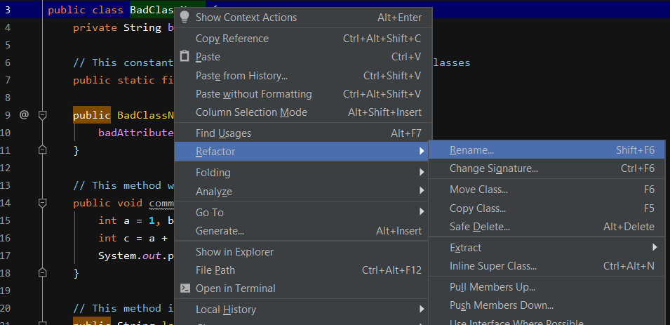

# Refactoring with IntelliJ

By now you've probably realized how tedious it can be to refactor everything by hand. Luckily, many modern IDEs offer tools to help you be more efficient. In this exercise we will be using the [IntelliJ](https://www.jetbrains.com/idea/) IDE.

> :information_source: Please note that we are using the Ultimate version 2019.2. If you have a different version, there might be slight differences in the layout and/or design.

## Example

Fire up the IDE, and import the given project. You will be modifying the `BadClassName.java` file. You can also do some tests in the `App.java`'s `main` method.

The first issue to address is the terrible name of the class. If we were to do this manually we would have to:

- change the class name inside the file
- change the name of the actual file
- change all files where there the class was used (which includes imports, constructors, instance declarations, method parameters, ...)

And lets be honest, that can be a real pain.

IntelliJ takes care of all of this. All you need to do is right click on the name of the class and navigate to **Refactor > Rename...**. Type the new name, hit `Enter` to validate and voilà !

> :information_source: You likely noticed that you can also use a keyboard shortcut (`Shift+F6` in our case). Using these shortcuts can help you be even more productive when writing code.

## Exercise

Now it's your turn. Try right clicking on variables, methods, or blocks of code which you selected with your mouse and navigating to **Refactor**. Depending on where you right-click, IntelliJ will offer you different options. For example, selecting a piece of code inside a method would offer you the **Extract method** option.

You will find comments in the code to help you target the parts that need to be refactored, although by now you should be pretty good at identifying them by yourself :wink:.