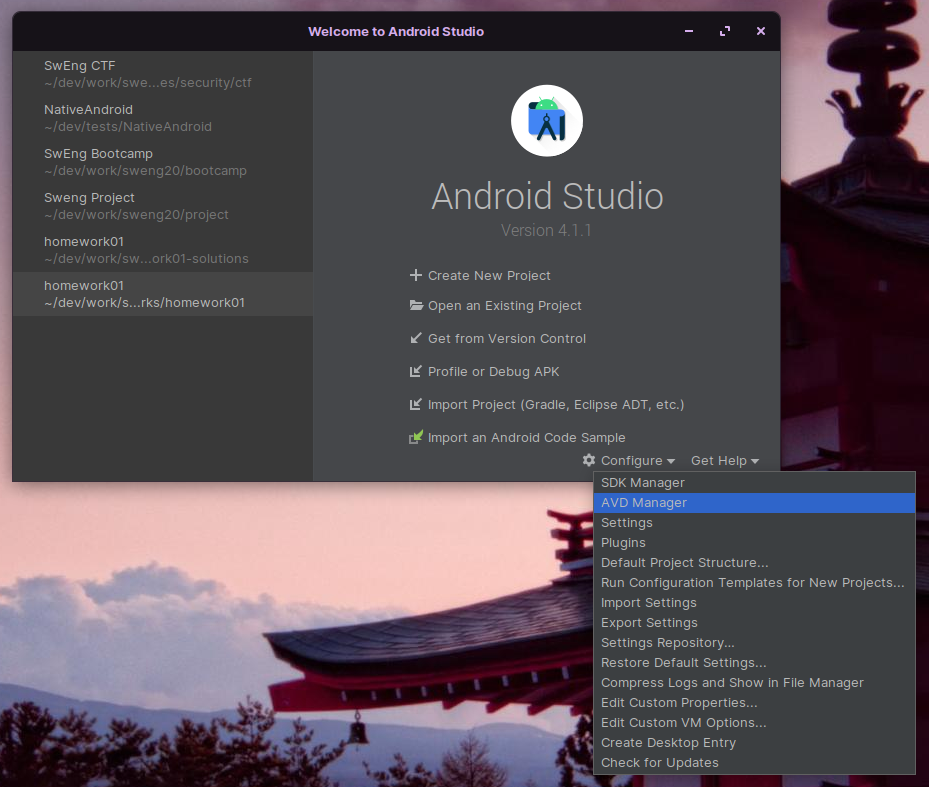

# SwEng CTF - Android Security

In this exercise, you will hack an Android app by exploiting common security vulnerabilities in Android mobile apps through a beginner-friendly capture the flag (CTF) game. This app contains a series of challenges, each illustrating a realistic attack vector in mobile security: each challenge hides a string flag, which you will need to uncover and submit in order to gain points, by inspecting the source code, playing with the app features and using external tools.

**Please do not attack the online leaderboard infrastructure, as we rely on third-party servers and services.**

## Getting started

First make sure that you have Android Studio with an Android emulator and API 30 installed on your computer. If not, follow the following steps:

### Android Emulator with API 30

1. Open Android Studio and select Configure > AVD Manager
    

2. Hit "Create Virtal Device..." in the bottom left

3. Select Phone > Pixel 2 and hit Next

4. If required, download the recommended "R" release (API Level 30). Then select it and hit Next

5. You can leave the default name. Hit Finish.

### Installing the CTF app

1. Download the CTF APK release on Moodle under the corresponding Security week.

2. From the AVD Manager (access it like step 1 of [the previous section](#android-emulator-with-api-30)), start your API 30 emulator using the green "Play" button.

3. Once your emulator has finished loading, drag-and-drop the APK file onto your emulator.
    

### Opening the project in Android Studio

This step is optional, as you can also browse the source on Github directly, however we recommend you use Android Studio so that you can easily navigate in the code with Ctrl + clicks. If you already are familiar with Android security, you can also try to solve the challenges without looking at the hints or the source code!

We distribute the **incomplete** source code of the app on this repo: source files related to the CTF infrastructure are not provided, as finding the flags would become trivial. However, we give you all the code you need to solve the challenges: you will need to read and inspect the code carefully in order to find bugs and weaknesses, understand the program flow and guess what could go wrong. Thus, you cannot compile the project yourself, but you can navigate in the files with your IDE.

1. Clone this repository somewhere on your machine
    ```
    git clone https://github.com/sweng-epfl/public.git
    ```

2. Open Android Studio and select "Open an Existing Project". Navigate to the repository and then to subfolder `exercises/security/ctf`. Make sure to select the `ctf` folder **and not the `app` folder**!
    
    

3. In the Project pane on the left, select the "Android" view in the top scrolling menu
    

4. Source files in Android projects are organized as follows:
    - The source code is available under `app/java/ch.epfl.sweng.ctf` and `app/cpp` in the left hierarchy.
    - Assets are available under `app/assets/` and `app/res/` respectively
    - We provide links to the Github repo in the challenge hints themselves: you will also find the same file structure in the project itself.

Remember that this is also an exercise in *reading code*: you will need to struggle and understand code that does not belong to you in order to break it.

The most important files are:

- [ChallengesRepository.kt](https://github.com/sweng-epfl/public/blob/master/exercises/security/ctf/app/src/main/java/ch/epfl/sweng/ctf/repositories/ChallengesRepository.kt): contains all the main data and logic of all challenges
- [Challenge.kt](https://github.com/sweng-epfl/public/blob/master/exercises/security/ctf/app/src/main/java/ch/epfl/sweng/ctf/models/Challenge.kt): the types and documentation for the challenge definitions
- [ChallengeFragment.kt](https://github.com/sweng-epfl/public/blob/master/exercises/security/ctf/app/src/main/java/ch/epfl/sweng/ctf/fragments/ChallengeFragment.kt): handles general UI logic common to all challenges
- Of course, you will need to follow method calls, assets and inspect other source files to find the root cause of weaknesses. Each challenge has hints which will progressively spoil the solution, and provide the incriminated lines of codes on Github.


## GLHF!

Open the app on your emulator, follow the on-screen instructions and have fun!

If you are lost or stuck on a challenge, do not hesitate to take a look at the lecture notes, discuss with classmates, ask a TA or write a post on the course forum!

## Online Leaderboard

We also provide an online leaderboard to promote friendly competitivity.

**Please do not attack the online infrastructure, as we rely on third-party servers and services.**

If you find a way to get a flag that does not seem to be the intended vulnerability, let us know! We will be very happy to award bonus points for creative hackers.

The app is not supposed to crash. If you find any bug, weird behaviour or crash, please let us know on the course forum or in the [Github Issues](https://github.com/sweng-epfl/public/issues)! We will be very happy to improve our application.

## Miscellaneous

This software is licensed under the [GNU Affero General Public License v3](LICENSE), yada, yada.
