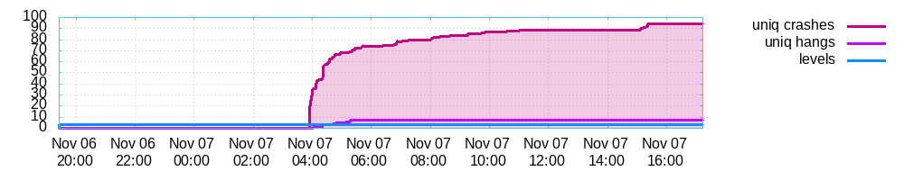
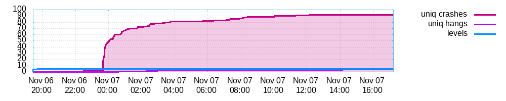
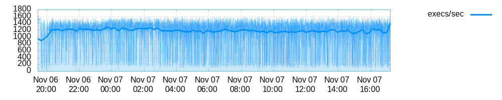
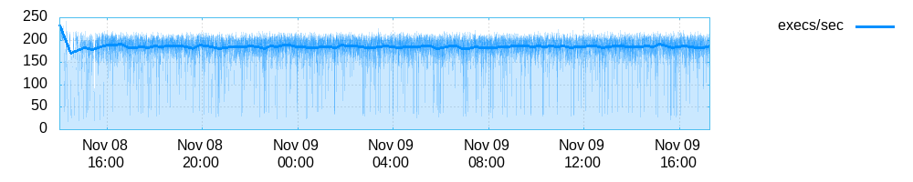
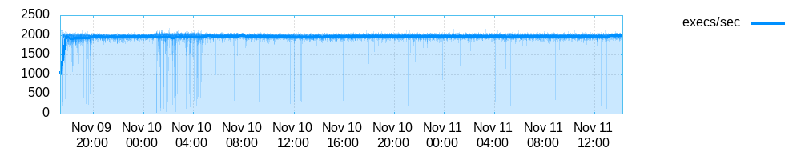

# Fuzzing

## Introduction

Most programs that parse user-supplied input expect this data to be in a
specific format. In a perfect world, these programs would reject ill-formed
input and terminate cleanly. Programming and perfection, however, are oxymorons:
in real life, most programs “break” by segfaulting when unexpected data
sequences are encountered. The goal of this lab is to test the robustness of two
binary parsers typically used in systems today (base64 and md5sum) using a
fuzzer, a tool which evolutionarily mutates program inputs until crashes occur.
Fuzzing turns out to be a technique very well-suited to test the robustness of
binary parsers and we will get acquainted with one such tool, AFL, under various
fuzzing scenarios:

1. Assembly-level instrumentation
2. Binary-level instrumentation
3. Compiler-level instrumentation

## Machine setup & methodology

The `afl-fuzz` tool expects as input (1) a binary under test; and (2) an input
file which will be mutated to trigger crashes. We ran experiments with two sets
of test strategies:

1. The first strategy consists of simply using an input file solely containing
   the word “fuzz” followed by a newline character.  This will help us see how
   deep our fuzzer can get with an input that can quickly be determined to be
   malformed.

2. The second strategy involves testing deeper program code. Since we want to
   test `base64`’s decoding procedures and `md5sum`’s checksum verification
   procedures, we need to start with valid base64-encoded files and valid md5
   checksum files as inputs to our fuzzer. We generated 100 random 512-byte
   input files using `/dev/urandom` for this purpose to which we then applied
   plain `base64` and `md5sum`. The results were saved in files and used as
   inputs to our fuzzer (In hindsight it turned out to be useless to generate so
   many input files as most of them were ignored by at runtime and labeled as
   “Some test cases look useless. Consider using a smaller set.”). The format of
   the md5 checksum files consists of a checksum, followed by the path to the
   file to which the checksum corresponds.  We made sure that all paths exist
   before launching the fuzzer to be sure `md5sum` doesn’t exit early due to not
   finding any file at the marked path.

All experiments were run on a dual-socket Intel Xeon E5-2680 v3 (24 cores, 48
threads, 2.50GHz). A 20 GB ramdisk was setup to prevent unnecessary wear to the
machine’s SSD and we leveraged `afl-fuzz`’s single-system master/slave
parallelization options to increase our fuzzing throughput. The various code
listings below show how to launch 4 instances of `afl-fuzz` due to space
constraints, but in reality we used 12 processes to run 4 experiments each time,
therefore allowing us to use all machine resources:

1. “fuzz” input on base64 decoding;
2. “fuzz” input on md5sum checksum verification;
3. well-formed input on base64 decoding;
4. well-formed input on md5sum checksum verification.

Although parallel fuzzing was used in all experiments, we only show the results
obtained by select workers which were able to trigger bugs as not all workers
were able to exhibit the same bug finding behavior.

## Fuzzing a binary instrumented at the assembly-level

In this task we fuzz a version of `base64` and `md5sum` compiled with AFL
instrumentation. In this setup, instrumentation is added at the assembly level
through a modified version of `gcc`, `afl-gcc`.

The bash script below gives an idea of how to launch parallel fuzzing instances
of the `md5sum` checksum verification on an instrumented binary. A similar
script was written for testing all other configurations.

```bash
#!/bin/bash -x

fuzz_in_md5='~/ramdisk/fuzz/in_md5'
fuzz_out_md5='~/ramdisk/fuzz/out_md5'

afl-fuzz -i ${fuzz_in_md5} -o ${fuzz_out_md5} -M master_fuzz_md5  md5sum-afl -c @@ &
afl-fuzz -i ${fuzz_in_md5} -o ${fuzz_out_md5} -S slave_fuzz_md5_0 md5sum-afl -c @@ &
afl-fuzz -i ${fuzz_in_md5} -o ${fuzz_out_md5} -S slave_fuzz_md5_1 md5sum-afl -c @@ &
afl-fuzz -i ${fuzz_in_md5} -o ${fuzz_out_md5} -S slave_fuzz_md5_2 md5sum-afl -c @@ &
```

It takes at least 8 hours for AFL to trigger a crash when `base64-afl` is run
with the unstructured `fuzz` input, whereas only 4 hours are needed with a valid
input file. From that point onwards, both input files slowly converge towards a
similar number of bugs found over time. The `fuzz` input version covered a total
of 471 paths and found 94 bugs, whereas the valid input version covered 486
paths, but found 92 bugs.  So an increased number of paths covered does not mean
that more bugs are forcefully found! It depends really on which paths you
followed throughout the program.

The images below show two `base64-afl` binaries fuzzed starting from the same
time under the different input files described earlier.


_Unique crashes and hangs over time for `base64-afl` when launched with `fuzz` input_


_Unique crashes and hangs over time for `base64-afl` when launched with valid input_

For `md5sum-afl` though, the situation is much less interesting as the fuzzer
could not find a single crash when the program was started with the `fuzz`
input. Furthermore, only 1 out of the 12 parallel instances of AFL we launched
with valid inputs for this experiment managed to trigger a bug (bug `#557`).

## Fuzzing an uninstrumented binary using QEMU

In this task we target binaries that were not compiled with `afl-gcc`. We take
the standard `base64` and `md5sum` binaries and run them through QEMU's
user-space emulation mode which inserts AFL instrumentation into the binary at
*runtime* through dynamic binary instrumentation (DBI).

The bash script below gives an idea of how we launched parallel instances of
this fuzzing experiment.

```bash
#!/bin/bash -x

fuzz_in_md5='~/ramdisk/fuzz/in_md5'
fuzz_out_md5='~/ramdisk/fuzz/out_md5'

afl-fuzz -Q -i ${fuzz_in_md5} -o ${fuzz_out_md5} -M master_fuzz_md5  md5sum-afl -c @@ &
afl-fuzz -Q -i ${fuzz_in_md5} -o ${fuzz_out_md5} -S slave_fuzz_md5_0 md5sum-afl -c @@ &
afl-fuzz -Q -i ${fuzz_in_md5} -o ${fuzz_out_md5} -S slave_fuzz_md5_1 md5sum-afl -c @@ &
afl-fuzz -Q -i ${fuzz_in_md5} -o ${fuzz_out_md5} -S slave_fuzz_md5_2 md5sum-afl -c @@ &
```

After 12 hours of fuzzing, we were able to trigger 30 bugs in `base64` (vs. 90+
bugs in the previous section with the binary instrumented with `afl-gcc`), but
we were unable to trigger any bug in `md5sum`. However, this reduced bug finding
performance is to be expected as QEMU adds an extra 2-5x overhead compared to a
standard binary due to the dynamic binary instrumentation that goes on under the
hood. We can observe the performance difference most easily by looking at the
number of program executions per second for the fuzzer that uses DBI vs.
standard binaries. We expect the fuzzing with QEMU to provide the same results
as for the instrumented binary, but it just needs to run for longer.


_Number of program executions per second over time for `base64` when launched with assembly-level instrumentation_


_Number of program executions per second over time for `base64` when launched with binary-level instrumentation using QEMU_

## Fuzzing a binary instrumented at the compiler-level

For this final section we instrument a binary using compiler-level
instrumentation (which takes place early in the compile phase, unlike the
previous assembly-level instrumentation which gets added at a very late phase of
the compilation process). Based on the documentation, the AFL authors claim that
the compiler can make many optimizations that are hard to pull off when manually
inserting assembly, and that as a result, some CPU-bound programs will run up to
around 2$\times$ faster.

The bash script below gives an indea of how we launched parallel instances of
this fuzzing experiment.

```bash
#!/bin/bash -x

fuzz_in_md5='~/ramdisk/fuzz/in_md5'
fuzz_out_md5='~/ramdisk/fuzz/out_md5'

afl-fuzz -i ${fuzz_in_md5} -o ${fuzz_out_md5} -M master_fuzz_md5  md5sum-llvm -c @@ &
afl-fuzz -i ${fuzz_in_md5} -o ${fuzz_out_md5} -S slave_fuzz_md5_0 md5sum-llvm -c @@ &
afl-fuzz -i ${fuzz_in_md5} -o ${fuzz_out_md5} -S slave_fuzz_md5_1 md5sum-llvm -c @@ &
afl-fuzz -i ${fuzz_in_md5} -o ${fuzz_out_md5} -S slave_fuzz_md5_2 md5sum-llvm -c @@ &
```

As a general observation, we found that the LLVM-compiled binaries are indeed
faster as we can perform more executions per second as shown in the figure
below:


_Number of program executions per second over time for `base64` when launched
with `afl-gcc` instrumentation_


_Number of program executions per second over time for `base64` when launched
with `afl-clang-fast` instrumentation_

However, the number of bugs found for `base64-llvm` (69) is lower than for
`base64-afl` (92).  There is, however, a sharp increase in the number of hangs
observed (30 vs. 4).

Finally, the number of queue cycles `afl-fuzz` goes through is much higher with
the LLVM-based instrumentation. At an equivalent time frame of 12 hours of CPU
time, we observe that the LLVM-based instrumentation goes through 4500 queue
cycles, whereas the GCC-based one only goes through 600. We don't think the
increased executions per second is the only explanation for this, but are unable
to find any other explanation.
