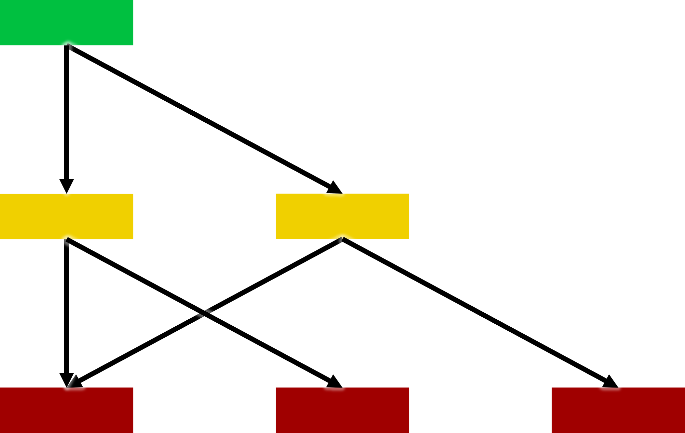
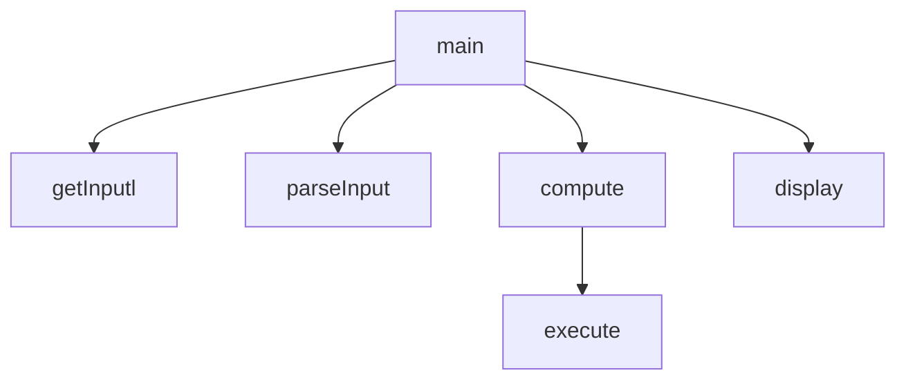
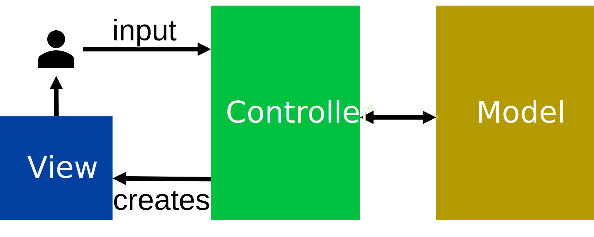
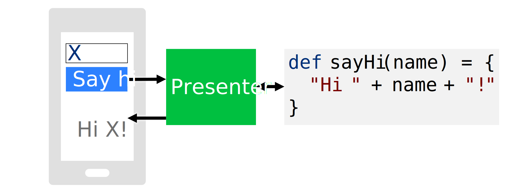
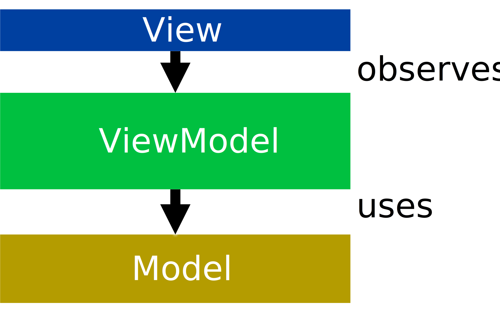
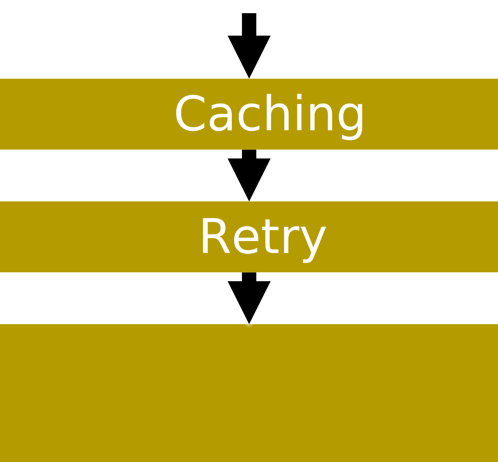

# Design

Imagine if, in order to display "Hello, World!" on a screen, you had to learn how everything worked.
You'd need to learn all about LED lights and their physics.
And then you'd need to read the thousands of pages in CPU data sheets to know what assembly code to write.

Instead, you can write `print("Hello, World!")` in a language like Scala or Python, and that's it.
The language's runtime does all the work for you, with the help of your operating system, which itself contains drivers for hardware.
Even those drivers don't know about LED lights, as the screen itself exposes an interface to display data that the drivers use.
Python itself isn't a monolith either: it contains sub-modules such as a tokenizer, a parser, and an interpreter.

Unfortunately, it's not easy to write large codebases in a clean way, and this is where _design_ comes in.


## Objectives

After this lecture, you should be able to:
- Apply _modularity_ and _abstraction_ in practice
- Compare ways to handle _failures_
- Organize code with _design patterns_
- Use common patterns for modern applications


## How can one design large software systems?

[Barbara Liskov](https://en.wikipedia.org/wiki/Barbara_Liskov), one of the pioneers of computer science and programming language design in particular,
once [remarked](https://infinite.mit.edu/video/barbara-liskov) that "_the basic technique we have for managing the complexity of software is modularity_".

Modularity is all about dividing and sub-dividing software into independent units that can be separately maintained and be reused in other systems: _modules_.
Each module has an _interface_, which is what the module exposes to the rest of the system. The module _abstracts_ some concept and presents this abstraction to the world.
Code that uses the module does not need to know or care about how the abstraction is implemented, only that it exists.

For instance, one does not need to know woodworking or textiles to understand how to use a sofa.
Some sofas can even be customized by customers, such as choosing whether to have a storage compartment or a convertible bed, because the sofas are made of sub-modules.

In programming, a module's interface is typically called an "API", which is short for "Application Programming Interface".
APIs contain objects, functions, errors, constants, and so on.
This is _not_ the same thing as the concept of an `interface` in programming languages such as Java.
In this lecture, we will talk about the high-level notion of an interface, not the specific implementation of this concept in any specific language.

Consider the following Java method:
```java
static int compute(String expr) {
  // ...
}
```
This can be viewed as a module, whose interface is the method signature: `int compute(String expr)`.
Users of this module do not need to know how the module computes expressions, such as returning `4` for `2 + 2`. They only need to understand its interface.

A similar interface can be written in a different technology, such as Microsoft's COM:
```cpp
[uuid(a03d1424-b1ec-11d0-8c3a-00c04fc31d2f)] 
interface ICalculator : IDispatch {
  HRESULT Compute([in] BSTR expr,
                  [out] long* result);
};
```
This is the interface of a COM component, which is designed to be usable and implementable in different languages.
It fundamentally defines the same concept as the Java one, except it has a different way of defining errors (exceptions vs. `HRESULT` codes)
and of returning data (return values vs. `[out]` parameters).
Anyone can use this COM module given its interface, without having to know or care about how it is implemented and in which language.

Another kind of cross-program interface is HTTP, which can be used through server frameworks:
```java
@Get("/api/v1/calc")
String compute(@Body String expr) {
  // ...
}
```
The interface of this HTTP server is `HTTP GET /api/v1/calc` with the knowledge that the lone parameter should be passed in the body, and the return value will be a string.
The Java method name is _not_ part of the interface, because it is not exposed to the outside world. Similarly, the name of the parameter `expr` is not exposed either.

These three interfaces could be used in a single system that combines three modules: an HTTP server that internally calls a COM component that internally calls a Java method.
The HTTP server doesn't even have to know the Java method exists if it goes through the COM component, which simplifies its development.

However, this requires some discipline in enforcing boundaries. If the Java method creates a file on the local disk, and the HTTP server decides to use that file, then the modularity is broken.
This problem also exists at the function level. Consider the same Java method as above, but this time with an extra method:
```java
static int compute(String expr);

static void useReversePolishNotation();
```
The second method is intended to configure the behavior of the first.
However, it creates a dependency between any two modules that use `compute`, since they have to agree on whether to call `useReversePolishNotation` or not, as the methods are `static`.
If a module tries to use `compute` assuming the default infix notation, but another module in the system has chosen to use reverse polish notation, the former will fail.

Another common issue with modules is voluntarily exposing excess information, usually because it makes implementation simpler in the short term.
For instance, should a `User` class with a `name` and a `favoriteFood` also have a Boolean property `fetchedFromDatabase`?
It may make sense in a specific implementation, but the concept of tracking users' favorite foods is completely unrelated to a database.
The maintainers of code using such a `User` class would need to know about databases any time they deal with users,
and the maintainers of the `User` class itself could no longer change the implementation of `User` to be independent of databases, since the interface mandates a link between the two concepts.
Similarly, at the package level, a "calc" package for a calculator app with a `User` class and a `Calculator` class probably should not have a `UserInterfaceCheckbox` class, as it is a much lower level concept.

---
#### Exercise
What would a `Student` class's interface look like...
- ... for a "campus companion" app?
- ... for a course management system?
- ... for an authentication system?
How will they differ and why?
<details>
<summary>Proposed solution (click to expand)</summary>
<p>

A campus companion app could view students as having a name and preferences such as whether to display vegetarian menus first or in what order to display the user's courses.

The campus companion does not care about whether the student has paid their fee for the current semester, which is something a course management system might care about,
along with what major the student is in.

Neither the campus companion nor the course management should know what the user's password is, or even the concept of passwords since the user might log in using biometric data or two-factor authentication.
Those concepts are what the authentication system cares about for students.

</p>
</details>


## What does modularity require in practice?

It is all too easy to write software systems in which each "module" is a mishmash of concepts, modules depend on each other without any clear pattern.
Maintaining such a system requires reading and understanding most of the system's code, which doesn't scale to large systems.
We have seen the theoretical benefits and pitfalls of modularity, now let's see how to design modular systems in practice.

We will talk about the _regularity_ of interfaces, _grouping_ and _layering_ modules, and organizing modules by _abstraction level_.

### Regularity

Consider fractals such as this one:

<p align="center"></p>

This image may look complex, but because it is a fractal, it is very regular.
It can be [formally defined](https://en.wikipedia.org/wiki/Mandelbrot_set#Formal_definition) with a short mathematical equation and a short sentence.
Contrast it to this image:

<p align="center"></p>

This is random noise. It has no regularity whatsoever. The only way to describe it is to describe each pixel in turn, which takes a long time.

The idea that things should be regular and have short descriptions applies to code as well.
Consider the following extract from Java's `java.util` package:
```java
class Stack {
  /** Returns the 1-based position where an object is on this stack. */
  int search(Object o);
}
```
For some reason, `search` returns a 1-based position, even though every other index in Java is 0-based.
Thus, any description of `search` must include this fact, and a cursory glance at code that uses `search` may not spot a bug if the index is accidentally used as if it was 0-based.

One should follow the "principle of least surprise", i.e., things should behave in the way most people will expect them to, and thus not have exceptions to common rules.
Another example from Java is the `URL` class's `equals` method.
One would expect that, like any other equality check in Java, `URL::equals` checks the fields of both objects, or perhaps some subset of them.
However, what it [actually does](https://docs.oracle.com/en/java/javase/17/docs/api/java.base/java/net/URL.html#equals(java.lang.Object)) is to check whether the two URLs resolve to the same IP address.
This means the result depends on whether the two URLs happen to point to the same IP at that particular point in time, and even whether the machine the code is running on has an Internet connection.
It also takes time to resolve IP addresses, which is orders of magnitude slower than usual `equals` methods that check for field equality.

A more formal way to view regularity is [Kolmogorov complexity](https://en.wikipedia.org/wiki/Kolmogorov_complexity): how many words do you need to describe something?
For instance, the fractal above has low Kolmogorov complexity because it can be described in very few words. One can write a short computer program to produce it.
In comparison, the random noise above has high Kolmogorov complexity because it can only be described with many words. A program to produce it has to produce each pixel individually.
Any module whose description must include "and..." or "except..." has higher Kolmogorov complexity than it likely needs to.

### Grouping

What do the following classes have in common? `Map<K, V>, Base64, Calendar, Formatter, Optional<T>, Scanner, Timer, Date`.

Not much, do they? Yet they are all in the same `java.util` package in Java's standard library.
This is not a good module interface: it contains a bunch of unrelated things!
If you see that a Java program depends on `java.util`, you don't gain much information, because it is such a broad module.

Now what do the following classes have in common? `Container, KeysView, Iterable, Sequence, Collection, MutableSet, Set, AsyncIterator`.

This is much more straightforward: they are all collections, and indeed they are in the Python collections module.
Unfortunately, that module is named `collections.abc`, because it's a fun acronym for "abstract base classes", which is not a great name for a module.
But at least if you see a Python program depends on `collections.abc`, after looking up the name, you now know that it uses data structures.

The importance of _grouping_ related things together explains why global variables are such a problem.
If multiple modules all access the same global variable, then they all effectively form one module since a programmer needs to understand how each of them uses the global variable to use any of them.
The grouping done by global variables is accidental, and thus unlikely to produce useful groups.

### Layering

You may already know the networking stack's layers: the application layer uses the transport layer, which uses the network layer, and so on until the physical layer at the bottom-most level.
The application layer does not use the network layer directly, nor does it even know there is a network layer. The network layer doesn't know there is an application or a transport layer, either.

Layering is a way to define the dependencies between modules in a minimal and manageable way, so that maintaining a module can be done without knowledge of most other modules.

There can be more than one module at a given layer: for instance, an app could use mobile and server modules, which form the layer below the app module.
The server module itself may depend on an authentication module and a database module, which form the layer below, and so on.

Thus, layer `N` depends _only_ on layer `N-1`, and the context for layer `N`'s implementation is the interface of layer `N-1`.
By building layers in a tall stack, one minimizes the context of each layer's implementation.

Sometimes, however, it is necessary to have one layer take decisions according to some higher-level logic, such as what comparison to use in a sorting function.
Hardcoding knowledge about higher-level items in the sorting function would break layering and make it harder to maintain the sorting function.
Instead, one can inject a "comparison" function as a parameter of the sort function:
```scala
def sort(items, less_than) = {
  ...
  if (less_than(items(i), items(j))
    ...
}        
```
The higher-level layers can thus pass a higher-level comparison function, and the sorting function does not need to explicitly depend on any layer above it, solving the problem.
This can also be done with objects by passing other objects as constructor parameters, and even with packages in languages that permit it such as [Ada](https://en.wikipedia.org/wiki/Ada_(programming_language)).

Layering also explains the difference between _inheritance_, such as `class MyApp extends MobileApp`, and _composition_, such as `class MyApp { private MyApp app; }`.
The former requires `MyApp` to expose all of the interface of `MobileApp` in addition to its own, whereas the latter lets `MyApp` choose what to expose and optionally use `MobileApp` to implement its interface:

<p align="center"></p>

In most cases, composition is the appropriate choice to avoid exposing irrelevant details to higher-level layers.
However, inheritance can be useful if the modules are logically in the same layer, such as `LaserPrinter` and `InkjetPrinter` both inheriting from `Printer`.

### Abstraction levels

An optical fiber cable provides a very low-level abstraction, which deals with light to transmit individual bits.
The Ethernet protocol provides a higher-level abstraction, which deals with MAC addresses and transmits bytes.
A mobile app provides provides a high-level abstraction, which deals with requests and responses to transmit information such as the daily menus in cafeterias.

If you had to implement a mobile app, and all you had available was an optical fiber cable, you would spend most of your time re-implementing intermediate abstractions,
since defining a request for today's menu in terms of individual bits is hard.

On the other hand, if you had to implement an optical fiber cable extension, and all you had available was the high-level abstraction of daily cafeteria menus, you would not be able to do your job.
The high-level abstraction is convenient for high-level operations, but voluntarily hides low-level details.

When designing a module, think about its _abstraction level_: where does it stand in the spectrum from low-level to high-level abstractions?
If you provide an abstraction of a level higher than what is needed, others won't be able to do their work because they cannot access the low-level information they need.
If you provide an abstraction of a level lower than what is needed, others will have to spend lots of time reinventing the high-level wheel on top of your low-level abstraction.

You do not always have to choose a single abstraction level: you can expose multiple ones.
For instance, a library might expose a module to transmit bits on optical fiber, a module to transmit Ethernet packets, and a module to make high-level requests.
Internally, the high-level request module might use the Ethernet module, which might use the optical fiber module. Or not; there's no way for your customers to know, and there's no reason for them to care,
as long as your modules provide working implementations of the abstractions they expose.

A real-world example of differing abstraction levels is displaying a triangle using a GPU, which is the graphics equivalent of printing the text "Hello, World!".
Using a high-level API such as [GDI](https://en.wikipedia.org/wiki/Graphics_Device_Interface) displaying a triangle requires around 10 lines of code.
You can create a window object, create a triangle object, configure these objects' colors, and show them.
Using a lower-level API such as [OpenGL](https://en.wikipedia.org/wiki/OpenGL), displaying a triangle requires around 100 lines of code, because you must explicitly deal with vertexes and shaders.
Using an even lower-level API such as [Vulkan](https://en.wikipedia.org/wiki/Vulkan), displaying a triangle requires around 1000 lines of code,
because you must explicitly deal with all of the low-level GPU concepts that even OpenGL abstracts away. Every part of the graphics pipeline must be configured in Vulkan.
But this does not make Vulkan a "bad" API, only one that is not adapted to high-level tasks such as displaying triangles.
Instead, Vulkan and similar APIs such as [Direct3D 12](https://en.wikipedia.org/wiki/Direct3D#Direct3D_12) are intended to be used for game engines and other "intermediate" abstractions that
themselves provide higher-level abstractions. For instance, OpenGL can be implemented as a layer on top of Vulkan.
Without such low-level abstractions, it would be impossible to implement high-level abstractions efficiently, and indeed performance was the main motivation for the creation of APIs such as Vulkan.

When implementing an abstraction on top of a lower-level abstraction, be careful to avoid _abstraction leaks_.
An abstraction leak is when a low-level detail "pops out" of a high-level abstraction, forcing users of the abstraction to understand and deal with lower-level details than they care about.
For instance, if the function to show today's menu has the signature `def showMenu(date: LocalDate, useIPv4: Boolean)`, anyone who wants to write an application that shows menus must
explicitly think about whether they want to use IPv4, a lower-level detail that should not be relevant at all in this context.
Note that the terminology "abstraction leak" is not related to the security concept of "information leak", despite both being leaks.

One infamous abstraction leak is provided by the former C standard library function `char* gets(char* str)`.
"Former" function because it is the only one that was considered so bad it had to be removed from the C standard library, breaking compatibility with previous versions.
What `gets` does is to read a line of input on the console and store it in the memory pointed to by `str`.
However, there's a mismatch in abstraction levels: `gets` tries to provide the abstraction of "a line of text", yet it uses the C concept of "a pointer to characters".
Because the latter has no associated length, this abstraction leak is a security flaw.
No matter how large the buffer pointed to by `str` is, the user could write more characters than that, at which point `gets` would overwrite whatever is next in memory with whatever data the user typed.

### Recap

Design systems such that individual modules have a regular API that provides one coherent abstraction.
Layer your modules so that each module only depends on modules in the layer immediately below, and the layers are ordered by abstraction level.
For instance, here is a design in which the green module provides a high-level abstraction and depends on the yellow modules, which provide abstractions of a lower level,
and themselves depend on the red modules and their lowest-level abstractions:

<p align="center"></p>

One way to do this at the level of individual functions is to write the high-level module first, with a high-level interface,
and an implementation that uses functions you haven't written yet.
For instance, for a method that predicts the weather:

```java
int predictWeather(LocalDate date) {
    var past = getPastWeather(date);
    var temps = extractTemperatures(past);
    return predict(temps);
}
```

After doing this, you can implement `getPastWeather` and others, themselves in terms of lower-level interfaces, until you either implement the lowest level yourself or reuse existing code for it.
For instance, `getPastWeather` will likely be implemented with some HTTP library, while `extractTemperature` will likely be custom-made for the format of `past`.

---
#### Exercise
Look at `App.java` in the [`calc`](exercises/lecture/calc) project. It mixes all kinds of concepts together. Modularize it!
Think about what modules you need, and how you should design the overall system.
First off, what will the new `main` method look like?
<details>
<summary>Suggested solution (click to expand)</summary>
<p>

Create one function for obtaining user input, one for parsing it into tokens, one for evaluating these tokens, and one for printing the output or lack thereof.
The evaluation function can internally use another function to execute each individual operator, so that all operators are in one place and independent of input parsing.
See the [solution file](exercises/solutions/lecture/Calc.java) for an example, which has the following structure:



</p>
</details>

---

At this point, you may be wondering: how far should you go with modularization? Should your programs consist of thousands of tiny modules stacked hundreds of layers high?
Probably not, as this would cause maintainability issues just like having a single big module for everything does. But where to stop?

There is no single objective metric to tell you how big or small a module should be, but here are some heuristics.
You can estimate _size_ using the number of logical paths in a module. How many different things can the module do?
If you get above a dozen or so, the module is probably too big.
You can estimate _complexity_ using the number of inputs for a module. How many things does the module need to do its job?
If it's more than four or five, the module is probably too big.

Remember the acronym _YAGNI_, for "You Aren't Gonna Need It".
You could split that module into three even smaller parts that hypothetically could be individually reused, but will you need this? No? You Aren't Gonna Need It, so don't do it.
You could provide ten different parameters for one module to configure every detail of what it does, but will you need this? No? You Aren't Gonna Need It, so don't do it.

One way to discuss designs with colleagues is through the use of diagrams such as [UML class diagrams](https://en.wikipedia.org/wiki/Class_diagram),
in which you draw modules with their data and operations and link them to indicate composition and inheritance relationships.
Keep in mind that the goal is to discuss system design, not to adhere to specific conventions.
As long as everyone agrees on what each diagram element means, whether or not you adhere to a specific convention such as UML is irrelevant.

Beware of the phenomenon known as "[cargo cult programming](https://en.wikipedia.org/wiki/Cargo_cult_programming)".
The idea of a "cargo cult" originated in remote islands used by American soldiers as bases during wars.
These islands were home to native populations who had no idea what planes were, but who realized that when Americans did specific gestures involving military equipment,
cargo planes full of supplies landed on the islands. They naturally hypothesized that if they, the natives, could replicate these same gestures, more planes might land!
Of course, from our point of view we know this was useless because they got the correlation backwards: Americans were doing landing gestures because they knew planes were coming, not the other way around.
But the natives did not know that, and tried to get cargo planes to land.
Some of these cults lasted for longer than they should have, and their modern-day equivalent in programming is engineers who design their system
"because some large company, like Google or Microsoft, does it that way" without the knowledge nor the understanding of why the large company does it that way.
Typically, big system in big companies have constraints that do not apply to the vast majority of systems, such as dealing with thousands of requests per second or having to provide extreme availability guarantees.


## How can one mitigate the impact of failures?

What should happen when one part of a system has a problem?

[Margaret Hamilton](https://en.wikipedia.org/wiki/Margaret_Hamilton_(software_engineer)), who along with her team wrote the software that put spaceships in orbit and people on the Moon,
recalled [in a lecture](https://www.youtube.com/watch?v=ZbVOF0Uk5lU) how she tried persuading managers to add a safety feature to a spaceship.
She had brought her young daughter to work one day, and her daughter tried the spaceship simulator. Surprisingly, the daughter managed to crash the software running in the simulator.
It turned out that the software was not resilient to starting one operation while the spaceship was supposed to be in a completely different phase of flight.
Hamilton tried to persuade her managers that the software should be made resilient to such errors, but as she recalls it:
"_[the managers] said 'this won't ever happen, astronauts are well-trained, they don't make mistakes... the very next mission, Apollo 8, this very thing happened [...] it took hours to get [data] back_".

The lack of a check for this condition was an _error_, i.e., the team who programmed the software chose not to consider a problem that might happen in practice.
Other kinds of errors involve forgetting to handle a failure case, or writing code that does not do what the programmer think it does.

Errors cause _defects_ in the system, which can be triggered by external inputs, such as an astronaut pressing the wrong button.
If defects are not handled, they cause _failures_, which we want to avoid.

Errors are inevitable in any large system, because systems involve humans and humans are fallible. "Just don't make errors" is not a realistic solution.
Even thinking about all possible failure cases is hard; consider the "[Cat causes login screen to hang](https://bugs.launchpad.net/ubuntu/+source/unity-greeter/+bug/1538615)" in Ubuntu.
Who would have thought that thousands of characters in a username input field was a realistic possibility from a non-malicious user?

Preventing failures thus requires preventing defects from propagating through the system, i.e., _mitigating_ the impact of defects.
We will see four ways to do it, all based on modules: isolating, repairing, retrying, and replacing.

How much effort you should put into tolerating defects depends on what is at stake.
A small script you wrote yourself to fetch cartoons should be tolerant to temporary network errors, but does not need advanced recovery techniques.
On the other hand, the [barrier over the Thames river](https://www.youtube.com/watch?v=eY-XHAoVEeU) that prevents mass floods needs to be resilient against lots of possible defects.

### Isolating

Instead of crashing an entire piece of software, it is desirable to _isolate_ the defect and crash only one module, as small and close to the source of the defect as possible.
For instance, modern Web browsers isolate each tab into its own module, and if the website inside the tab causes a problem, only that tab needs to crash, not the entire browser.
Similarly, operating systems isolate each program such that only the program crashes if it has a defect, not the entire operating system.

However, only isolate if the rest of the program can reasonably function without the failed module.
For instance, if the module responsible for drawing the overall browser interface crashes, the rest of the browser cannot function.
On the other hand, crashing only a browser tab is acceptable, as the user can still use other tabs.

### Repairing

Sometimes a module can go into unexpected states due to defects, at which point it can be _repaired_ by switching to a well-known state.
This does not mean moving from the unexpected state in some direction, since the module does not even know where it is, but replacing the entirety of the module's state with a specific "backup" state that is known to work.
An interesting example of this is [the "top secret" room](https://zelda-archive.fandom.com/wiki/Top_Secret_Room) in the video game _The Legend of Zelda: A Link to the Past_.
If the player manages to get the game into an unknown state, for instance by switching between map areas too quickly for the game to catch up,
the game recognizes that it is confused and drops the player into a special room, and pretends that this is intentional and the player has found a secret area.

One coarse form of repair is to "turn it off and on again", such as restarting a program, or rebooting the operating system.
The state immediately after starting is known to work, but this cannot be hidden from users and is more of a way to work around a failure.

However, only repair if the entirety of a module's state can be repaired to a state known to work.
Repairing only part of a module risks creating a Frankenstein abomination that only makes the problem worse.

### Retrying

Not all failures are forever. Some failures come from external causes that can fix themselves without your intervention, and thus _retrying_ is often a good idea.
For instance, if a user's Internet connection fails, any Web request your app made will fail. But it's likely that the connection will be restored quickly, for instance
because the user was temporarily in a place with low cellular connectivity such as a tunnel.
Thus, retrying some number of times before giving up avoids showing unnecessary failures to the user.
How many times to retry, and how much to wait before retries, is up to you, and depends on the system and its context.

However, only retry if a request is _idempotent_, meaning that doing it more than once has the same effect as doing it once.
For instance, withdrawing cash from a bank account is not an idempotent request. If you retry it because you didn't get a response, but the request had actually reached the server, the cash will be withdrawn twice.

You should also only retry when encountering problems that are _recoverable_, i.e., for which retrying has a chance to succeed because they come from circumstances beyond your control that could fix themselves.
For instance, "no internet" is recoverable, and so is "printer starting and not ready yet". This is what Java tried to model as "checked" exceptions: if the exception is recoverable,
the language should force the developer to deal with it.
On the other hand, problems such as "the desired username is already taken" or "the code has a bug which divided by zero" are not recoverable, because retrying will hit the same issue again and again.

### Replacing

Sometimes there is more than one way to perform a task, and some of these ways can serve as backups, _replacing_ the main module if there is a problem.
For instance, if a fingerprint reader cannot recognize a user's finger because the finger is too wet, an authentication system could ask for a password instead.

However, only replace if you have an alternative that is as robust and tested as the original one.
The "backup" module should not be old code that hasn't been run in years, but should be treated with the same care and quality bar as the main module.


## How can one reuse concepts across software systems?

When designing a system, the context is often the same as in previous systems, and so are the user requirements.
For instance, "cross over a body of water" is a common requirement and context that leads to the natural solution "build a bridge".
If every engineer designed the concept of a bridge from scratch every time someone needed to cross a body of water,
each bridge would not be very good, as it would not benefit from the knowledge accumulated by building previous bridges.
Instead, engineers have blueprints for various kinds of bridges, select them based on the specifics of the problem, and propose improvements when they think of any.

In software engineering, these kinds of blueprints are named _design patterns_, and are so common that one sometimes forgets they even exist.
For instance, consider the following Java loop:
```java
for (int item : items) {
    // ...
}
```
This `for` construct looks perfectly normal and standard Java, but it did not always exist.
It was introduced in Java 1.5, alongside the `Iterable<T>` interface, instead of having every collection provide its own way to iterate.
This used to be known as "the Iterator design pattern", but nowadays it’s such a standard part of modern programming languages
that we do not explicitly think of it as a design pattern any more.

Design patterns are blueprints, not algorithms.
A design pattern is not a piece of code you can copy-paste, but an overall description of what the solution to a common problem can look like.
You can think of it as providing the name of a dish rather than the recipe for it.
Have some fish? You could make fish with vegetables and rice, which is a healthy combo. Soy sauce is also a good idea as part of the sauce.
How exactly you cook the fish, or which vegetables you choose, is up to you.

There are many patterns, and even more descriptions of them online. We provide a [short summary](DesignPatterns.md) of common ones.

In this lecture, we will see patterns to separate the user interface of a program, the business logic that is core to the program, and the reusable strategies the program needs
such as retrying when a request fails.

The problem solved by design patterns for user interfaces is a common one: software engineers must write code for applications that will run on different kinds of systems, such as a desktop app and a mobile app.
However, writing the code once per platform would not be maintainable: most of the code would be copy-pasted.
Any modification would have to be replicated on all platforms’ code, which would inevitably lead to one copy falling out of sync.

Instead, software engineers should be able to write the core logic of the application once, and only write different code per platform for the user interface.
This also means tests can be written against the logic without being tied to a specific user interface.
This is a requirement in practice for any large application.
For instance, Microsoft Office is tens of millions of lines of code; it would be entirely infeasible to have this code duplicated in Office for Windows, Mac, Android, the web, and so on.

The business logic is typically called the _model_, and the user interface is called the _view_.
We want to avoid coupling them, thus we naturally need something in the middle that will talk to both of them, but what?

### Model-View-Controller (MVC)

In the MVC pattern, the view and model are mediated by a controller, with which users interact.
A user submits a request to the controller, which interacts with the model and returns a view to the user:

<p align="center"></p>

For instance, in a website, the user's browser sends an HTTP request to the controller, which eventually creates a view using data from the model, and the view renders as HTML.
The view and model are decoupled, which is good, but there are also disadvantages.
First, users don’t typically talk directly to controllers, outside of the web.
Second, creating a new view from scratch every time is not very efficient.

### Model-View-Presenter (MVP)

In the MVP pattern, the view and model are mediated by a presenter, but the view handles user input directly.
This matches the architecture of many user interfaces: users interact directly with the view, such as by touching a button on a smartphone screen.
The view then informs the presenter of the interaction, which talks to the model as needed and then tells the view what to update:

<p align="center"></p>

This fixes two of MVC's problems: users don’t need to know about the intermediary module, they can interact with the view instead, and the view can be changed incrementally.

---
#### Exercise
Transform the code of `App.java` in the [`weather`](exercises/lecture/weather) project to use the MVP pattern.
As a first step, what will the interface of your model and view look like?
Once that's set, implement them by moving the existing code around, and think about what the presenter should look like.
<details>
<summary>Suggested solution (click to expand)</summary>
<p>

The model should provide a method to get the forecast, and the view should provide a method to show text and one to run the application.
Then, move the existing code into implementations of the model and the view, and write a presenter that binds them together.
See the [solution file](exercises/solutions/lecture/Weather.java) for an example.

</p>
</details>

---

MVP does have disadvantages.
First, the view now holds state, as it is updated incrementally. This pushes more code into the view, despite one of our original goals being to have as little code in the view as possible.
Second, the interface between the view and the presenter often becomes tied to specific actions that the view can do given the context, such as a console app, and it's hard to make the view generic over many form factors.

### Model-View-ViewModel (MVVM)

Let's take a step back before describing the next pattern.
What is a user interface anyway?
- Data to display
- Commands to execute

...and that's it! At a high-level, at least.

The key idea behind MVVM is that the view should observe data changes using the Observer pattern,
and thus the intermediary module, the viewmodel, only needs to be a platform-independent user interface that exposes data, commands,
and an Observer pattern implementation to let views observe changes.

The result is a cleanly layered system, in which the view has little code and is layered on top of the viewmodel, which holds state and itself uses the model to update its state when commands are executed:

<p align="center"></p>

The view observes changes and updates itself. It can choose to display the data in any way it wants, as the viewmodel does not tell it how to update, only what to display.

The view is conceptually a function of the viewmodel: it could be entirely computed from the viewmodel every time, or it could incrementally change itself as an optimization.
This is useful for platforms such as smartphones, in which applications running in the background need to use less memory: the view can simply be destroyed, as it can be entirely re-created from the viewmodel whenever needed.
MVVM also enables the code reuse we set out to achieve, as different platforms need different views but the same model and viewmodel, and the viewmodel contains the code that keeps track of state, thus the views are small.

### Middleware

You've written an app using an UI design pattern to separate your business logic and your user interface, but now you get a customer request:
can the data be cached so that an Internet connection isn't necessary? Also, when there isn't cached data, can the app retry if it cannot connect immediately?

You could put this logic in your controller, presenter, or viewmodel, but that would tie it to a specific part of your app.
You could put it in a model, but at the cost of making that module messier as it would contain multiple orthogonal concepts.

Instead, this is where the _middleware_ pattern comes in, also known as _decorator_.
A middleware provides a layer that exposes the same interface as the layer below but adds functionality:

<p align="center"></p>

A middleware can "short circuit" a request if it wants to answer directly instead of using the layers below.
For instance, if a cache has recent data, it could return that data without asking the layer below for the very latest data.

One real-world example of middlewares is in [Windows file system minifilters](https://learn.microsoft.com/en-us/windows-hardware/drivers/ifs/filter-manager-concepts),
which are middlewares for storage that perform tasks such as virus detection, logging, or replication to the cloud.
This design allows programs to add their own filter in the Windows I/O stack without interfering with others.
Programs such as Google Drive do not need to know about other programs such as antiviruses.

---
#### Exercise
You've transformed the [`weather`](exercises/lecture/weather) project to use the MVP pattern already, now add a retrying middleware that retries until the weather is known and not `???`.
As a first step, write a middleware that wraps a model and provides the same interface as the model, without adding functionality.
Then add the retrying logic to your middleware.
<details>
<summary>Suggested solution (click to expand)</summary>
<p>

Your middleware needs to use the wrapped model in a loop, possibly with a limit on retries.
See the [solution file](exercises/solutions/lecture/RetryingWeather.java) for an example.

</p>
</details>

---

Beware: just because you _can_ use all kinds of patterns does not mean you _should_.
Remember to avoid cargo cults! If "You Aren't Gonna Need It", don't do it.
Otherwise you might end up with an "implementation of AspectInstanceFactory that locates the aspect from the BeanFactory using a configured bean name",
just in case somebody _could_ want this flexibility.
[Really](https://docs.spring.io/spring-framework/docs/current/javadoc-api/org/springframework/aop/config/SimpleBeanFactoryAwareAspectInstanceFactory.html)!

## Summary

In this lecture, you learned:
- Abstraction and modularity, and how to use them in practice: regularity, grouping, layering, abstraction levels, and abstraction leaks
- Tolerating defects: isolating, retrying, repairing, and replacing
- Design patterns, and specifically common ones to decouple user interfaces, business logic, and reusable strategies: MVC, MVP, MVVM, and Middleware

You can now check out the [exercises](exercises/)!
