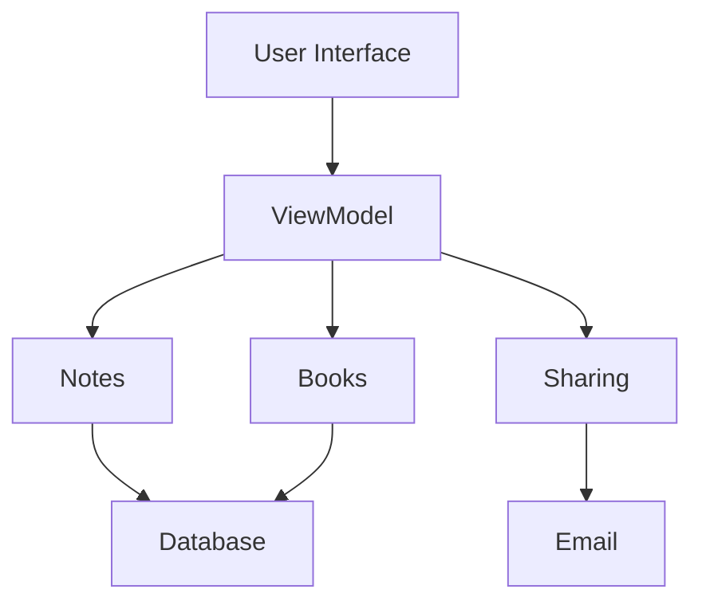

# Evaluation Criteria

- The proposed modules each offer a clear abstraction

- The system is composed of modules grouped in layers by level of abstraction and without unnecessary or circular
  dependencies

# Proposed Solution

The lowest level modules are the generic database, and sending e-mails. The books module and the notes module use the
database, and the sharing function uses e-mail. Then, we can for example have a ViewModel using these three intermediate
modules, and a user interface on top of it:

