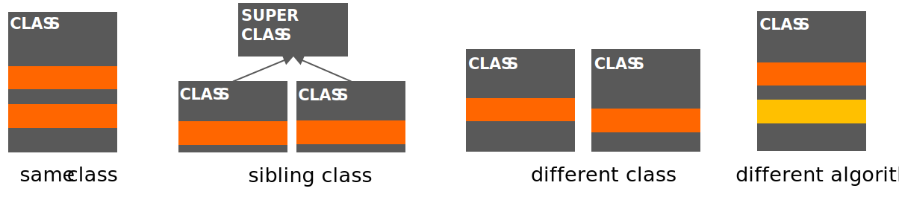

# Duplication

Duplication is a very common code smell. Although it's sometimes hard to
completely avoid it, it's important to keep it to a minimum. Duplicated code
often comes in multiple forms:

- Duplicated code in the same class or method
- Duplicated code in sibling classes
- Duplicated code in different classes
- Different algorithms that do the same thing

Here's an illustration of the different forms of duplication:

The duplicated code is indicated in dark orange. Code which implements the same
functionality with different algorithms is indicated in light orange.

---

In this exercise, you are going to refactor some code that has duplication in
different forms. The project has four packages: `one`, `two`, `three` and
`four`. Each package contains some code that has duplication. Your task is to
refactor the code in each package so that the duplication is removed.

For each package, you should:

1. Identify the form of duplication in the package.
2. Refactor the code so that the duplication is removed.
3. Indicate the kind of refactoring you used to remove the duplication (for
   example, "Extract Method", "Extract Class", etc.).
