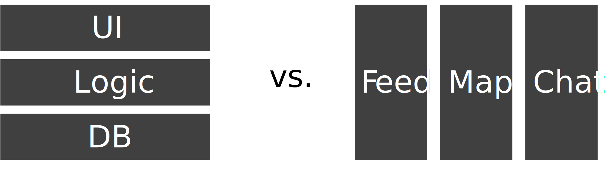
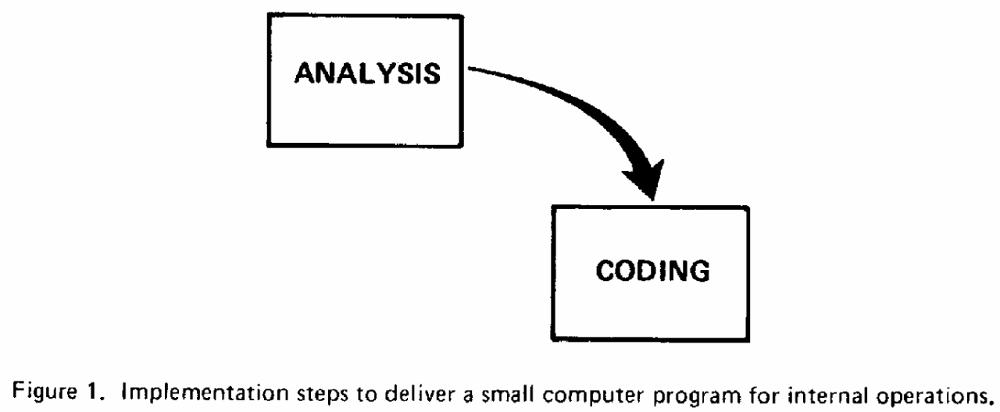
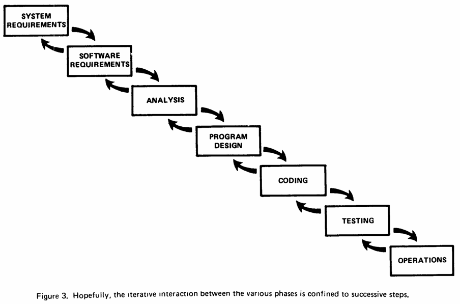
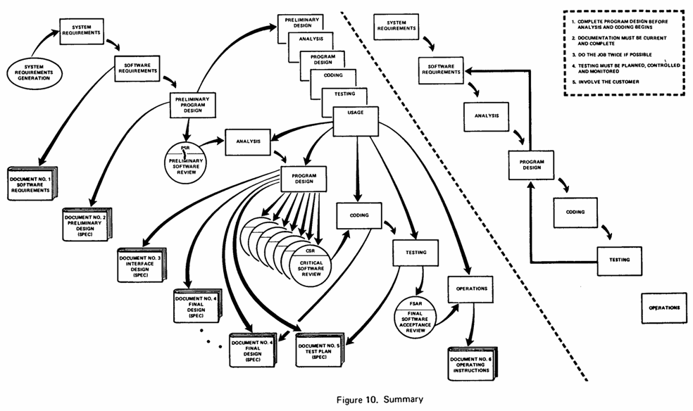
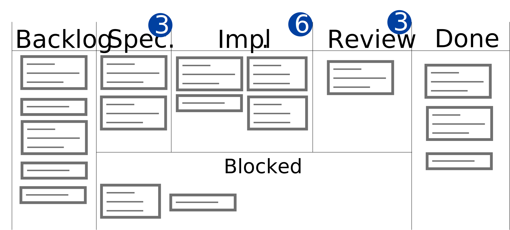
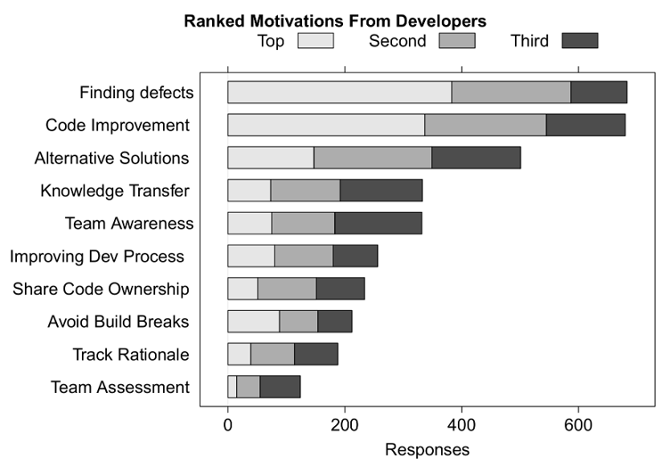

# Teamwork

Working on your own typically means engineering a small application, such as a calculator.
To design bigger systems, teams are needed, including not only engineers but also designers, managers, customer representatives, and so on.
There are different kinds of tasks to do, which need to be sub-divided and assigned to people: requirements elicitation, design, implementation, verification, maintenance, and so on.
While you could in theory allow anyone to edit the codebase at any time they want, this would quickly devolve into chaos.
Furthermore, you may want to make your project "open source" and accept outside contributions.

This lecture is all about teamwork: who does what, when, and why?

## Objectives

After this lecture, you should be able to:
- Organize software development in a team
- Compare software development methods
- Use code reviews constructively
- Understand open source development

## What are common sources of friction in a team?

_Friction_ is a common cause of project delays and cancellations.
Team members who can produce results on their own fail to do so in a team, because they don't organize effectively.

Remember, there are no winners on a losing team.
It is not useful to do a "perfect" job in isolation if it does not integrate with the rest of the team's work, or if there are other more important tasks to be done, such as helping a teammate.
A customer-facing problem is never due to a single team member, since it implies the people who reviewed the work also made mistakes by not spotting the problem.
It's the team vs. the problem, not one person vs. the rest of the team.
Of course, if the same person keeps making the same mistakes, the team needs to have a chat.

A particularly common cause of delays is the "just one more thing..." phenomenon.
One team member, in charge of an important task, keeps adding more and more sub-tasks so the overall result is "better" in isolation.
But because the task is late, the result is actually worse since the rest of the team is delayed due to waiting for this "better" result.

When estimating how much time a task takes, keep in mind that working on a task is not only the initial work, it also involves getting feedback from others and integrating that feedback.
If you need to be done in 3 days, don't schedule your work to take exactly 3 days, because then you won't have time for a review and subsequent fixes.

In general, it's better to avoid dependencies if you can, especially when many people depend on one person.
If that person becomes unavailable, or is late for any reason, others will become late.
It can be better to plan for a little redundant work than a lot of dependencies.

To measure the level of dependencies, use the "bus factor": how many team members can be hit by a bus before the project fails?
This is a rather morbid way to look at it, so one can also think of vacations, illnesses, or personal emergencies.
Many teams have a bus factor of 1, because there is at least one member who is the only person with knowledge of some important task, password, external contact, and so on.
If this member leaves the team, gets sick, or is in any way incapacitated, the team grinds to a halt because they can no longer perform key tasks.

Even without any buses or illnesses involved, if there is only one person who "knows everything" and takes time to review everything, such as a manager, work will pile up for review.
Team members won't be able to finish their tasks on time because the review takes longer than is reasonable.
While having one person with the final say over some decisions is reasonable, they should delegate some reviews and write down acceptance criteria in advance so that reviews don't pile up.
Of course, going the other way with nobody in charge isn't a good idea either as it leads to misalignment.
Team members do all kinds of work without consulting anyone, some of the work has to be thrown away because it's not needed, other work is duplicated because two team members didn't know, and so on.

One particularly problematic form of misalignment is when someone works on a task, presents it to the team, and gets told that most of their work needs redoing
because they didn't do what the team actually wanted. This can for instance happen in open source project without a clear workflow for proposing new features.
There must be a way for potential contributors, inside or outside the team, to get early feedback on whether what they want to do would be accepted.

## How can a team minimize friction?

The short answer fits in three points:
1. Communicate
2. Communicate
3. Communicate
This is only half in jest. Communication is absolutely key. Nobody can read your mind if you don't speak up.

One way to communicate in a software team is by sending code to be reviewed and merged.
If you frequently merge your code, the rest of the team knows what you've done and can give their feedback often.
However, if you instead have a long-lived branch on which you push code without asking for feedback and without trying to merge it, the rest of your team won't know what you're doing,
and you might realize too late that your work is not needed or duplicates someone else's work.

Instead of adding "one more thing" to a task, do the opposite: split it into sub-tasks that can ideally be done in parallel so that they can be assigned to multiple people.
Even if you're the only one working on all sub-tasks, merging small pieces of code that each do one specific sub-task makes it easier for your team to remain in sync.

There are conceptually two ways to split work, either "horizontally" in terms of application layers, or "vertically" in terms of end-to-end functionality:

For instance, the entirety of the database work could be assigned to one person, the entirety of the UI work to another, and so on.
However, if the database person cannot do their work, for instance because of illness, then no matter what other team members do, nothing will work end-to-end.
Furthermore, if the same people are continuously assigned to the same layers, the bus factor becomes 1.
Instead, team members should be assigned to features, such as one person in charge of user login, one in charge of informational messages, and one in charge of chat.

For tasks that really require coordination, such as defining the interfaces of modules in an app, it's better to assign multiple people to the sub-task that needs coordinating,
and then let them work in parallel on dependent sub-tasks.
For instance, instead of "Alice designs the `User` class and develops the user feed, then Bob reuses that class to develop the user profile", you can have Alice and Bob
co-design the `User` class, and then they can work in parallel on the feed and profile. That way, not only can Bob start and thus finish earlier, but you won't get in a situation
where Bob has to re-design what Alice did because he didn't tell her about some necessary functionality for the user profile.

One key limit of coordination is team size.
If you have a team of 3 people, you only need to keep 3 one-to-one communication channels.
With a team of 4, there are 6 different one-to-ones.
As the team size goes up, the number of one-to-one pairs goes up quadratically, becoming less and less efficient.

One common heuristic is the "two-pizza" team, i.e., a team that could be fed with two large pizzas, so 4-8 people.
Any more than this and you're likely better off splitting into two teams that work on entirely separate parts of the final product.
With a reasonably sized team, you can have frequent discussions so everyone is in sync and people don't have to throw away work that doesn't fit.

One extreme form of frequent discussion is _pair programming_: instead of two programmers coordinating asynchronously via, for instance, email or instant messaging,
they can both sit in front of the same computer, with one person acting as the "driver" in charge of the keyboard and mouse and the other acting as the "passenger" giving instant feedback.
This can also be done remotely via videoconferencing.
For tasks that require a lot of interactions, pair programming can be extremely effective.
Some teams like it so much they mandate pair programming for all tasks, period.

An even more extreme form of frequent discussion is _mob programming_: all team members are in front of the same screen, with one "driver" and everybody else as "passengers".
This can be, for instance, an alternative to a design meeting. Instead of discussing potential designs, the entire team can write the design in one mob programming session.

## What's the traditional engineering method?

Before we discuss how modern teams organize themselves, let's take a look at the traditional engineering method as applied to software development.

The work to be done is divided into phases, such as "design", "implementation", and "testing".
The cost of having to fix a defect in requirements goes up at each step, e.g., it is simple to update requirements while they are being written,
while rewriting a requirement during testing means re-doing a lot of the work that has been done, for instance, in implementation.
Thus, it is intuitively worth spending time to make sure the requirements are correct.
Furthermore, having structure ensures that the team will know what to do when, even if they have little experience.

Applying this intuition to a small program, such as one for internal operations in a small company, leads to a simple two-step process:

This figure comes from Winston W. Royce's influential 1970 paper titled "Managing the Development of Large Software Systems".
He continues with a schema for the development of a larger program:

Note that Royce explicitly states this is not a particularly good way to develop software.
Yet it remains a good model for the way many organizations develop software.
It has been named "_Waterfall_" due to the analogy with the flow of water: once you've finished a step, you cannot go back, just as water goes down a waterfall but not back up.

Each step in Waterfall ends with roughly three deliverables.
One is step-specific, such requirements, design, or code.
The other two are documentation and customer signoff.
Only when the output is documented and the customer is happy does development continue to the next step.

Waterfall has some advantages.
First, it ensures requirements are validated early with the customer, since development can only proceed once that has happened.
Second, it enforces structure with clear objectives, as the team always knows which stage it is in and what the deliverable is.
Finally, it ensures that everything is documented and that there are no surprises such as forgetting to do a task that was delayed long ago, since such tasks can only be delayed within each step.

Waterfall is thus a good candidate for projects with stable technology, stable requirements, possibly an inexperienced team, and some external bureaucracy that imposes Waterfall-like steps on developers.
It is fairly common for non-tech organizations to want to mold technical project development into a shape they're familiar with, in which case Waterfall can be a natural fit.
One typical example is space travel. Developing a robot to go to the Moon or Mars is a good use case for Waterfall, since there are known requirements and there is no possibility to get "early feedback" since launching even one robot is extremely expensive.

However, Waterfall needs all requirements to be set in stone early, and only does _product_ validation late, since there is no working product until the very end.
It's thus a bad fit for projects where the technology or requirements are not completely stable, especially if the team is experienced and there is not too much bureaucracy.
This description in fact fits most projects! Waterfall is generally not a good fit for modern software development.

One commonly-used example of how bad Waterfall can get is Denver Airport's baggage system, a tale that has spurred many a case study (e.g., [here](https://peimpact.com/the-denver-international-airport-automated-baggage-handling-system/)).
Work on a baggage system for the new Denver Airport started in June 1991, with a scheduled delivery of October 1993 for the airport's opening.
After many delays due to the automated baggage system not being ready, the airport opened in February 1995.
However, by that point the "system" was only used for part of one airline's flights, as it could not handle any of the original requirements.
Development was plagued by requirements that were too complex to be realistically implemented and late feedback that led to major changes, both of which are symptoms of developing requirements in isolation from the rest of the process.
Other case studies have been written down, e.g., [Ericsson's difficulties](https://link.springer.com/chapter/10.1007/978-3-642-02152-7_29) again due to requirements needing late changes,
as well as testing being compromised to meet project-wide deadlines.

Winston W. Royce ended his paper with a more "realistic" plan for software development, which is a lot more complex than the original diagrams:

We will not discuss this diagram further, but it is important to remember that even the "original" Waterfall paper did not actually recommend Waterfall for general software development.
There are plenty of other software development methodologies, often inspired by the basic Waterfall steps.
For instance, the "[V-Model](https://en.wikipedia.org/wiki/V-Model)" tries to represent Waterfall with more connections between design and testing,
and the "[Spiral model](https://en.wikipedia.org/wiki/Spiral_model)" is designed to minimize risks by doing many iterations of the same cycle.

---

#### Exercise
Which of the following could you use Waterfall for? Why or why not?
- A campus companion app
- A student rocket for a competition across universities
- The Linux kernel
- A rewrite of Microsoft Word (to achieve similar features with a simpler code base)

Example solution (click to expand)

- A campus companion app is a terrible candidate, as it has unclear needs since there are extremely many possible features, and should regularly get feedback from end users during development
- A student rocket competition is a good candidate, for overall the same reasons as space travel in general
- The Linux kernel might use Waterfall for specific subprojects, such as designing a software driver for a specific piece of hardware, but for the overall project Waterfall would not work
- A rewrite of any software, or a "version 2" in general, can be a good use case for Waterfall since the requirements are precisely known

## How do modern teams organize themselves?

In reaction to the shortcomings of rigid Waterfall-like processes, modern processes attempt to go the other way.
Instead of late user feedback on the product, get user feedback as frequently as possible.
Instead of one long development cycle in which the product is only usable at the end, have many short development cycles that each result in a usable increment.
Instead of heavy bureaucracy around deadlines and documentation, have low bureaucracy and focus on results.

These were formalized in the [Manifesto for Agile Software Development](https://agilemanifesto.org/), a declaration from many people interested in improving software development, which has four core values:
- Individuals and interactions over processes and tools
- Working software over comprehensive documentation
- Customer collaboration over contract negotiation
- Responding to change over following a plan
As they state, while they value the things on the right, they value the things on the left more.
They further present [principles](https://agilemanifesto.org/principles.html) they see as foundational to agile software.

It's important to note the difference between "agile" development, a general principle this manifesto refers to, and the various form of "Agile" with a capital A that have popped up over the years.
Many entities invented their own spin on agile development, which they formalized into complex processes that they sell to corporations as a magic "Agile" solution to all their development problems.
In general, if it requires trainings or certifications, it's unlikely to be an agile way of development.

The most common form of agile development practiced today is _Scrum_, which was [described](https://doi.org/10.1145/260111.260274) by its authors in the following way:

> The stated, accepted philosophy for systems development is that [the] systems development process is a well understood approach that can be planned, estimated, and successfully completed.
> This is an incorrect basis.
> Scrum states that the systems development process is an unpredictable, complicated process that can only be roughly described as an overall progression.
> Scrum defines the systems development process as a loose set of activities that combines known, workable tools and techniques with the best that a development team can devise to build systems.
> Since these activities are loose, controls to manage the process and inherent risk are used.

The core idea is that we can only truly control development at a high level, when thinking about overall progression, because individual steps are unpredictable.
Thus, we should add some simple guardrails at the low leel to mitigate the risk there.

Scrum is composed of:
- The _Product Goal_, which is the goal that the team is working towards, such as a specific software system for a customer
- The _Product Backlog_, an ordered list of items that should be completed to reach the product goal, which can be expanded as needed when new needs arise
- A sequence of _Sprints_, which subdivide work into units of time, each with:
  - Their _Sprint Goal_, the part of the product backlog that will get done for this sprint and turn into working _Increments_ towards the product goal
  - Their _Sprint Backlog_, an ordered list of tasks that should be completed to reach the sprint goal
In each sprint, in addition to their daily work, the _Scrum Team_ starts with a _Sprint Planning_ meeting to define the sprint, and ends with a _Sprint Review_ oriented towards the customer and a _Sprint Retrospective_ to decide on process improvements.

Let's now discuss each of these components in more details.

The _Scrum Team_ is composed of one _Scrum Master_, who facilitates the process, one _Product Owner_, who represents customers, and a number of _Developers_.
There is no hierarchy nor sub-teams within a Scrum Team.
The _Scrum Master_ is not a manager but more of a "servant leader", who helps the rest of the team by organizing and facilitating any meetings the team wants, dealing with external constraints, and so on.
Usually, because this work is not enough to be full-time, the Scrum Master is also a Developer.
The _Product Owner_ is the single representative of all customers, and gatekeeps the backlogs. The Product Owner has the final say over what goes in the backlog in what order, and no one else is allowed to directly change the backlog.
In particular, users cannot directly request features from individual developers or change the backlog themselves, as this would lead to chaos.

You may encounter, when working in software development teams, other roles such as "Tech Lead", "Engineering Manager", "Product Manager", and so on.
These roles have a purpose, and can be useful in some cases, but they are not part of Scrum, even though many organizations claim to adhere to Scrum while also having many unrelated roles and sometimes not even the basic Scrum roles.
Because Scrum and agile development in general are so popular, there is a big gap between the original definitions and what people do in practice under those names.

A _Sprint_ in Scrum consists of a goal and a backlog, achievable in a specific unit of time.
Usually, all Sprints are the same length, typically 1-4 weeks.
Because Scrum is agile, if a Sprint is no longer useful or needs major changes, there is no need to continue it just for the same of following the process.
Instead, the Product Owner can change or cancel a Sprint if needed.

The _Sprint Planning_ meeting is where the sprint's backlog is defined, to decide what working _Increments_ the team wishes to finish in the Sprint.
An Increment is a combination of a Product Backlog item and a _Definition of Done_, i.e., a clear statement that defines whether a task has been completed in a way that requires minimal interpretation.
During the planning meeting, the team prioritizes work, for instance based on what would be most useful to the user, what has the least risk, and so on.
Product Backlog items are split into tasks that individual developers can work on, estimating their completion time so that no task is too long and no developer has too much or too little work.

For instance, here are some good tasks, with an implicit definition of done:
- "_Add public location to user profiles_"
- "_Let users sort restaurants by type or rating_"

And here are some _bad_ tasks, which are way too vague:
- "_Implement user profile_" (what should be in it? what's editable vs. not? what's visible publicly vs. not?)
- "_Generate better course content_" (what does "better" mean? how will the content be generated?)

Ideally, a single task should represent 1 to 2 days of work for a single developer, with realistic time assumptions.
It's important to avoid the "everything will go perfectly" mindset, and to keep in mind the need for testing, code reviews, and adapting to review feedback.
While tasks may occasionally need to be larger than this, the larger a task, the more likely it is to be underspecified and later cause merge conflicts.

Splitting backlog items into tasks is more of an art than a science, and developers get better at it the more they do it.
For instance, consider the item "_Let users find nearby places of interest_". We could split this into "_Allow users to set or auto-detect their location_", "_Import place locations from the database_", and "_Sort places by distance_".
This of course depends on how complex each item is in context. Perhaps location auto-detection is difficult on the specific platform the app works on, and the first task should instead be two tasks, for instance.

Importantly, Product Backlog items are always taken from top to bottom, since the backlog is ordered.
The Product Owner may decide to reorder the Product Backlog due to customer feedback.

Back to Sprint components, during the working part of the Sprint, the developers should meet for a _Daily Scrum_ meeting, also often called a "_standup_" meeting as it should be short enough that most people do not need to sit down for it.
The standup can be in-person, via videocall, or even instant messaging, as the team wishes.
During the standup, each developer quickly summarizes what they've done the previous day, what they're going to work on this day, and whether they're _blocked_ by something.

Besides keeping the team in sync, the main goal of the standup is to identify _blockers_: issues that prevent a developer from getting their work done.
Anything of the form "I can't continue my work because..." is a blocker, even if it is not phrased that way.
In particular, not everyone knows they're blocked! For instance, someone might assume that it is normal they cannot do their task in a simple way, and state that they are looking into a more complex way that will take considerably more time.
A teammate may then state that they really expected the simple way to work, and suggest the two meet shortly after the standup to discuss this, ideally unblocking their colleague.

At the end of the Sprint, the _Sprint Review_ meeting is where the team presents their work to the _Product Owner_, typically in the form of a demo of the software.
This is not necessarily the only time the team can do a demo, it is entirely acceptable to talk to the Product Owner during a Sprint to ask for their opinion given a demo, for instance.
The Review exists to discuss outcomes related to the product, such as what the team learned about feasibility and possible prioritization of future tasks.

Finally, there is the _Sprint Retrospective_, which is about the process.
The team meets to discuss what worked and didn't work, in a sort of "post mortem" of the Sprint.
A common outcome for a Retrospective is a list of three categories: "Stop doing..., Start doing..., Keep doing...".
Because Scrum is all about agility, even the Scrum process itself can be changed if needed.
For instance, perhaps the team believes it would be better to only have the standup one day out of two, and wishes to experiment with this for one sprint.

Overall, remember that agile processes are all about, well, agility.
If you find a minor bug, you can and should fix it on the spot, there's no need to open a formal ticket and ask for the Product Owner's opinion if you can fix it in 10 minutes.
If you encounter something odd that you think might jeopardize future development, such as an external library not having the functions the team expected for future tasks, discuss this early with the team.
If you have an idea to save time, such as a way to implement 80% of a task in 20% of the task, discuss with the team and the Product Owner early, perhaps they'll agree and the definition of done for your task will change.
Do not follow the process for the sake of following the process.

Also keep in mind the overall goal when thinking of backlog item and tasks.
For instance, if you want to build a large mansion with reinforced stone walls, there is no point in starting with [dry stone walls](https://en.wikipedia.org/wiki/Dry_stone) as a simple form of wall,
since you will need mortar to build the house so your first task after building the dry stone wall will be to dismantle it and build a wall with mortar this time.
It takes experience and expertise to know which "shortcuts" are actually shortcuts and which ones lead you down the wrong path.

---

#### Exercise

Create a Product Goal and a Product Backlog, with at least 5 items, for a project you'd like to make.

This can be anything, e.g., a podcasts app, a chess tournament manager, an event sign-up website, ...

---

If iterating in short sprints is good, is iterating in extremely short sprints extremely good? Maybe.
That's the core idea behind _Kanban_ as a software development philosophy.
Instead of explicit sprints, Kanban involves a _board_ with columns for the various states of items.
The team maintains the backlog column in sorted order, then moves items as development goes:

Importantly, there is a limit on each column, meaning there cannot be more than a certain number of items in a given status at the same time.
For instance, if you want to put your code in review for an item but the Review column is full, you must do a code review for one of the items in that column to free a spot.
To balance this, there is a "blocked" area for items that are blocked due to reasons beyond the team's control, such as waiting for another team.

The concept of a "Kanban board" is widely used even outside of Kanban, often without the limit on items per status.
It's common to use a Kanban-like board for Scrum projects, for instance.

---

#### Exercise

Create a Kanban board by using GitHub's Projects feature, which you can access from a tab in your profile.
Add columns for Product Backlog, Sprint Backlog, Tasks, and Done.
Then add your backlog items from the previous exercise.

---

## How can we provide and receive effective feedback on code?

What should happen when you're done with a coding task? Merging it directly into the main branch?
Unfortunately, humans are imperfect, and we all make mistakes. There may be bugs, unhandled edge cases, missing tests, bad design choices, and so on.
The interactions between new, modified, and existing code can hide all kinds of problems.
For instance, a new subclass may cause existing code to crash, either because the new class does not respect its base class's postconditions, or because the existing code was making assumptions stronger than the existing class's postconditions.
Even trickier, code might be missing, for instance to handle specific edge cases. Deciding which code wasn't added but should be is harder than deciding whether added code is correct.

_Code reviews_ lower the probability of errors by having another person look at the code.
This is of course not a new concept, as it exists in any other process of creating an output, such as giving feedback on a book draft.
And it started a long time ago even in software engineering, with Ada Lovelace [begging Charles Babbage](https://web.archive.org/web/20241212033625/https://www.iflscience.com/relatable-ada-lovelace-letter-shows-her-begging-charles-babbage-not-to-mess-with-her-math-65640) to stop messing with her programs because he introduced errors in them.

If someone suggests code changes, and someone else reviews them, who is responsible for any remaining bugs in the code after it's merged?
This is a trick question: the answer is _the entire team_. The goal is not to blame individuals for human error, as we expect it will still happen even if someone else reads the code, just less often.
If the same person consistently makes the same mistakes, then intervention is needed, but otherwise, the goal is to deliver quality software, not to decide who made the most mistakes.

One form of review is pair programming: if two people work on a piece of code, then one could decide to waive the review process as the code has already received a second pair of eyes.
On the other hand, the two people may share the same biases and blind spots of they worked on it together, so teams need to decide how to handle pair-programmed code in terms of reviewing.

Code reviews are particularly important if you're receiving code from someone you do not know or trust, such as a proposal from someone on the Internet to merge code into your publicly available project.
That person may have written great code, or they may have made many mistakes. They might even be [malicious](https://en.wikipedia.org/wiki/XZ_Utils_backdoor)!

So what's a code review? Conceptually, it's simple:
1. Read the code
2. Write comments on the code
3. Accept or reject the code
In general, "rejection" in the last step is not permanent, but more akin to "please fix the issues I pointed out and submit the code again for another review".

Code reviews can happen [over email](https://marc.info/?l=linux-fsdevel&m=176284687628463&w=2), or using online tools such as [GitHub's pull requests](https://github.com/dotnet/runtime/pull/121489).
But what exactly is the goal, who should do them, and how to give and receive good code reviews? Let's see all four of these points in turn.

### Code review goals

The goal might initially appear to simply be "find bugs", but there is more to code reviews than this.
Thankfully, empirical research exists on code reviews, in which researchers interview many software engineers to get their opinion.
For instance, here are developer's main motivations for reviewing, as collected by [Bacchelli and Bird](https://doi.org/10.1109/ICSE.2013.6606617) in 2013:

While finding defects is unsurprisingly the top one, right behind it are improving code, i.e., proposing better ways even if the submitted code is not buggy, and alternative solutions, i.e., proposing better design choices.
For instance, instead of a 100-line solution, the code reviewer could point out that there is already a method in the codebase that does what the code submitter wanted to do.

Then comes knowledge transfer, another key goal of code review in practice.
Code reviews are not a monologue but a dialogue, in which both the submitter and the reviewer discuss.
Remember the "bus factor": you do not want a project to fail because the one person who knew about a part of the code is sick or leaves.
By enforcing code reviews, you guarantee that at least two people are familiar with every piece of code.
It can also be a good mentoring opportunity for senior engineers to explain things to junior engineers.

### Code review authors

Who should the code reviewer be? While finding defects and proposing alternative solutions require high knowledge of the code being modified, as Bacchelli and Bird found in the same paper,
other goals such as knowledge transfer can benefit from less experienced reviewers.
There is a clear tradeoff: more reviewers means more feedback and more knowledge transfer, but also more time before the code can be merged.

In practice, it is common to have a review by a code "owner", i.e., someone responsible for the part of the code being modified.
This can be enforced using tool features such as [GitHub's `CODEOWNERS` file](https://docs.github.com/en/repositories/managing-your-repositorys-settings-and-features/customizing-your-repository/about-code-owners),
requiring pull requests to be signed off by people named as code owners.
It can be useful to have others review to learn and provide minor feedback, but this is typically not required.

### Giving a good code review

Let's discuss three aspects of giving a code review: the overall approach, the comments, and some human factors.

First, in order to approach a review properly, you should block some time to do it, such as 10-15 minutes.
Unless the code is particularly complex, you should not need much more than this. If you need an hour to understand a pull request, it's a sign that either the code is too messy, or that the pull request should be split in smaller parts.

You can read the code online in the repository the request is made, or locally by pulling the branch and opening it in your editor.
Some editors even have integration with code review tools, letting you add comments from the editor.
However, you typically should not need to run the code yourself, that's what unit tests and continuous integration are for.

Decide which parts you will read thoroughly, skim, and ignore.
Ignoring some code can be useful if you trust the code submitter and the changes are not interesting, such as a refactoring that changed the name of a method, or the addition of some resource file whose contents you are already familiar with.
If needed, you can delegate, for instance because you are not confident in your ability to review changes to a specific module.
Document these choices once you're done with your review, with comments such as "_I only reviewed... because..._" or "_I trust that... so I didn't read..._".

Comments are the main component of a code review. Most goals of code reviews, from finding defects to transferring knowledge, can be achieved through discussion.
Sometimes that discussion involves pointing out facts, other times it involves asking questions.
For instance, here are some examples of **good** comments types:
- "_I don't understand why..._"
- "_If `x = -1` here, I think this will crash, because..._"
- "_Could we move this bit of code to class X, so that..._"
Not all comments have to be critical or pointing out problems, either. It's a good idea to leave comments like "This is great! I like how..." if you think a part of the code is well done!

Here are, on the other hand, some examples of **bad** comments and why:
- "_I don't like this_"  
  (It's not about your personal preference, it's about the team's)
- "_Make this better_"  
  (How? This is not constructive)
- "_Your code is stupid_"  
  (All this does is put the submitter on the defensive, which achieves nothing)
- "_Let's also do this change on these other 40 files_"  
  (You could propose doing another pull request for this, but don't extend the scope of an existing request unless truly necessary)
- "_I would have done it..._"  
  (When someone else does a task, they will never do it 100% like you want it to)
- "_In my opinion..._"  
  (Again, it's about the team's opinion, you should back up comments with shared facts, not personal preference)

One way to make your comments more actionable is to classify them with a category, for instance
- "_**Question**: Why do we need to check this condition... ?_"
- "_**Blocker**: This condition needs to include..._"
- "_**Nitpick**: Maybe a better name for this method is..._"
This way, the submitter knows what they need to address (= "blockers"), what they can choose to take or not (="nitpicks"), and which questions are truly questions as opposed to rhetorical ones.

Remember to justify your comments, so that the submitter has context and can discuss more constructively, for instance "_...per our formatting conventions_" or "_...as we discussed last Thursday_".
Maybe there was a misunderstanding of what should be done last Thursday, for instance, in which case adding this context lets you jump straight into clarifying that misunderstanding.

Remember the big picture. You're reviewing code to find potential issues and improvements as well as learn about it.
Think in terms of whether the architecture makes sense, which tests might be missing, and so on. There is little point in leaving a review made up of just "nitpick" comments.
Sometimes you can simply leave "_LGTM_", standing for _Looks Good To Me_, if you think the code is fine. This is especially likely for small pull requests that do simple tasks.

Finally, remember human factors.
Code reviews are not about showing who's smartest, it's not "Me vs. You", but "Us vs. The problem", your overall goal is delivering working software and you are collaborating with the submitter.
Don't write comments like "_You're doing..._" but focus on the code, e.g., "_The code is doing..._", so you don't put people on the defensive.
And don't forget that cultural misunderstandings happen, e.g., someone from the USA stating code is "quite good" intends to say it's fine, but a reader from the UK will assume they mean it's pretty terrible, because words have different meanings to different people.
You cannot avoid misunderstandings, but you can keep their possibility in mind so you don't immediately jump to a bad interpretation, and instead ask clarifying questions.

### Receiving a code review well

Code reviews are collaborative, so the submitter also has a responsibility to do their best.
Let's see three aspects: helping others help you, getting feedback early, and handling bad reviews.

Start by summarizing your changes in the description of any pull request you create, including anything you'd like to guide potential reviewers towards.
Think of what "obvious" questions a reviewer might initially get, so that you can immediately get to the next step of the conversation.
For instance, you could say some of the following:
- "_I implemented X as described in the task, but this required me to also modify Y, because..._"
- "_I used the Middleware pattern, because..._"
- "_I'm not sure about the implementation of..._"

Before asking someone else to review your code, just like any other output you produce, do a review yourself to catch basic mistakes.
Perhaps you forgot to remove some code you had added while debugging. Maybe you commented out a line and forgot to uncomment it. Maybe you changed a file by accident.
Instead of waiting for someone else to point this out, do one review yourself to find out.
You can also leave comments on your own pull request, in the same way you can leave an overall description.
For instance, you might leave comments such as:
- "_I originally wanted to write X here, but..._"
- "_Not sure this is the right place for this method, because..._"
- "_I plan on rewriting this file next week for feature Y_"
These should be used when they matter for reviewers but not for future maintainers. If something needs to be left for maintainers, leave it as a code comment instead.

Get feedback early, just as you want early user feedback in agile development.
You don't need to wait until you've fully implemented a task to get feedback on the design or the test cases.
It's completely acceptable to ask a colleague "_can you take a look at [the design / the tests / ...]?_".
In fact, platforms like GitHub have a concept of "draft" pull requests specifically for this.
A draft pull request has a special draft indication and cannot be merged, indicating that it was only opened for feedback.

If needed, you can also split your pull request into multiple ones.
In the same way that you might split a task before starting it, if you realize after finishing one portion of the task that the next portion is independent of the previous one, open a pull request already while you work on the next portion.
This way, you can get your code reviewed faster, and you are less likely to run into conflicts with the main branch when merging.

Finally, accept that you will sometimes get bad code reviews, and that you must deal with them professionally and constructively.
Not everyone knows how to leave a good review, and some people want to micromanage you or force their opinion on everyone.
Answer their comments by reminding them of shared justifications, such as "_Per the team's conventions..._", or by calling in someone else to help, like "_Let's ask X what they think_".
If you think someone is writing nitpick-style comments without marking them as such, ask them if addressing the comment can wait, they'll likely say yes and then forget they asked you.

---
#### Exercise

Do a code review of this [pull request](https://github.com/sweng-example/pr-example/pull/2).
What do you think? Are there any bugs? What comments would you leave?

Then look at an existing [code review](https://github.com/sweng-example/pr-example/pull/1) for the same code.
Do you agree with the comments? Disagree? Are some comments missing?

Example solution (click to expand)

The biggest problem is that the "search" feature is missing tests, and consequently the two typos in its implementation were not spotted.

From an architectural perspective, having the Presenter format lists into text makes little sense, as the exact format is View-specific.
Similarly, the Presenter should not know of the concept of `Ctrl+C` to stop. Perhaps it could instead handle `"exit"` as a command, and the View could invoke that command when the user performs a View-specific exit function.

Documenting the JSON format would also be good.

There are plenty of issues that could be discussed as a team, such as wildcard imports or when to add Javadoc.

## How does open source collaboration work?

First, what exactly does "open source" mean?
The freedom to use source code as one wishes, e.g., reading, using, sharing, studying...
This is not a very firm definition, and indeed there are no objective ones, but a common one is the [Open Source Initiative's](https://opensource.org/osd).
Importantly, it requires free distribution, that this distribution should be of the source code and not a compiled or obfuscated version, that derived work should be allowed, and that one cannot discriminate in terms of who gets which rights.
Note that open source does not mean you can submit patches and get them merged. A project can be open source even if it accepts no outside contributions.

_Licenses_ are the formal version of "who can do what under which conditions?".
They specify, in legal terms, what the code's authors want.
It may be tempting to think you don't need a license for simple code, but the opposite is true.
Without a license, in most jurisdictions, your code will default to being "copyrighted" by you, meaning you give no rights to anyone to do anything.
People will usually not touch code that does not have a license, since in theory you could sue them for, e.g., reusing it.

So how do you pick a license?
You could look at, e.g., [Wikipedia's comparison](https://en.wikipedia.org/wiki/Comparison_of_free_and_open-source_software_licenses) of open source licenses, but it would take a while.
There are shorter versions, such as [choosealicense.com](https://choosealicense.com/). But here's a very short and biased version:
- The **MIT** license is for when you just any use to credit you
- The **GPL** license is for when you want any use to also be open source under the GPL
- Licenses such as the "Unlicense" or the "WTFPL" are for when you want a form of "public domain", i.e., anyone can use your code for anything unconditionally

Now that we have defined open source, what does an open source project look like?
In terms of hierarchy, there typically are:
- _Maintainers_, who have write access to the code and the final say over project decisions
- _Contributors_, who submit code and ideas but must have their pull requests and suggestions approved by maintainers
- _Users_, who do not contribute code

People maintain open source projects for fun, for work, and very rarely even for profit.
For instance, if you look at [the Linux kernel's maintainers page](https://docs.kernel.org/process/maintainers.html), you will see that most pieces of the kernel have someone who looks after them, and some of these are even paid to do so.
Typically, this means a company that uses the kernel has decided to assign an engineer to, at least part of the time, work on it.
Some widely-used projects such as `curl` even have [sponsors](https://curl.se/sponsors.html).
Some commercial projects are, for various reasons, open source, such as [the C# and Visual Basic .NET compilers](https://github.com/dotnet/roslyn/).

How can you climb the hierarchy and move from "user" to "contributor" of a project you like and want to help with?
In short:
1. Find an issue
2. Read the project's contribution guidelines
3. Work on the issue locally
4. Open a pull request

To find an issue, look for large projects that have tagged issues with labels such as "good first issue" or "help wanted", like [this](https://github.com/microsoft/terminal/issues/12632), and communicate your intent to work on it with the maintainers.
You can also open your own issue, e.g., [translating the UI into your language](https://github.com/microsoft/terminal/issues/19530).

These examples are from the `microsoft/terminal` repo, which has a [contributing guide](https://github.com/microsoft/terminal/blob/main/CONTRIBUTING.md) explaining what kind of contributions they accept, where to get started, and so on.

Before you can get your pull request looked at, you will typically have to sign a "Contributor License Agreement", or "CLA" for short.
This is a document that effectively gives the maintainers ownership of the specific code you submitted, so that if in the future they need to, e.g., change the project's license,
they do not have to chase the hundreds of past contributors who submitted code that was merged into the project.

Finally, remember that if you contribute to an open source project, you are joining a team with established practices.
Do not begin your pull request by doing random refactorings to fit your idea of what the codebase should like.
Do not split a file into multiple ones just because of your personal preference for how to structure code.
This kind of behavior causes a lot of friction, makes your code much harder to review, and might get your pull request rejected without proper review.
Also avoid opening large pull requests without warning, as most maintainers are not interested in reviewing thousands of lines of code for a feature they did not explicitly ask for.

---

#### Exercise

Contribute to an open source project!

You can for instance find projects with "good first issue" labels here, filtering by programming language if needed: <https://github.com/topics/good-first-issue>

Find such an issue you're interested in, plan how you will work on it, and contribute!

---

## Summary

In this lecture, you learned:
- Teamwork: avoiding friction, reviewing code
- Developent methods: Waterfall, Scrum, agility
- Open source: structure, licenses, contributing

You can now check out the [exercises](exercises/)!
