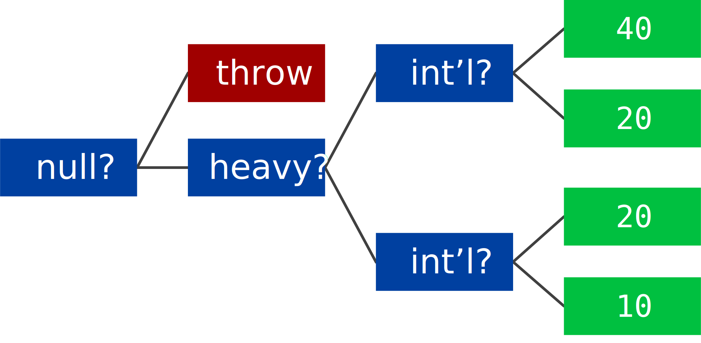
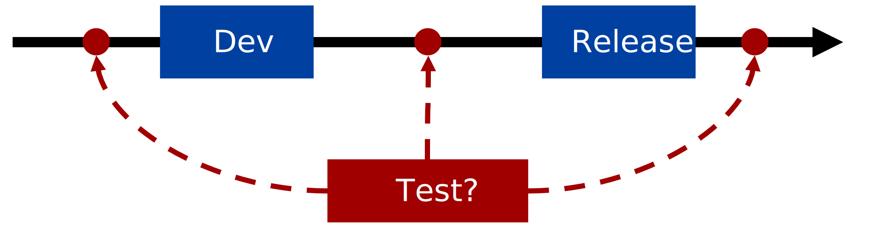

# Testing

> **Prerequisite**: Before following this lecture, you should make sure you can build and run the [sample project](exercises/sample-project).

It's tempting to think that testing is not necessary if one "just" writes correct code from the first try and double-checks the code before running it.

But in practice, this does not work. Humans make mistakes all the time.
Even [Ada Lovelace](https://en.wikipedia.org/wiki/Ada_Lovelace), who wrote a correct algorithm to compute Bernoulli numbers
for [Charles Babbage](https://en.wikipedia.org/wiki/Charles_Babbage)'s "[Analytical Engine](https://en.wikipedia.org/wiki/Analytical_Engine)",
made a typo by switching two variables in the code transcription of her algorithm.
And she had plenty of time to double-check it, since the Analytical Engine was a proposed design by Babbage that was not actually implemented!
The "first program ever" already contained a typo.

One modern option is computer-aided verification, but it requires lots of time.
If Ada Lovelace had lived in the 21st century, she could have written a proof and gotten a computer to check it, ensuring that the proof is correct as long as the prover program is itself correct.
This can work in practice, but currently at the cost of high developer effort.
The [seL4 operating system kernel](https://sel4.systems/), for instance, required 200,000 lines of proof for its 10,000 lines of code
(Klein et al., ["seL4: formal verification of an OS kernel"](https://dl.acm.org/doi/10.1145/1629575.1629596)).
Such a method might have worked for Ada Lovelace, an aristocrat with plenty of free time, but is not realistic yet for everyday programmers.

Another modern option is to let users do the work, in a "beta" or "early access" release.
Users get to use a program ahead of everyone else, at the cost of encountering bugs and reporting them, effectively making them testers.
However, this only works if the program is interesting enough, such as a game, yet most programs out there are designed as internal tools for small audiences that are unlikely to want to beta test.
Furthermore, it does not eliminate bugs entirely either. Amazon's "New World" game, despite having an "Open Beta" period,
[released](https://www.denofgeek.com/games/new-world-bugs-glitches-exploits-list-cyberpunk-2077/) with many glitches including a 7-day delay before respawning.

Do we even need tests in the first place? What's the worst that could happen with a bug?
In some scenarios, the worst is not that bad comparatively, such as a bug in an online game.
But imagine a bug in the course registration system of a university, leaving students wondering whether they are signed up to a course or not.
Worse, a bug in a bank could make money appear or disappear at random.
Even worse, bugs can be lethal, as in the [Therac-25 radiation therapy machine](https://en.wikipedia.org/wiki/Therac-25) which killed some patients.


## Objectives

After this lecture, you should be able to:

- Understand the basics of _automated testing_
- Evaluate tests with _code coverage_
- Identify _when_ to write which tests
- _Adapt_ code to enable fine-grained testing


## What is a test?

Testing is, at its core, three steps:

1. Set up the system
2. Perform an action
3. Check the outcome

If the outcome is the one we expect, we gain confidence that the system does the right thing.
However, "confidence" is not a guarantee.
As [Edsger W. Dijkstra](https://en.wikipedia.org/wiki/Edsger_W._Dijkstra) once said, "_Program testing can be used to show the presence of bugs, but never to show their absence!_".

The simplest way to test is manual testing.
A human manually performs the workflow above.
This has the advantage of being easy, since one only has to perform the actions that would be typically expected of users anyway.
It also allows for a degree of subjectivity: the outcome must "look right", but one does not need to formally define what "looking right" means.

However, manual testing has many disadvantages.
It is slow: imagine manually performing a hundred tests.
It is also error-prone: the odds increase with each test that a human will forget to perform one step, or perform a step incorrectly, or not notice that something is wrong.
The subjectivity of manual testing is also often a disadvantage: two people may not agree on exactly what "right" or "wrong" is for a given test.
Finally, it also makes it hard to test edge cases. Imagine testing that a weather app correctly shows snowfalls when they occur if it's currently sunny outside your home.

To avoid the issues of manual testing, we will focus on automated testing.
The workflow is fundamentally the same, but automated:

1. Code sets up the system
2. Code performs an action
3. Code checks the outcome

These steps are commonly known as "Arrange", "Act", and "Assert".

Automated testing can be done quickly, since computers are much faster than human, and do not forget steps or randomly make mistakes.
This does not mean automated tests are always correct: if the code describing the test is wrong, then the test result is meaningless.
Automated testing is also more objective: the person writing the test knows exactly what will be tested.
Finally, it makes testing edge cases possible by programmatically faking the environment of the system under test, such as the weather forecast server for a weather app.

There are other benefits to automated testing too: tests can be written once and used forever, everywhere, even on different implementations.
For instance, the [CommonMark specification](https://spec.commonmark.org/) for Markdown parsers includes many examples that are used as tests, allowing anyone to use these tests to check their own parser.
If someone notices a bug in their parser that was not covered by the standard tests, they can suggest a test that covers this bug for the next version of the specification.
This test can then be used by everyone else.
The number of tests grows and grows with time, and can reach enormous amounts such as [the SQLite test suite](https://www.sqlite.org/testing.html), which currently has over 90 million lines of tests.

On the flip side, automated testing is harder than manual testing because one needs to spend time writing the test code, which includes a formal definition of what the "right" behavior is.


## How does one write automated tests?

We will use Java as an example, but automated testing works the same way in most languages.

The key idea is that each test is a Java method, and a test failure is indicated by the method throwing an exception.
If the method does not throw exceptions, then the test passes.

One way to do it using Java's built-in concepts is the following:

```java
void test1plus1() {
  assert add(1, 1) == 2
}
```

If `add(1, 1)` returns `2`, then the assertion does nothing, the method finishes, and the test is considered to pass.
But if it returns some other number, the assertion throws an `AssertionError`, which is a kind of exception, and the test is considered to fail.

...or, at least, that's how it should be, but [Java asserts are disabled by default](https://docs.oracle.com/javase/7/docs/technotes/guides/language/assert.html), unfortunately.
So this method does absolutely nothing unless the person running the test remembers to enable assertions.

One could mimic the `assert` statement with an `if` and a `throw`:

```java
void test1plus1() {
  if (add(1, 1) != 2) {
    throw new AssertionError()
  }
}
```

This is a working implementation of a test, which we could run from a `main` method.
However, if the test fails, there is no error message, since we did not put one when creating the `AssertionError`.
For instance, if the test fails, what did `add(1, 1)` actually return? It would be good to know this.
We could write code to store the result in a variable, test against that variable, and then create a message for the exception including that variable.
Or we could use [JUnit](https://junit.org/junit5/) to do it for us:

```java
@Test
void test1plus1() {
  assertEquals(add(1, 1), 2);
}
```

JUnit finds all methods annotated with `@Test` and runs them, freeing us from the need to write the code to do it ourselves,
and throws exceptions whose message includes the "expected" and the "actual" value.

...wait, did we do that right? Should we have put the "expected" value first? It's hard to remember.
And even if we do that part right, it's hard to make assertion messages useful for tests such as "this list should either be empty or contain `[1, 2, 3]`".
We can write code to check that, but if the test fails we will get "expected `true`, but was `false`", which is not useful.

Instead, let's use [Hamcrest](https://hamcrest.org/JavaHamcrest/) to write our assertions on top of JUnit:

```java
@Test
void test1plus1() {
  assertThat(add(1, 1), is(2));
}
```

This is much clearer! The `is` part is a Hamcrest "matcher", which describes what value is expected. `is` is the simplest one, matching exactly one value, but we can use fancier ones:

```java
List<Integer> values = ...;

assertThat(values,
    either(empty())
.or(contains(1, 2, 3)));
```

If this assertion fails, Hamcrest's exception message states "Expected: (an empty collection or iterable containing `[<1>, <2>, <3>]`) but: was `<[42]>`".

Sometimes we need to test that a piece of code _fails_ in some circumstances, such as validating arguments properly and throwing an exception of an argument has an invalid value.
This is what `assertThrows` is for:

```java
var ex = assertThrows(
  SomeException.class,
  () -> someOperation(42)
);

// ... test 'ex'...    
```

The first argument is the type of exception we expect, the second is a function that should throw that type of exception.
If the function does not throw an exception, or throws an exception of another type, `assertThrows` will throw an exception to indicate the test failed.
If the function does throw an exception of the right type, `assertThrows` returns that exception so that we can test it further if needed, such as asserting some fact about its message.

---
#### Exercise
It's your turn now! Open [the in-lecture exercise project](exercises/lecture) and test `Functions.java`.
Start by testing valid values for `fibonacci`, then test that it rejects invalid values.
For `split` and `shuffle`, remember that Hamcrest has many matchers and has documentation.
<details>
<summary>Example solution (click to expand)</summary>
<p>

You could test `fibonacci` using the `is` matcher we discussed earlier for numbers such as 1 and 10, and test that it throws an exception with numbers below `0` using `assertThrows`.

To test `split`, you could use Hamcrest's `contains` matcher, and for the shuffling function, you could use `arrayContainingInAnyOrder`.

We provide some [examples](exercises/solutions/lecture/FunctionsTests.java).

</p>
</details>

---

**Should you test many things in one method, or have many small test methods?**
Think of what the tests output will look like if you combine many tests in one method.
If the test method fails, you will only get one exception message about the first failure in the method, and will not know whether the rest of the test method would pass.
Having big test methods also means the fraction of passing tests is less representative of the overall code correctness.
In the extreme, if you wrote all assertions in a single method, a single bug in your code would lead to 0% of passing tests.
Thus, you should prefer small test methods that each test one "logical" concept, which may need one or multiple assertions.
This does not mean one should copy-paste large blocks of code between tests; instead, share code using features such as JUnit's `@BeforeAll`, `@AfterAll`, `@BeforeEach`, and `@AfterEach` annotations.

**How can you test private methods?** You **don't**.
Otherwise the tests must be rewritten every time the implementation changes.
Think back to the SQLite example: the code would be impossible to change if any change in implementation details required modifying even a fraction of the 90 million lines of tests.

**What standards should you have for test code?**
The same as for the rest of the code.
Test code should be in the same version control repository as other code, and should be reviewed just like other code when making changes.
This also means tests should have proper names, not `test1` or `testFeatureWorks` but specific names that give information in an overview of tests such as `nameCanIncludeThaiCharacters`.


## What metric can one use to evaluate tests?

What makes a good test?
When reviewing a code change, how does one know whether the existing tests are enough, or whether there should be more or fewer tests?
When reviewing a test, how does one know if it is useful?

There are many ways to evaluate tests; we will focus here on the most common one, _coverage_.
Test coverage is defined as the fraction of code executed by tests compared to the total amount of code.
Without tests, it is 0%. With tests that execute each part of the code at least once, it is 100%.
But what is a "part of the code"? What should be the exact metric for coverage?

One naïve way to do it is _line_ coverage. Consider this example:

```java
int getFee(Package pkg) {
  if (pkg == null) throw ...;
  int fee = 10;
  if (pkg.isHeavy()) fee += 10;
  if (pkg.isInternational()) fee *= 2;
  return fee;
}
```

A single test with a non-null package that is both heavy and international will cover both lines.
This may sound great since the coverage is 100% and easy to obtain, but it is not.
If the `throw` was on a different line instead of being on the same line as the `if`, line coverage would no longer be 100%.
It is not a good idea to define a metric for coverage that depends on code formatting.

Instead, the simplest metric for test coverage is _statement_ coverage.
In our example, the `throw` statement is not covered but all others are, and this does not change based on code formatting.
Still, reaching almost 100% statement coverage based on a single test for the code above seems wrong.
There are three `if` statements, indicating the code performs different actions based on a condition, yet we ignored the implicit `else` blocks in those ifs.

A more advanced form of coverage is _branch_ coverage: the fraction of branch choices that are covered.
For each branch, such as an `if` statement, 100% branch coverage requires covering both choices.
In the code above, branch coverage for our single example test is 50%: we have covered exactly half of the choices.

Reaching 100% can be done with two additional tests: one null package, and one package that is neither heavy nor international.

But let us take a step back for a moment and think about what our example code can do:

<p align="center"></p>

There are five paths throughout the code, one of which fails.
Yet, with branch coverage, we could declare victory after only three tests, leaving two paths unexplored.
This is where path coverage comes in. Path coverage is the most advanced form of coverage, counting the fraction of paths throughout the code that are executed.
Our three tests cover 60% of paths, i.e., 3 out of 5. We can reach 100% by adding tests for the two uncovered paths: a package that is heavy but not international, and one that is the other way around.

Path coverage sounds very nice in theory.
But in practice, it is often infeasible, as is obvious from the following example:

```java
while (true) {
  var input = getUserInput();
  if (input.length() <= 10) break;
  tellUser("No more than 10 chars");
}      
```

The maximum path coverage obtainable for this code is _zero_.
That's because there is an infinite number of paths: the loop could execute once, or twice, or thrice, and so on.
Since one can only write a finite number of tests, path coverage is blocked at 0%.

Even without infinite loops, path coverage is hard to obtain in practice.
With just 5 independent `if` statements that do not return early or throw, one must write 32 tests.
If 1/10th of the lines of code are if statements, a 5-million-lines program has more paths than there are atoms in the universe.
And 5 million lines is well below what some programs have in practice, such as browsers.

There is thus a tradeoff in coverage between feasibility and confidence.
Statement coverage is typically easy to obtain but does not give that much confidence, whereas path coverage can be impossible to obtain in practice but gives a lot of confidence.
Branch coverage is a middle ground.

It is important to note that coverage is not everything.
We could cover 100% of the paths in our "get fee" function above with 5 tests, but if those 5 tests do not actually check the value returned by the function, they are not useful.
Coverage is a metric that should help you decide whether additional tests would be useful, but it does not replace human review.

---
#### Exercise
Run your tests from the previous exercise with coverage.
You can do so either from the command line or from your favorite IDE, which should have a "run tests with coverage" command next to "run tests".
Note that using the command line will run the [JaCoCo](https://www.jacoco.org/jacoco/) tool, which is a common way to get code coverage in Java.
If you use an IDE, you may use the IDE's own code coverage tool, which could have minor differences in coverage compared to JaCoCo in some cases.


## When to test?

Up until now we have assumed tests are written after development, before the code is released.
This is convenient, since the code being tested already exists.
But it has the risk of duplicating any mistakes found in the code: if an engineer did not think of an edge case while writing the code,
they are unlikely to think about it while writing the tests immediately afterwards.
It's also too late to fix the design: if a test case reveals that the code does not work because its design needs fundamental alterations,
this will likely have to be done quickly under pressure due to a deadline, leading to a suboptimal design.

If we simplify a product lifecycle to its development and its release, there are three times at which we could test:

<p align="center"></p>

The middle one is the one we have seen already. The two others may seem odd at first glance, but they have good reasons to exist.

Testing before development is commonly known as **test-driven development**, or _TDD_ for short, because the tests "drive" the development, specifically the design of the code.
In TDD, one first writes tests, then the code.
After writing the code, one can run the tests and fix any bugs.
This forces programmers to think before coding, instead of writing the first thing that comes to mind.
It provides instant feedback while writing the code, which can be very gratifying: write some of the code, run the tests, and some tests now pass!
This gives a kind of progress indication. It's also not too late to fix the design, since the design does not exist yet.

The main downside of TDD is that it requires a higher time investment, and may even lead to missed deadlines.
This is because the code under test must be written regardless of what tests are written.
If too much time is spent writing tests, there won't be enough time left to write the code.
When testing after development, this is not a problem because it's always possible to stop writing tests at any time, since the code already exists,
at the cost of fewer tests and thus less confidence in the code.
Another downside of TDD is that the design must be known upfront, which is fine when developing a module according to customer requirements but not when prototyping, for instance, research code.
There is no point in writing a comprehensive test suite for a program if that program's very purpose will change the next day after some thinking.

Let us now walk through a TDD example step by step.
You are a software engineer developing an application for a bank.
Your first task is to implement money withdrawal from an account.
The bank tells you that "users can withdraw money from their bank account".
This leaves you with a question, which you ask the bank: "can a bank account have a balance below zero?".
The bank answers "no", that is not possible.

You start by writing a test:

```java
@Test void canWithdrawNothing() {
  var account = new Account(100);
  assertThat(account.withdraw(0), is(0));
}
```

The `new Account` constructor and the `withdraw` method do not exist, so you create a "skeleton" code that is only enough to make the tests _compile_, not pass yet:

```java
class Account {
  Account(int balance) { }
  int withdraw(int amount) { throw new UnsupportedOperationException("TODO"); }
}
```

You can now add another test for the "balance below zero" question you had:

```java
@Test void noInitWithBalanceBelow0() {
  assertThrows(IllegalArgumentException.class, () -> new Account(-1));
}
```

This test does not require more methods in `Account`, so you continue with another test:

```java
@Test void canWithdrawLessThanBalance() {
  var account = new Account(100);
  assertThat(account.withdraw(10), is(10));
  assertThat(account.balance(), is(90));
}
```

This time you need to add a `balance` method to `Account`, with the same body as `withdraw`. Again, the point is to make tests compile, not pass yet.

You then add one final test for partial withdrawals:

```java
@Test void partialWithdrawIfLowBalance() {
  var account = new Account(10);
  assertThat(account.withdraw(20), is(10));
  assertThat(account.balance(), is(0));
}
```

Now you can run the tests... and see them all fail! This is normal, since you did not actually implement anything.
You can now implement `Account` and run the tests every time you make a change until they all pass.

Finally, you go back to your customer, the bank, and ask what is next.
They give you another requirement they had forgotten about: the bank can block accounts and withdrawing from a blocked account has no effect.
You can now translate this requirement into tests, adding code as needed to make the tests compile, then implement the code.
Once you finish, you will go back to asking for requirements, and so on until your application meets all the requirements.

----
#### Exercise
It's your turn now! In [the in-lecture exercise project](exercises/lecture) you will find `PeopleCounter.java`, which is documented but not implemented.
Write tests first then implement the code and fix your code if it doesn't pass the tests, in a TDD fashion.
First, think of what tests to write, then write them, then implement the code.

<details>
<summary>Example tests (click to expand)</summary>
<p>

You could have five tests: the counter initializes to zero, the "increment" method increments the counter,
the "reset" method sets the counter to zero, the "increment" method does not increment beyond the maximum,
and the maximum cannot be below zero.

We provide [sample tests](exercises/solutions/lecture/PeopleCounterTests.java) and [a reference implementation](exercises/solutions/lecture/PeopleCounter.java).

</p>
</details>

----

Testing after deployment is commonly known as **regression testing**. The goal is to ensure old bugs do not come back.

When confronted with a bug, the idea is to first write a failing test that reproduces the bug, then fix the bug, then run the test again to show that the bug is fixed.
It is crucial to run the test before fixing the bug to ensure it actually fails.
Otherwise, the test might not actually reproduce the bug, and will "pass" after the bug fix only because it was already passing before, providing no useful information.

Recall the SQLite example: all of these 90 million lines of code show that a very long list of possible bugs will not appear again in any future release.
This does not mean there are no bugs left, but that many if not all common bugs have been removed, and that the rest are most likely unusual edge cases that nobody has encountered yet.


## How can one test entire modules?

Up until now we have seen tests for pure functions, which have no dependencies on other code.
Testing them is useful to gain confidence in their correctness, but not all code is structured as pure functions.

Consider the following function:

```java
/** Downloads the book with the given ID
 *  and prints it to the console. */
void printBook(String bookId);
```

How can we test this? First off, the function returns `void`, i.e., nothing, so what can we even test?
The documentation also mentions downloading data, but from where does this function do that?

We could test this function by passing a book ID we know to be valid and checking the output.
However, that book could one day be removed, or have its contents update, invalidating our test.

Furthermore, tests that depend on the environment such as the book repository this function uses cannot easily test edge cases.
How should we test what happens if there is a malformed book content? Or if the Internet connection drops after downloading the table of contents but before downloading the first chapter?

One could design _end-to-end tests_ for this function: run the function in a custom environment, such as a virtual machine whose network requests are intercepted,
and parse its output from the console, or perhaps redirect it to a file.
While end-to-end testing is useful, it requires considerable time and effort, and is infrastructure that must be maintained.

Instead, let's address the root cause of the problem: the input and output to `printBook` are _implicit_, when they should be _explicit_.

Let's make the input explicit first, by designing an interface for HTTP requests:

```java
interface HttpClient {
  String get(String url);
}
```

We can then give an `HttpClient` as a parameter to `printBook`, which will use it instead of doing HTTP requests itself.
This makes the input explicit, and also makes the `printBook` code more focused on the task it's supposed to do rather than on the details of HTTP requests.

Our `printBook` function with an explicit input thus looks like this:

```java
void printBook(
  String bookId,
  HttpClient client
);
```

This process of making dependencies explicit and passing them as inputs is called **dependency injection**.

We can then test it with whatever HTTP responses we want, including exceptions, by creating a fake HTTP client for tests:

```java
var fakeClient = new HttpClient() {
  @Override
  public String get(String url) { ... }
}
```

Meanwhile, in production code we will implement HTTP requests in a `RealHttpClient` class so that we can call `printBook(id, new RealHttpClient(...))`.

We could make the output explicit in the same way, by creating a `ConsolePrinter` interface that we pass as an argument to `printBook`.
However, we can change the method to return the text instead, which is often simpler:

```java
String getBook(
  String bookId,
  HttpClient client
);
```

We can now test the result of `getBook`, and in production code feed it to `System.out.println`.

Adapting code by injecting dependencies and making outputs explicit enables us to test more code with "simple" tests rather than complex end-to-end tests.
While end-to-end tests would still be useful to ensure we pass the right dependencies and use the outputs in the right way, manual testing for end-to-end scenarios already provides
a reasonable amount of confidence. For instance, if the code is not printing to the console at all, a human will definitely notice it.

This kind of code changes can be done recursively until only "glue code" between modules and low-level primitives remain untestable.
For instance, an "UDP client" class can take an "IP client" interface as a parameter, so that the UDP functionality is testable.
The implementation of the "IP client" interface can itself take a "Data client" interface as a parameter, so that the IP functionality is testable.
The implementations of the "Data client" interface, such as Ethernet or Wi-Fi, will likely need end-to-end testing since they do not themselves rely on other local software.

---
#### Exercise
It's your turn now! In [the in-lecture exercise project](exercises/lecture) you will find `JokeFetcher.java`, which is not easy to test in its current state.
Change it to make it testable, write tests for it, and change `App.java` to match the `JokeFetcher` changes and preserve the original program's functionality.
Start by writing an interface for an HTTP client, implement it by moving existing code around, and use it in `JokeFetcher`. Then add tests.

<details>
<summary>Suggestions (click to expand)</summary>
<p>

The changes necessary are similar to those we discussed above, including injecting an `HttpClient` dependency and making the function return a `String`.
We provide [an example `JokeFetcher`](exercises/solutions/lecture/JokeFetcher.java), [an example `App`](exercises/solutions/lecture/App.java),
and [tests](exercises/solutions/lecture/JokeFetcherTests.java).

</p>
</details>

----

If you need to write lots of different fake dependencies, you may find _mocking_ frameworks such as [Mockito](https://site.mockito.org/) for Java useful.
These frameworks enable you to write a fake `HttpClient`, for instance, like this:

```java
var client = mock(HttpClient.class);
when(client.get(anyString())).thenReturn("Hello");
// there are also methods to throw an exception, check that specific calls were made, etc.
```

There are other kinds of tests we have not talked about in this lecture, such as performance testing, accessibility testing, usability testing, and so on.
We will see some of them in future lectures.


## Summary

In this lecture, you learned:
- Automated testing, its basics, some good practices, and how to adapt code to make it testable
- Code coverage as a way to evaluate tests, including statement coverage, branch coverage, and path coverage
- When tests are useful, including testing after development, TDD, and regression tests

You can now check out the [exercises](exercises/)!
