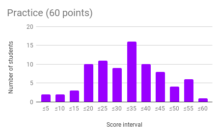
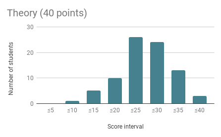
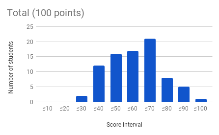

Software Engineering Midterm Exam

- [Exam statement](Midterm.md)
- [Solutions to Practice questions](Practice-Questions-Solution.md)
- [Solutions to Theory questions](Theory-Questions-Solution.md)

The scores on this exam (Fall 2017) were distributed as follows:

