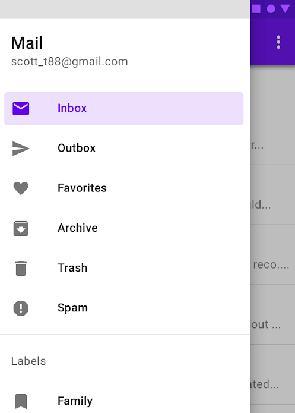

# Using Fragments

Until now, you probably used an activity, for each view of your application,
and while this works, there is another unit of UI in Android called a _fragment_.
Compared to activities, fragments are reusable portions of UI. They can be added
and removed programmatically, you can add multiple of them at the same time, and
much more. Note that they do not live on their own, instead, they are always owned
by an activity (referred to as the host activity) or another fragment.

In particular, you will probably use fragments to implement a way to quickly navigate
between the main screens of your application, using a menu, in the top bar for instance.
This has to be implemented with fragments, because part of the UI (the menu) is fixed, and
therefore belongs to an activity, while some other parts, the different main views of your app,
will be swapped at runtime, depending on what option you choose.


## Let's give it a try

Your task is to implement a few fragments, representing the main view of your app, and an activity
with a side menu, letting you navigate between these fragments, like this:
<p align="center"></p>

In this scenario, the activity will hold the side menu, called a NavigationDrawer, and 
a "hamburger menu button" on the top bar, to pull it out. 
The rest of the activity will be a container holding fragments, and clicking on the different option 
of the drawer menu, will swap the fragment with the relevant one.

For the different fragments, you can name them in a way that is relevant to your app idea, with some placeholder content,
otherwise, you can create a few generic names and placeholders, like home, profile, and settings, for instance.

Finally, you will add a few unit tests, one where you check that the navigation works as intended, 
and another where you test a fragment in isolation (simply asserting that its content is the one expected is enough).

A good place to start, to understand fragments, is the official [documentation](https://developer.android.com/guide/fragments), it is quite up to date and detailed.
In particular, those two dependencies are recommended. The first when implementing fragments:
```kotlin
// For java
implementation "androidx.fragment:fragment:1.5.5"
// For kotlin
implementation 'androidx.fragment:fragment-ktx:1.5.5'
```
and the second for testing:
```kotlin
debugImplementation "androidx.fragment:fragment-testing:1.5.5"
```
They will give you access to a few utilities function for fragments.

You may notice that the documentation presents a slightly different way to define fragments than the one you use when creating a new 
fragments from the gallery, in Android Studio. The one from the documentation is nicer, since it is less verbose.
Also it may mention the NavigationComponent, this is a component of Android that helps you handle complex navigation through fragments. This component is nice but it also adds a bit of complexity which is probably not needed for your project, you can have a look if you are interested.

In order to understand how to define and use a NavigationDrawer, you should refer to [this](https://m2.material.io/components/navigation-drawer/android#standard-navigation-drawer), in particular the [Modal navigation drawer](https://m2.material.io/components/navigation-drawer/android#modal-navigation-drawer) section.

## A few tips
When setting up the layout for the host-activity (the one containing fragments), the design may disappear once you add a FragmentContainerView,
this [post](https://stackoverflow.com/questions/75285013/design-layout-is-missing-after-adding-fragmentcontainerview) may help.

Also if you don't know how to proceed, in particular how to define the layout, you can have a look at the `Navigation Drawer Activity` from
the activity gallery in Android Studio. This will basically implement what we are doing here, but using more technologies such as the `Navigation Component` and [`View Binding`](https://developer.android.com/topic/libraries/view-binding), therefore the code might be hard to understand, but the
layout is roughly the same.
Finally, keep in mind that many new libraries/technologies are recommended by Google but then deprecated a few years later.
It can be useful to use all of these libraries, but you should still have a good understanding of the basics that they hide from you.

