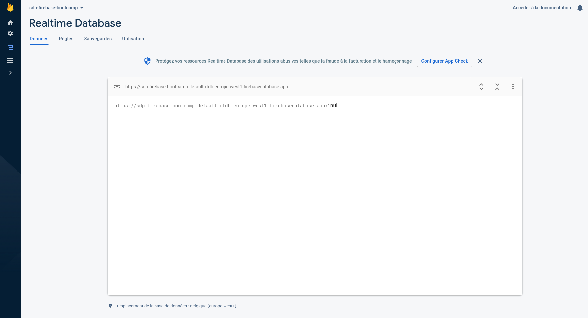
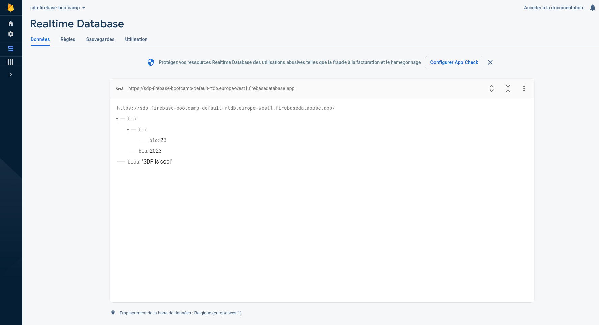
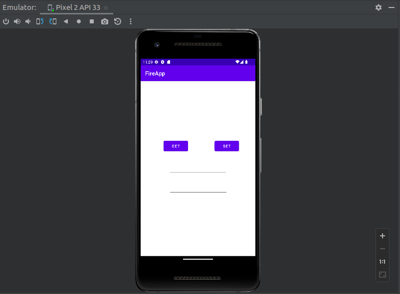

# Firebase

## Introduction

Firebase is a popular backend platform developed by Google and often used for building Android applications. More specifically, it offers real-time databases (i.e. databases that, as the name suggests, are optimized to be updated continuously and frequently), authentication systems (see authentication bootcamp for more details), and other cool API services that you can check out on their [website](https://firebase.google.com/products-build).

Firebase's real-time database is a NoSQL cloud database that follows a key-value store model. For a detailed overview of its features, see the official [documentation](https://firebase.google.com/docs/database). 

## Objective

The goal of this bootcamp is to get you started using Firebase's real-time database.

We will help you setup a simple activity that lets you associate a phone number with an email and store it in Firebase, as well as a button that lets you retrieve the corresponding email if it exists.

Then we will create some basic tests to check our work.

### Step 1 : *Setup*

1. Setup a Firebase project by following this [link](https://console.firebase.google.com/) and click on 'create a project'. 

2. Enter a name for your project, such as 'sdp-firebase-bootcamp', accept the conditions and your project should be ready to go! 

3. Now, create a real-time database via the Firebase console. There, you can temporarily select 'test mode', so that you do not yet have to worry about the write and read permissions of your database.

Your real-time database is now empty and should look like the following.

<p align="center">
  
</p>

Feel free to manually add some key-value entries to the database in order to get a grasp on its internal organization. Also, this might be useful for future troubleshooting.

> [!WARNING]
> Use your personal Google account instead of your university one, otherwise you will not be able to create a database. But you can later give admin rights to your university account and those of your teammates.


It is important to note that the keys in this database are represented as URLs or paths (strings), while the values can be of any type (i.e. numbers, Boolean values, serialized objects, etc.). This allows for a clean nested hierarchical data organization.
 
<p align="center">
  
</p>

### Step 2: *Android Activity*

Now, we shall create a simply Android activity that will interact with our newly created database.

1. Create a new Android project, and select a new 'empty activity'.

2. Go to the 'activity_main.xml' file and add two buttons in the view: one labeled 'set' and one labeled 'get'. Also add an email and a phone box in the view, which you can find under the text section of the menu. Don't forget to assign constraints and IDs to the fields.

More specifically, your view should look like this.

<p align="center">
  
</p>

3. Now you can add two functions in the main activity class: 'get' and 'set', each of which will be called when the corresponding buttons are pressed.

**Reminder:** These functions have to take a `View` object as a parameter. You can then set the 'onclick' behaviors in the .xml file of your activity or in the designer.

4. Both functions should start by retrieving the phone and email views as `TextView`s, then getting their text.

5. Follow this [guide](https://firebase.google.com/docs/android/setup) to setup Firebase's dependencies in **both** gradle configuration files. This notably requires you to generate a JSON file and move it at the root of your '/app' directory.

6. We are now ready to finish our 'set' function. The first step is to connect to our remote database and associate the phone number with its email. This can be done as follows.

```kotlin
val db: DatabaseReference = Firebase.database.reference
db.child(PHONE_NB).setValue(EMAIL)
```

> [!TIP]
> To better organize our code, the database instance can be put as a private attribute of our activity.

> [!TIP]
> Notice how it does not require us to pass the URL of our database, as this is fetched automatically from the generated JSON file.

7. Now you can already start your application and manually test if the 'set' button works as expected by manually looking into the database (the change should be instantaneous)!

8. The get function displays the associated email into its respective box and can be retrieved from the database as follows.

```kotlin
val future = CompletableFuture<String>()

db.child(phone.text.toString()).get().addOnSuccessListener {
  if (it.value == null) future.completeExceptionally(NoSuchElementException())
  else future.complete(it.value as String)
}.addOnFailureListener {
    future.completeExceptionally(it)
}

future.thenAccept {
  emailView.text = it
}
```

> [!WARNING]
> Notice how the 'get' function is slightly more complicated as it is asynchronous! As such, Firebase has a callback that is triggered when either the value has been retrieved or when no value is associated to the key (in which case `null` is returned). Thus, we have wrapped the callback into a future for better modularity and ease of understanding.

9. Our FireApp 🔥 is now up and running. You can check its simple functionality manually (i.e. 'get' and 'set') and see how it impacts our database instance.

### Step 3: *Testing*

Testing your database is not always a simple task, but it is absolutely crucial if you desire to have high test coverage and thus find more bugs. Indeed, at the end of the semester, there is a high chance that most of your code will be interacting with Firebase.

Of course, we don't want our tests to interact directly with Firebase online, as this would cause obvious problems: you don't want continuous integration to mess up your production database while running tests!

Fortunately, Google offers a Firebase emulator that you can run locally and use for testing. You can find the necessary information in [here](https://firebase.google.com/docs/emulator-suite/connect_rtdb).

On the other hand, you can also mock the behavior of Google's Firebase by coding a generic 'database' abstraction and have two instances of it: a 'MockDatabase' used for testing, and a 'FireDatabase' used for production. This has the advantage that you are no longer completely reliant on Firebase as a dependency for your project.

Before you end, we invite you to do one (or both!) of the following tasks.

1. Install the Firebase emulator and write a simple 'setAndGet' test to verify the functionality of our app.

2. Similarly, abstract the FireDatabase into a generic Database class, which offers two functions: 'get' and 'set'. Then, code a MockDatabase (using a HashMap for example) and write a similar 'setAndGet' test.

> [!TIP]
> To easily switch the database instance in your code, you can have your database as a static reference somewhere that will be overwritten into a MockDatabase instance when your tests are starting.

## Tutorials

You can find many resources online about Firebase's real-time database.

Here is its official [documentation](https://firebase.google.com/docs/database).

Feel free to look online for videos, forums, and other websites explaining the core functionalities of Firebase. The best way to start practicing is to program elementary functions that gradually become more complicated.

## Remarks

Below are three important aspects that you may need in your database at a later date.

- Firebase has listeners that are triggered automatically when the value at a particular key changes. For more information, look up "Firebase event listeners" on the Internet.

- Firebase as we have used in the bootcamp is **not** concurrent. You will have to use [transactions](https://firebase.google.com/docs/database/admin/save-data) to achieve this.

- Values can be automatically serialized to strings when stored in Firebase. This is particularly useful as it allows you to store Kotlin/Java objects directly in your database.
